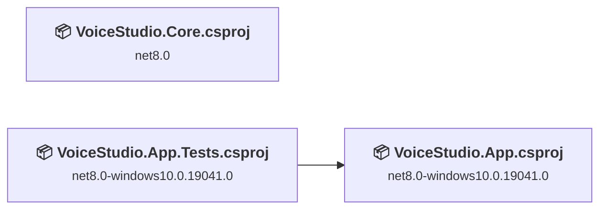
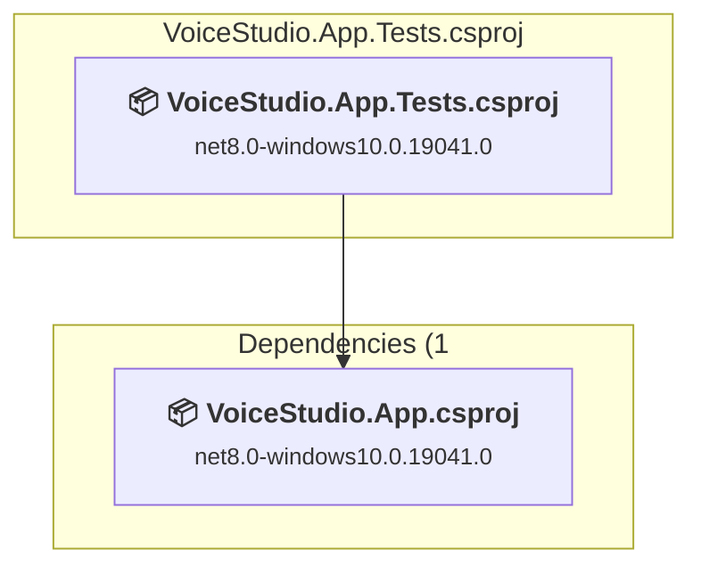
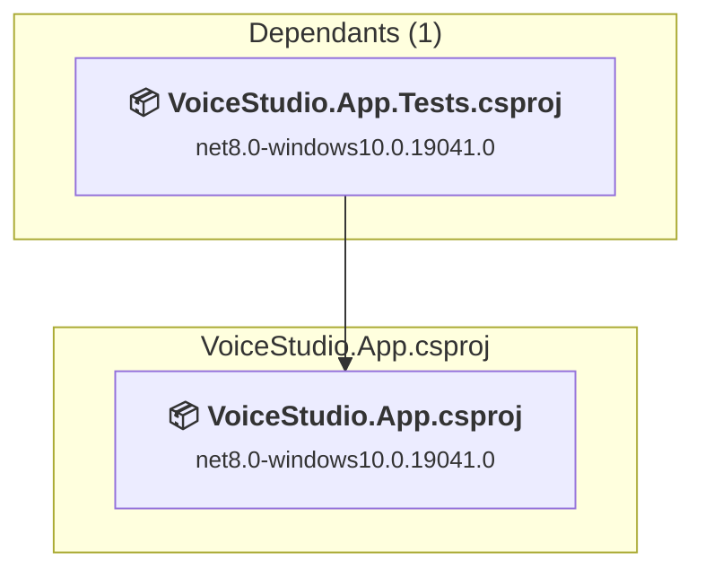
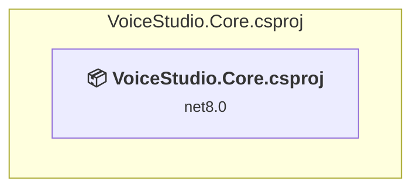

# Projects and dependencies analysis

This document provides a comprehensive overview of the projects and their dependencies in the context of upgrading to .NETCoreApp,Version=v10.0.

## Table of Contents

- [Executive Summary](#executive-Summary)
  - [Highlevel Metrics](#highlevel-metrics)
  - [Projects Compatibility](#projects-compatibility)
  - [Package Compatibility](#package-compatibility)
  - [API Compatibility](#api-compatibility)
- [Aggregate NuGet packages details](#aggregate-nuget-packages-details)
- [Top API Migration Challenges](#top-api-migration-challenges)
  - [Technologies and Features](#technologies-and-features)
  - [Most Frequent API Issues](#most-frequent-api-issues)
- [Projects Relationship Graph](#projects-relationship-graph)
- [Project Details](#project-details)

  - [src\VoiceStudio.App.Tests\VoiceStudio.App.Tests.csproj](#srcvoicestudioapptestsvoicestudioapptestscsproj)
  - [src\VoiceStudio.App\VoiceStudio.App.csproj](#srcvoicestudioappvoicestudioappcsproj)
  - [src\VoiceStudio.Core\VoiceStudio.Core.csproj](#srcvoicestudiocorevoicestudiocorecsproj)

## Executive Summary

### Highlevel Metrics

| Metric | Count | Status |
| :--- | :---: | :--- |
| Total Projects | 3 | All require upgrade |
| Total NuGet Packages | 10 | 2 need upgrade |
| Total Code Files | 485 |  |
| Total Code Files with Incidents | 292 |  |
| Total Lines of Code | 118716 |  |
| Total Number of Issues | 1460 |  |
| Estimated LOC to modify | 1455+ | at least 1.2% of codebase |

### Projects Compatibility

| Project | Target Framework | Difficulty | Package Issues | API Issues | Est. LOC Impact | Description |
| :--- | :---: | :---: | :---: | :---: | :---: | :--- |
| [src\VoiceStudio.App.Tests\VoiceStudio.App.Tests.csproj](#srcvoicestudioapptestsvoicestudioapptestscsproj) | net8.0-windows10.0.19041.0 | 🟢 Low | 0 | 0 |  | WinUI, Sdk Style = True |
| [src\VoiceStudio.App\VoiceStudio.App.csproj](#srcvoicestudioappvoicestudioappcsproj) | net8.0-windows10.0.19041.0 | 🟢 Low | 2 | 1455 | 1455+ | WinForms, Sdk Style = True |
| [src\VoiceStudio.Core\VoiceStudio.Core.csproj](#srcvoicestudiocorevoicestudiocorecsproj) | net8.0 | 🟢 Low | 0 | 0 |  | ClassLibrary, Sdk Style = True |

### Package Compatibility

| Status | Count | Percentage |
| :--- | :---: | :---: |
| ✅ Compatible | 8 | 80.0% |
| ⚠️ Incompatible | 2 | 20.0% |
| 🔄 Upgrade Recommended | 0 | 0.0% |
| ***Total NuGet Packages*** | ***10*** | ***100%*** |

### API Compatibility

| Category | Count | Impact |
| :--- | :---: | :--- |
| 🔴 Binary Incompatible | 0 | High - Require code changes |
| 🟡 Source Incompatible | 447 | Medium - Needs re-compilation and potential conflicting API error fixing |
| 🔵 Behavioral change | 1008 | Low - Behavioral changes that may require testing at runtime |
| ✅ Compatible | 159771 |  |
| ***Total APIs Analyzed*** | ***161226*** |  |

## Aggregate NuGet packages details

| Package | Current Version | Suggested Version | Projects | Description |
| :--- | :---: | :---: | :--- | :--- |
| CommunityToolkit.Mvvm | 8.2.2 |  | [VoiceStudio.App.csproj](#srcvoicestudioappvoicestudioappcsproj) | ✅Compatible |
| CommunityToolkit.WinUI.UI.Controls | 7.1.2 |  | [VoiceStudio.App.csproj](#srcvoicestudioappvoicestudioappcsproj) | ⚠️NuGet package is incompatible |
| coverlet.collector | 6.0.2 |  | [VoiceStudio.App.Tests.csproj](#srcvoicestudioapptestsvoicestudioapptestscsproj) | ✅Compatible |
| Microsoft.Graphics.Win2D | 1.3.2 | 1.1.0 | [VoiceStudio.App.csproj](#srcvoicestudioappvoicestudioappcsproj) | ⚠️NuGet package is incompatible |
| Microsoft.TestPlatform.TestHost | 17.12.0 |  | [VoiceStudio.App.Tests.csproj](#srcvoicestudioapptestsvoicestudioapptestscsproj) | ✅Compatible |
| Microsoft.Windows.SDK.BuildTools | 10.0.26100.4654 |  | [VoiceStudio.App.csproj](#srcvoicestudioappvoicestudioappcsproj) [VoiceStudio.App.Tests.csproj](#srcvoicestudioapptestsvoicestudioapptestscsproj) | ✅Compatible |
| Microsoft.WindowsAppSDK | 1.8.251106002 |  | [VoiceStudio.App.csproj](#srcvoicestudioappvoicestudioappcsproj) [VoiceStudio.App.Tests.csproj](#srcvoicestudioapptestsvoicestudioapptestscsproj) | ✅Compatible |
| MSTest.TestAdapter | 3.4.3 |  | [VoiceStudio.App.Tests.csproj](#srcvoicestudioapptestsvoicestudioapptestscsproj) | ✅Compatible |
| MSTest.TestFramework | 3.4.3 |  | [VoiceStudio.App.Tests.csproj](#srcvoicestudioapptestsvoicestudioapptestscsproj) | ✅Compatible |
| NAudio | 2.2.1 |  | [VoiceStudio.App.csproj](#srcvoicestudioappvoicestudioappcsproj) | ✅Compatible |

## Top API Migration Challenges

### Technologies and Features

| Technology | Issues | Percentage | Migration Path |
| :--- | :---: | :---: | :--- |

### Most Frequent API Issues

| API | Count | Percentage | Category |
| :--- | :---: | :---: | :--- |
| T:System.Uri | 509 | 35.0% | Behavioral Change |
| T:System.Net.Http.HttpContent | 292 | 20.1% | Behavioral Change |
| M:System.Uri.#ctor(System.String) | 152 | 10.4% | Behavioral Change |
| T:Windows.Foundation.Point | 143 | 9.8% | Source Incompatible |
| T:Windows.UI.Color | 136 | 9.3% | Source Incompatible |
| M:System.TimeSpan.FromMilliseconds(System.Double) | 38 | 2.6% | Source Incompatible |
| M:System.TimeSpan.FromSeconds(System.Double) | 37 | 2.5% | Source Incompatible |
| M:Windows.UI.Color.FromArgb(System.Byte,System.Byte,System.Byte,System.Byte) | 36 | 2.5% | Source Incompatible |
| P:Windows.Foundation.Point.Y | 22 | 1.5% | Source Incompatible |
| M:System.Uri.#ctor(System.String,System.UriKind) | 21 | 1.4% | Behavioral Change |
| P:Windows.Foundation.Point.X | 11 | 0.8% | Source Incompatible |
| M:System.Net.Http.HttpContent.ReadAsStreamAsync | 10 | 0.7% | Behavioral Change |
| T:System.Text.Json.JsonDocument | 10 | 0.7% | Behavioral Change |
| M:System.Net.Http.HttpContent.ReadAsStreamAsync(System.Threading.CancellationToken) | 7 | 0.5% | Behavioral Change |
| T:System.IO.WindowsRuntimeStorageExtensions | 6 | 0.4% | Source Incompatible |
| M:System.Uri.TryCreate(System.String,System.UriKind,System.Uri@) | 5 | 0.3% | Behavioral Change |
| M:System.TimeSpan.FromMinutes(System.Double) | 5 | 0.3% | Source Incompatible |
| M:System.IO.WindowsRuntimeStorageExtensions.OpenStreamForReadAsync(Windows.Storage.IStorageFile) | 4 | 0.3% | Source Incompatible |
| M:System.IO.WindowsRuntimeStorageExtensions.OpenStreamForWriteAsync(Windows.Storage.IStorageFile) | 2 | 0.1% | Source Incompatible |
| P:Windows.UI.Color.B | 2 | 0.1% | Source Incompatible |
| P:Windows.UI.Color.G | 2 | 0.1% | Source Incompatible |
| P:Windows.UI.Color.R | 2 | 0.1% | Source Incompatible |
| M:System.Uri.#ctor(System.Uri,System.String) | 1 | 0.1% | Behavioral Change |
| T:System.WindowsRuntimeSystemExtensions | 1 | 0.1% | Source Incompatible |
| P:System.Environment.OSVersion | 1 | 0.1% | Behavioral Change |

## Projects Relationship Graph

Legend:
📦 SDK-style project
⚙️ Classic project

## Project Details

### src\VoiceStudio.App.Tests\VoiceStudio.App.Tests.csproj

#### Project Info

- **Current Target Framework:** net8.0-windows10.0.19041.0
- **Proposed Target Framework:** net10.0-windows10.0.22000.0
- **SDK-style**: True
- **Project Kind:** WinUI
- **Dependencies**: 1
- **Dependants**: 0
- **Number of Files**: 36
- **Number of Files with Incidents**: 1
- **Lines of Code**: 2628
- **Estimated LOC to modify**: 0+ (at least 0.0% of the project)

#### Dependency Graph

Legend:
📦 SDK-style project
⚙️ Classic project

### API Compatibility

| Category | Count | Impact |
| :--- | :---: | :--- |
| 🔴 Binary Incompatible | 0 | High - Require code changes |
| 🟡 Source Incompatible | 0 | Medium - Needs re-compilation and potential conflicting API error fixing |
| 🔵 Behavioral change | 0 | Low - Behavioral changes that may require testing at runtime |
| ✅ Compatible | 1804 |  |
| ***Total APIs Analyzed*** | ***1804*** |  |

### src\VoiceStudio.App\VoiceStudio.App.csproj

#### Project Info

- **Current Target Framework:** net8.0-windows10.0.19041.0
- **Proposed Target Framework:** net10.0-windows10.0.22000.0
- **SDK-style**: True
- **Project Kind:** WinForms
- **Dependencies**: 0
- **Dependants**: 1
- **Number of Files**: 451
- **Number of Files with Incidents**: 290
- **Lines of Code**: 116088
- **Estimated LOC to modify**: 1455+ (at least 1.3% of the project)

#### Dependency Graph

Legend:
📦 SDK-style project
⚙️ Classic project

### API Compatibility

| Category | Count | Impact |
| :--- | :---: | :--- |
| 🔴 Binary Incompatible | 0 | High - Require code changes |
| 🟡 Source Incompatible | 447 | Medium - Needs re-compilation and potential conflicting API error fixing |
| 🔵 Behavioral change | 1008 | Low - Behavioral changes that may require testing at runtime |
| ✅ Compatible | 157967 |  |
| ***Total APIs Analyzed*** | ***159422*** |  |

### src\VoiceStudio.Core\VoiceStudio.Core.csproj

#### Project Info

- **Current Target Framework:** net8.0
- **Proposed Target Framework:** net10.0
- **SDK-style**: True
- **Project Kind:** ClassLibrary
- **Dependencies**: 0
- **Dependants**: 0
- **Number of Files**: 0
- **Number of Files with Incidents**: 1
- **Lines of Code**: 0
- **Estimated LOC to modify**: 0+ (at least 0.0% of the project)

#### Dependency Graph

Legend:
📦 SDK-style project
⚙️ Classic project

### API Compatibility

| Category | Count | Impact |
| :--- | :---: | :--- |
| 🔴 Binary Incompatible | 0 | High - Require code changes |
| 🟡 Source Incompatible | 0 | Medium - Needs re-compilation and potential conflicting API error fixing |
| 🔵 Behavioral change | 0 | Low - Behavioral changes that may require testing at runtime |
| ✅ Compatible | 0 |  |
| ***Total APIs Analyzed*** | ***0*** |  |

