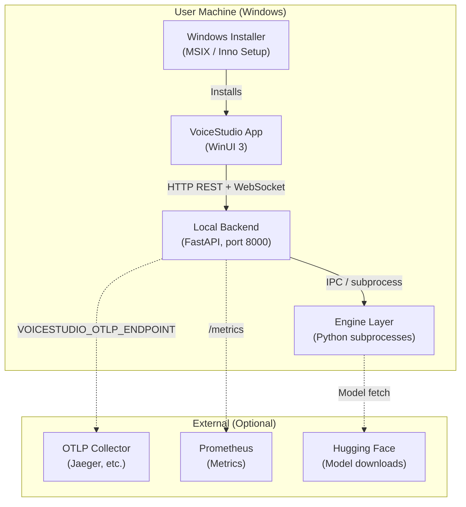

# Deployment Topology

**Phase 7 Sprint 4**  
**VoiceStudio Quantum+**

VoiceStudio is a **native Windows desktop application**. This diagram shows the deployment topology.

## Topology Diagram

## Component Descriptions

| Component | Technology | Purpose |
|-----------|------------|---------|
| Installer | MSIX / Inno Setup | Deploys app, backend, runtime |
| VoiceStudio App | WinUI 3, C# | Desktop UI, MVVM |
| Local Backend | FastAPI, Python 3.11 | REST API, WebSocket, orchestration |
| Engine Layer | Python subprocesses | TTS, STT, audio processing |
| OTLP Collector | Optional | Trace export (Jaeger, etc.) |
| Prometheus | Optional | Metrics scraping |
| Hugging Face | Optional | Model downloads |

## Data Flow

1. **Install**: Installer deploys app + backend to user machine
2. **Startup**: App launches backend process; backend loads engines
3. **Synthesis**: App → Backend → Engine subprocess → Audio file
4. **Observability**: Backend exports traces (file or OTLP), exposes `/metrics`

## Local-First

- No cloud required for core features
- Models cached locally
- API keys stored in `~/.voicestudio/data/`
- Plugin catalog can use remote URL or local JSON
