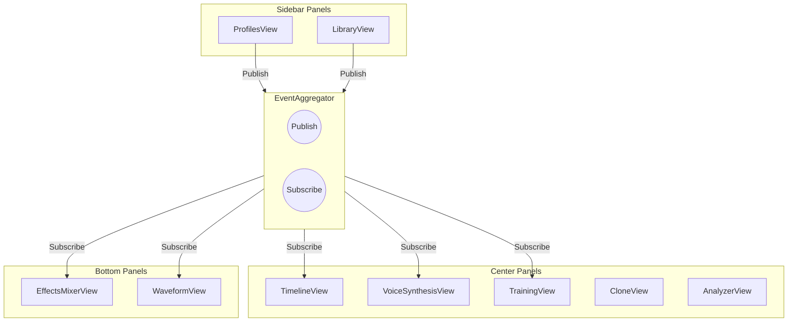
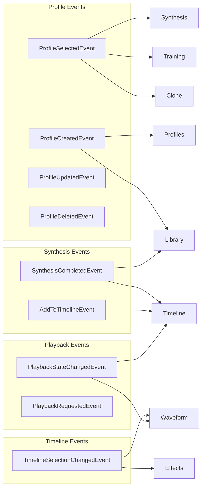

# Panel Communication Matrix

> **GAP-I17 Resolution**: This document formalizes inter-panel event communication.
> 
> **Last Updated**: 2026-02-15  
> **Status**: Active  

## Overview

VoiceStudio uses an event-driven architecture for panel communication via the `EventAggregator` service. This document maps all inter-panel events, their payloads, and flow patterns.

## Architecture



## Event Flow Diagram



## Event Matrix

### Profile Events

| Event | Source Panels | Target Panels | Payload |
|-------|---------------|---------------|---------|
| `ProfileSelectedEvent` | ProfilesView, LibraryView | VoiceSynthesisView, TrainingView, CloneView | `ProfileId: string`, `ProfileName: string?` |
| `ProfileCreatedEvent` | TrainingView | ProfilesView, LibraryView | `ProfileId: string`, `ProfileName: string` |
| `ProfileUpdatedEvent` | ProfilesView, SettingsView | VoiceSynthesisView, LibraryView | `ProfileId: string`, `ChangedProperties: Dictionary<string, object>?` |
| `ProfileDeletedEvent` | ProfilesView | LibraryView, VoiceSynthesisView | `ProfileId: string` |
| `VoiceProfileSelectedEvent` | LibraryView | CloneView, AnalyzerView | `ProfileId: string`, `ProfileName: string?` |

### Asset Events

| Event | Source Panels | Target Panels | Payload |
|-------|---------------|---------------|---------|
| `AssetSelectedEvent` | LibraryView, TimelineView | EffectsMixerView, WaveformView, AnalyzerView | `AssetId: string`, `AssetType: string` |
| `AssetAddedEvent` | VoiceSynthesisView, ImportView | LibraryView, TimelineView | `AssetId: string`, `AssetType: string`, `AssetPath: string` |
| `AssetRemovedEvent` | LibraryView | TimelineView | `AssetId: string` |
| `CloneReferenceSelectedEvent` | LibraryView | CloneView | `AssetId: string`, `AssetPath: string` |

### Synthesis Events

| Event | Source Panels | Target Panels | Payload |
|-------|---------------|---------------|---------|
| `SynthesisCompletedEvent` | VoiceSynthesisView | TimelineView, LibraryView | `AudioId: string`, `AudioPath: string`, `Duration: double`, `ProfileId: string?` |
| `AddToTimelineEvent` | VoiceSynthesisView, LibraryView | TimelineView | `AudioId: string`, `AudioPath: string`, `Text: string?`, `Duration: double` |
| `TranscriptionCompletedEvent` | TranscribeView | LibraryView, EditorView | `AudioId: string`, `TranscriptionId: string`, `Text: string` |

### Playback Events

| Event | Source Panels | Target Panels | Payload |
|-------|---------------|---------------|---------|
| `PlaybackStateChangedEvent` | TimelineView, WaveformView | All playback-aware panels | `IsPlaying: bool`, `CurrentTime: double`, `Duration: double` |
| `PlaybackRequestedEvent` | LibraryView, TimelineView | WaveformView, EffectsMixerView | `AssetId: string`, `AssetPath: string`, `StartTime: double?` |
| `TimelineSelectionChangedEvent` | TimelineView | EffectsMixerView, WaveformView | `SelectionStart: double`, `SelectionEnd: double`, `ClipId: string?` |

### Project Events

| Event | Source Panels | Target Panels | Payload |
|-------|---------------|---------------|---------|
| `ProjectChangedEvent` | MainWindow | All panels | `ProjectId: string?`, `ProjectName: string?`, `ProjectPath: string?` |
| `ProjectSettingsChangedEvent` | SettingsView | VoiceSynthesisView, TimelineView | `ProjectId: string`, `ChangedSettings: Dictionary<string, object>?` |
| `WorkspaceChangedEvent` | MainWindow | All panels | `WorkspaceId: string?`, `Layout: string?` |

### Job Events

| Event | Source Panels | Target Panels | Payload |
|-------|---------------|---------------|---------|
| `JobStartedEvent` | Any (via service) | ProgressView, StatusBar | `JobId: string`, `JobType: string`, `TotalItems: int?` |
| `JobProgressEvent` | Any (via service) | ProgressView, StatusBar | `JobId: string`, `ProgressPercent: double`, `StatusMessage: string?` |
| `JobCompletedEvent` | Any (via service) | ProgressView, StatusBar | `JobId: string`, `Success: bool`, `ErrorMessage: string?` |

### Engine Events

| Event | Source Panels | Target Panels | Payload |
|-------|---------------|---------------|---------|
| `EngineChangedEvent` | SettingsView | VoiceSynthesisView, CloneView | `EngineId: string`, `EngineName: string?` |
| `EngineSettingsChangedEvent` | SettingsView | VoiceSynthesisView | `EngineId: string`, `ChangedSettings: Dictionary<string, object>?` |

### Navigation Events

| Event | Source Panels | Target Panels | Payload |
|-------|---------------|---------------|---------|
| `NavigateToEvent` | Any | MainWindow | `TargetPanelId: string`, `Parameters: Dictionary<string, object>?` |
| `PanelNavigationRequestEvent` | Any | MainWindow | `TargetPanelId: string`, `Parameters: Dictionary<string, object>?` |

### Sync Events

| Event | Source Panels | Target Panels | Payload |
|-------|---------------|---------------|---------|
| `ScrollSyncEvent` | Any scrollable panel | Synced panels | `ScrollArgs: ScrollPositionChangedEventArgs` |
| `SelectionBroadcastEvent` | Any selection-aware panel | Synced panels | `Previous: SelectionInfo`, `Current: SelectionInfo` |

## Panel Subscription Summary

### By Panel

| Panel | Subscribes To | Publishes |
|-------|--------------|-----------|
| **ProfilesView** | `ProfileCreatedEvent`, `ProfileDeletedEvent` | `ProfileSelectedEvent`, `ProfileUpdatedEvent`, `ProfileDeletedEvent` |
| **LibraryView** | `AssetAddedEvent`, `ProfileCreatedEvent`, `SynthesisCompletedEvent` | `AssetSelectedEvent`, `AssetRemovedEvent`, `PlaybackRequestedEvent` |
| **VoiceSynthesisView** | `ProfileSelectedEvent`, `EngineChangedEvent`, `EngineSettingsChangedEvent` | `SynthesisCompletedEvent`, `AddToTimelineEvent` |
| **TimelineView** | `AddToTimelineEvent`, `AssetRemovedEvent`, `PlaybackStateChangedEvent` | `TimelineSelectionChangedEvent`, `PlaybackStateChangedEvent`, `PlaybackRequestedEvent` |
| **TrainingView** | `ProfileSelectedEvent` | `ProfileCreatedEvent`, `JobStartedEvent`, `JobProgressEvent`, `JobCompletedEvent` |
| **CloneView** | `ProfileSelectedEvent`, `CloneReferenceSelectedEvent`, `VoiceProfileSelectedEvent` | `SynthesisCompletedEvent` |
| **EffectsMixerView** | `TimelineSelectionChangedEvent`, `AssetSelectedEvent` | - |
| **WaveformView** | `TimelineSelectionChangedEvent`, `PlaybackStateChangedEvent`, `PlaybackRequestedEvent` | `PlaybackStateChangedEvent` |
| **AnalyzerView** | `AssetSelectedEvent`, `VoiceProfileSelectedEvent` | - |
| **SettingsView** | - | `EngineChangedEvent`, `EngineSettingsChangedEvent`, `ProjectSettingsChangedEvent` |

## Event Base Class

All panel events inherit from `PanelEventBase`:

```csharp
public abstract class PanelEventBase
{
    public string SourcePanelId { get; }
    public DateTime Timestamp { get; }
    public Guid EventId { get; }
    
    protected PanelEventBase(string sourcePanelId)
    {
        SourcePanelId = sourcePanelId;
        Timestamp = DateTime.UtcNow;
        EventId = Guid.NewGuid();
    }
}
```

## Usage Patterns

### Publishing Events

```csharp
// In a ViewModel
_eventAggregator.Publish(new ProfileSelectedEvent(
    sourcePanelId: "ProfilesView",
    profileId: selectedProfile.Id,
    profileName: selectedProfile.Name
));
```

### Subscribing to Events

```csharp
// In a ViewModel constructor
_eventAggregator.Subscribe<ProfileSelectedEvent>(OnProfileSelected);

// Handler
private void OnProfileSelected(ProfileSelectedEvent e)
{
    SelectedProfileId = e.ProfileId;
    LoadProfileSettings(e.ProfileId);
}
```

### Unsubscribing (INavigationAware)

```csharp
public class MyViewModel : BaseViewModel, INavigationAware
{
    public void OnNavigatedFrom()
    {
        _eventAggregator.Unsubscribe<ProfileSelectedEvent>(OnProfileSelected);
    }
}
```

## Performance Considerations

1. **Event Throttling**: Use `ThrottledEventPublisher` for high-frequency events (scroll, playback position)
2. **Payload Size**: Keep payloads minimal; use IDs and lazy-load details
3. **Subscription Cleanup**: Always unsubscribe when panels are deactivated
4. **Thread Safety**: Events may arrive on any thread; dispatch to UI thread as needed

## Related Documents

- [VOICESTUDIO_ARCHITECTURE_PORTFOLIO.md](VOICESTUDIO_ARCHITECTURE_PORTFOLIO.md) - Overall architecture
- [BOUNDED_CONTEXTS.md](BOUNDED_CONTEXTS.md) - Domain boundaries
- [CONCURRENCY_GUIDE.md](CONCURRENCY_GUIDE.md) - Thread safety patterns
- [src/VoiceStudio.Core/Events/PanelEvents.cs](../../src/VoiceStudio.Core/Events/PanelEvents.cs) - Event definitions
