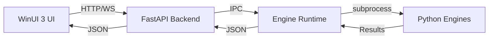

# VoiceStudio Architecture Documentation

> **Last Updated**: 2026-01-29  
> **Owner**: System Architect (Role 1)  
> **Purpose**: Entry point to VoiceStudio architecture documentation

---

## Overview

VoiceStudio Quantum+ is a **native Windows AI voice studio** built with:
- **Frontend**: WinUI 3 / .NET 8 (MVVM pattern)
- **Backend**: FastAPI / Python (Clean Architecture)
- **Engine Layer**: Python engines + manifests (Plugin Architecture)

**Platform**: Native Windows 10/11 only (not Electron, not web-based). See [ADR-010](decisions/ADR-010-native-windows-platform.md).

---

## Architecture Decisions (ADRs)

All architecture decisions are documented in `docs/architecture/decisions/`. See [decisions/README.md](decisions/README.md) for the complete index.

### Core ADRs

| ADR | Title | Status | Date |
|-----|-------|--------|------|
| [ADR-001](decisions/ADR-001-rulebook-integration.md) | Rulebook Integration | ACCEPTED | 2026-01-25 |
| [ADR-002](decisions/ADR-002-document-governance.md) | Document Governance | PENDING | 2026-01-29 |
| [ADR-003](decisions/ADR-003-agent-governance-framework.md) | Agent Governance Framework | ACCEPTED | 2026-01-25 |
| [ADR-007](decisions/ADR-007-ipc-boundary.md) | IPC Boundary | PENDING | 2026-01-29 |
| [ADR-010](decisions/ADR-010-native-windows-platform.md) | Native Windows Platform | PENDING | 2026-01-29 |
| [ADR-018](decisions/ADR-018-ipc-architecture-deviation.md) | IPC Architecture Deviation | ACCEPTED | 2026-01-30 |
| [ADR-019](decisions/ADR-019-orchestration-architecture.md) | Orchestration Architecture | ACCEPTED | 2026-01-30 |

**Full List**: See [decisions/README.md](decisions/README.md) for all 19 ADRs.

---

## Architecture Boundaries

### Sacred Boundaries (UI ↔ Core ↔ Engines)

- **UI** may NOT call engine internals directly
- **UI** interacts through stable core contracts (interfaces/protocols)
- **Engines** attach via adapters that implement those contracts
- These boundaries enable independent evolution of each layer

**Enforcement**: See `.cursor/rules/core/architecture.mdc`

### Control Plane vs Data Plane

| Plane | Boundary | Protocol | Evidence |
|-------|----------|----------|----------|
| **Control Plane** | UI ↔ Backend | HTTP REST + WebSocket | `src/VoiceStudio.App/Services/BackendClient.cs`, `backend/api/routes/` |
| **Data Plane** | Backend ↔ Engine subprocess | IPC (subprocess) | `app/core/runtime/`, engine adapters |

**Decision**: [ADR-007](decisions/ADR-007-ipc-boundary.md), [ADR-018](decisions/ADR-018-ipc-architecture-deviation.md)

---

## Architecture Patterns

### Clean Architecture (Backend)

```
Domain (entities, value objects)
    ↓
Use Cases (services)
    ↓
Adapters (routes, engine adapters)
    ↓
Infrastructure (FastAPI, engines)
```

**Implementation**: `tools/overseer/domain/` (domain layer), `backend/services/` (use cases), `backend/api/routes/` (adapters)

**Compliance**: 78% (per [ARCHITECTURE_COMPLIANCE_AUDIT_2026-01-30.md](../reports/audit/ARCHITECTURE_COMPLIANCE_AUDIT_2026-01-30.md))

**Gaps**: Routes import engines directly (GAP-002); FastAPI in services layer (GAP-007)

---

### MVVM (Frontend)

```
View (XAML + code-behind)
    ↓
ViewModel (presentation logic)
    ↓
Model/Service (business logic, backend client)
```

**Implementation**: `src/VoiceStudio.App/Views/`, `ViewModels/`, `Services/`

**Compliance**: 80% (per audit)

**Gaps**: Business logic in code-behind (GAP-004); 5 ViewModels don't inherit BaseViewModel (GAP-005)

---

### Plugin Architecture (Engines)

```
Engine Manifest (JSON) → Engine Adapter (Python) → BaseEngine Protocol
```

**Implementation**: `engines/*.json` (manifests), `app/core/engines/` (adapters), `app/core/engines/base.py` (protocol)

**Compliance**: GOOD

**Gaps**: Engine Manifest Schema v2 not adopted (TD-016)

---

## System Architecture

### High-Level Flow



### Component Map

| Layer | Location | Purpose |
|-------|----------|---------|
| **Frontend** | `src/VoiceStudio.App/` | WinUI 3 MVVM (Views, ViewModels, Services) |
| **Core Library** | `src/VoiceStudio.Core/` | Contracts, interfaces, models |
| **Backend API** | `backend/api/` | FastAPI routes, middleware, models |
| **Backend Services** | `backend/services/` | Business logic, orchestration |
| **Engine Layer** | `app/core/engines/` | Engine adapters, quality metrics |
| **Engine Runtime** | `app/core/runtime/` | Engine subprocess management |
| **Engine Manifests** | `engines/` | JSON configs for 44 engines |

---

## Architecture Documentation

### Specifications

| Document | Purpose | Status |
|----------|---------|--------|
| [UI_IMPLEMENTATION_SPEC.md](../design/UI_IMPLEMENTATION_SPEC.md) | UI design specification | ACTIVE |
| [VOICESTUDIO_COMPLETE_IMPLEMENTATION_SPEC.md](../design/VOICESTUDIO_COMPLETE_IMPLEMENTATION_SPEC.md) | Full implementation spec | ACTIVE |
| [EXECUTION_PLAN.md](../archive/legacy_worker_system/design/EXECUTION_PLAN.md) | Legacy execution plan (archived) | ARCHIVED |

### Cross-Reference Reports

| Document | Purpose | Date |
|----------|---------|------|
| [ARCHITECTURE_CROSS_REFERENCE_2026-01-30.md](../reports/verification/ARCHITECTURE_CROSS_REFERENCE_2026-01-30.md) | ChatGPT spec vs implementation | 2026-01-30 |
| [ARCHITECTURE_COMPLIANCE_AUDIT_2026-01-30.md](../reports/audit/ARCHITECTURE_COMPLIANCE_AUDIT_2026-01-30.md) | Pattern compliance audit | 2026-01-30 |

### Gap Analysis

| Document | Purpose | Date |
|----------|---------|------|
| [GAP_ANALYSIS_REMEDIATION_PLAN_2026-01-30.md](../reports/audit/GAP_ANALYSIS_REMEDIATION_PLAN_2026-01-30.md) | 28 gaps + remediation | 2026-01-30 |
| [FINAL_SWEEP_MISSING_FILES_GAPS_2026-01-29.md](../reports/verification/FINAL_SWEEP_MISSING_FILES_GAPS_2026-01-29.md) | Missing files inventory | 2026-01-29 |

---

## Architecture Compliance

### Current Compliance Scores

| Pattern | Score | Grade |
|---------|-------|-------|
| Clean Architecture | 78% | C+ |
| MVVM Pattern | 80% | B- |
| IPC Boundaries | 85% | B |
| ADR Coverage | 32% (6/19 complete) | F |

**Source**: [ARCHITECTURE_COMPLIANCE_AUDIT_2026-01-30.md](../reports/audit/ARCHITECTURE_COMPLIANCE_AUDIT_2026-01-30.md)

### Known Violations

| Violation | Files Affected | Remediation | Priority |
|-----------|----------------|-------------|----------|
| Routes import engines directly | 23 route files | Create engine interface layer (GAP-002) | HIGH |
| Business logic in Views | 3 View files | Move to ViewModels (GAP-004) | HIGH |
| ViewModels not inheriting BaseViewModel | 5 ViewModels | Change inheritance (GAP-005) | HIGH |
| Direct HttpClient instantiation | 3 ViewModels | Inject IHttpClientFactory (GAP-006) | HIGH |

---

## Next Steps

1. **Complete PENDING ADRs** — Fill Context/Decision/Consequences for ADR-002, 004-016
2. **Address HIGH priority gaps** — GAP-002 through GAP-006 (32-48h effort)
3. **Improve compliance scores** — Target: Clean Architecture 85%, MVVM 90%, ADR Coverage 100%

---

## References

- **ADR Index**: [decisions/README.md](decisions/README.md)
- **Canonical Registry**: [CANONICAL_REGISTRY.md](../governance/CANONICAL_REGISTRY.md)
- **Master Roadmap**: [MASTER_ROADMAP_UNIFIED.md](../governance/MASTER_ROADMAP_UNIFIED.md)
- **Tech Debt**: [TECH_DEBT_REGISTER.md](../governance/TECH_DEBT_REGISTER.md)

---

*Architecture documentation entry point for VoiceStudio Quantum+. Created 2026-01-29 per final sweep audit.*
