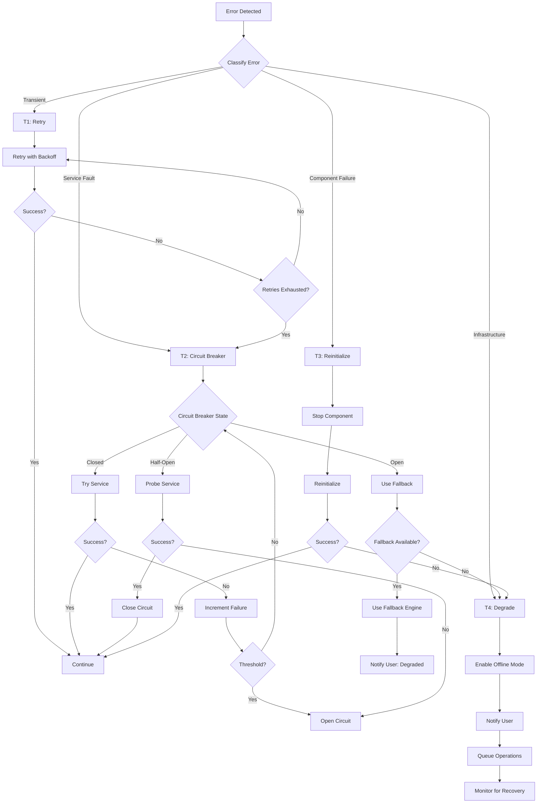

# Recovery Coordination Guide

> **GAP-I18 Resolution**: This document formalizes failure recovery patterns and coordination.
>
> **Last Updated**: 2026-02-15  
> **Status**: Active  

## Overview

VoiceStudio employs a tiered recovery strategy that balances reliability with user experience. This document defines recovery tiers, decision trees, and coordination points.

## Recovery Tiers

| Tier | Scope | Strategy | Recovery Time | Example |
|------|-------|----------|---------------|---------|
| **T1** | Operation | Retry with backoff | < 5s | HTTP 500 → retry 3x with exponential backoff |
| **T2** | Service | Circuit breaker | 5-30s | Engine down → open CB, queue requests |
| **T3** | Component | Restart/reinitialize | 30s-2min | GPU error → reinitialize engine process |
| **T4** | Application | Graceful degradation | Indefinite | Backend unreachable → offline mode |

## Recovery Decision Tree



## Error Classification

### Transient Errors (T1)

Temporary failures that resolve with retry:

| Error Type | HTTP Codes | Retry Strategy |
|------------|------------|----------------|
| Network timeout | 408, 504 | 3 retries, exponential backoff (1s, 2s, 4s) |
| Rate limiting | 429 | Retry after `Retry-After` header |
| Service overload | 503 | 3 retries, exponential backoff |
| Connection reset | - | Immediate retry, then backoff |

### Service Faults (T2)

Persistent service failures requiring circuit breaker:

| Service | Failure Threshold | Recovery Check | Fallback |
|---------|------------------|----------------|----------|
| Synthesis Engine | 5 failures in 30s | Every 30s | Next engine in chain |
| Transcription Engine | 3 failures in 30s | Every 60s | Whisper local |
| Backend API | 3 failures in 10s | Every 15s | Offline mode |
| Storage Service | 3 failures in 10s | Every 30s | Local cache |

### Component Failures (T3)

Component-level issues requiring reinitialization:

| Component | Failure Indicator | Recovery Action | Timeout |
|-----------|-------------------|-----------------|---------|
| GPU Engine | CUDA error, OOM | Kill process, reinitialize | 60s |
| Audio Pipeline | Driver error | Reinitialize audio context | 30s |
| Model Loader | Corrupt model load | Clear cache, reload | 120s |

### Infrastructure Failures (T4)

Application-wide issues requiring graceful degradation:

| Failure | Detection | Degradation Mode | User Experience |
|---------|-----------|------------------|-----------------|
| Backend down | Health check fails | Offline mode | Read-only, queued operations |
| No GPU | GPU enumeration fails | CPU-only mode | Slower processing, warning banner |
| Disk full | Write fails | Read-only mode | Cannot save, warning banner |
| Network down | Connectivity check fails | Local-only mode | No cloud sync, local engines only |

## Coordination Points

### Service-Level Coordinators

| Component | Coordinator Service | Recovery Responsibilities |
|-----------|--------------------|-----------------------------|
| Synthesis | `EngineService` | Fallback to next engine, cache last-good config |
| Transcription | `TranscriptionService` | Queue for retry, fallback to local Whisper |
| Storage | `StorageService` | Retry with exponential backoff, use local cache |
| Backend Comms | `BackendClient` | Circuit breaker, offline queue |

### UI-Level Recovery

| Component | Pattern | Implementation |
|-----------|---------|----------------|
| ViewModel | `ExecuteWithErrorHandlingAsync` | Retry dialog, error notification |
| Command | `EnhancedAsyncRelayCommand` | Automatic retry, busy state |
| Toast | `ToastService` | Error notification with retry action |

## Implementation Patterns

### T1: Retry with Backoff (C#)

```csharp
// BaseViewModel provides ExecuteWithErrorHandlingAsync
protected async Task<T?> ExecuteWithRetryAsync<T>(
    Func<Task<T>> operation,
    int maxRetries = 3,
    TimeSpan? initialDelay = null)
{
    var delay = initialDelay ?? TimeSpan.FromSeconds(1);
    
    for (int attempt = 1; attempt <= maxRetries; attempt++)
    {
        try
        {
            return await operation();
        }
        catch (TransientException ex) when (attempt < maxRetries)
        {
            _logger.LogWarning(ex, "Attempt {Attempt}/{Max} failed, retrying...", 
                attempt, maxRetries);
            await Task.Delay(delay);
            delay = TimeSpan.FromTicks(delay.Ticks * 2); // Exponential backoff
        }
    }
    
    throw new RetryExhaustedException("All retry attempts failed");
}
```

### T2: Circuit Breaker (Python)

```python
# backend/services/circuit_breaker.py
class CircuitBreaker:
    def __init__(self, failure_threshold=5, recovery_timeout=30):
        self.failure_threshold = failure_threshold
        self.recovery_timeout = recovery_timeout
        self.failure_count = 0
        self.last_failure_time = None
        self.state = CircuitState.CLOSED
    
    async def execute(self, operation: Callable, fallback: Callable = None):
        if self.state == CircuitState.OPEN:
            if self._should_attempt_reset():
                self.state = CircuitState.HALF_OPEN
            elif fallback:
                return await fallback()
            else:
                raise CircuitOpenException()
        
        try:
            result = await operation()
            self._on_success()
            return result
        except Exception as e:
            self._on_failure()
            if fallback and self.state == CircuitState.OPEN:
                return await fallback()
            raise
```

### T3: Component Reinitialization

```csharp
// EngineService.cs
public async Task<bool> RecoverEngineAsync(string engineId, CancellationToken ct)
{
    _logger.LogWarning("Attempting engine recovery for {EngineId}", engineId);
    
    // Stop the failed engine
    await StopEngineAsync(engineId, ct);
    
    // Clear any cached state
    _engineCache.Remove(engineId);
    
    // Reinitialize with fresh state
    try
    {
        await InitializeEngineAsync(engineId, ct);
        _logger.LogInformation("Engine {EngineId} recovered successfully", engineId);
        return true;
    }
    catch (Exception ex)
    {
        _logger.LogError(ex, "Engine recovery failed for {EngineId}", engineId);
        return false;
    }
}
```

### T4: Graceful Degradation

```csharp
// BackendClient.cs
public async Task<T?> ExecuteWithDegradationAsync<T>(
    Func<Task<T>> onlineOperation,
    Func<T> offlineFallback)
{
    if (_offlineMode)
    {
        return offlineFallback();
    }
    
    try
    {
        return await _circuitBreaker.ExecuteAsync(onlineOperation);
    }
    catch (CircuitOpenException)
    {
        _logger.LogWarning("Backend circuit open, entering offline mode");
        await EnterOfflineModeAsync();
        return offlineFallback();
    }
}

private async Task EnterOfflineModeAsync()
{
    _offlineMode = true;
    _eventAggregator.Publish(new OfflineModeEnabledEvent());
    await _offlineQueue.StartQueueingAsync();
}
```

## User Notification Strategy

| Recovery Tier | Notification Type | User Action |
|---------------|-------------------|-------------|
| T1 (Retry) | None (transparent) | - |
| T1 (Final failure) | Toast error | "Retry" button |
| T2 (Circuit open) | Banner warning | "Using backup engine" |
| T3 (Reinitializing) | Progress indicator | Wait or cancel |
| T4 (Offline mode) | Persistent banner | "Operations queued, reconnect to sync" |

## Monitoring and Alerts

### Metrics to Track

| Metric | Threshold | Alert |
|--------|-----------|-------|
| Retry rate | > 10% of requests | Warning |
| Circuit breaker opens | > 3/hour | Warning |
| Component restarts | > 2/hour | Critical |
| Offline mode entries | > 1/day | Warning |

### Health Check Endpoints

| Endpoint | Purpose | Check Interval |
|----------|---------|----------------|
| `/health` | Overall health | 30s |
| `/health/engines` | Engine status | 60s |
| `/health/storage` | Storage connectivity | 60s |
| `/health/dependencies` | External services | 120s |

## Recovery Testing

### Test Scenarios

1. **T1 Validation**: Kill backend mid-request → verify retry succeeds
2. **T2 Validation**: Block engine port → verify circuit opens → restore → verify recovery
3. **T3 Validation**: Simulate GPU OOM → verify reinit → verify operation resumes
4. **T4 Validation**: Disconnect network → verify offline mode → reconnect → verify queue drains

## Related Documents

- [CONCURRENCY_GUIDE.md](CONCURRENCY_GUIDE.md) - Thread safety and cancellation
- [PANEL_COMMUNICATION_MATRIX.md](PANEL_COMMUNICATION_MATRIX.md) - Event flows
- [backend/services/circuit_breaker.py](../../backend/services/circuit_breaker.py) - Circuit breaker implementation
- [src/VoiceStudio.App/Services/BackendClient.cs](../../src/VoiceStudio.App/Services/BackendClient.cs) - Frontend resilience
