---

## 14. Gap Analysis and Technical Debt

This section catalogs architectural gaps, technical debt, and improvement opportunities identified across all system layers. Each gap is assigned a severity, impact assessment, and recommended resolution path.

> **Companion Document**: See `ARCHITECTURE_GAP_REGISTER.md` for a trackable version of this gap analysis with resolution status and ownership.

### 14.1 Gap Severity Classification

| Severity | Definition | SLA |
|----------|------------|-----|
| **Critical** | Blocks core functionality or poses security risk | Immediate |
| **High** | Impacts user experience or developer productivity | Next sprint |
| **Medium** | Technical debt with manageable workarounds | Quarterly |
| **Low** | Improvement opportunity, not blocking | Backlog |

---

### 14.2 Frontend Gaps (GAP-F)

#### GAP-F01: Duplicate AppStateStore Implementations

| Attribute | Value |
|-----------|-------|
| **Severity** | High |
| **Location** | `Services/AppStateStore.cs` vs `Services/State/AppStateStore.cs` |
| **Description** | Two implementations of AppStateStore exist in different directories, causing confusion about which is authoritative. |
| **Impact** | Developer confusion, potential state synchronization issues, maintenance burden |
| **Recommended Fix** | Consolidate to single implementation in `Services/State/`, update all references, delete duplicate |
| **Related Tech Debt** | TD-035 |

#### GAP-F02: Mixed Dependency Injection Patterns

| Attribute | Value |
|-----------|-------|
| **Severity** | Medium |
| **Location** | Various ViewModels |
| **Description** | Some ViewModels use constructor DI, others access static ServiceProvider directly. |
| **Impact** | Reduced testability, inconsistent patterns, harder to mock in tests |
| **Recommended Fix** | Standardize on constructor DI via IViewModelContext for all ViewModels |
| **Related Tech Debt** | TD-028 |

#### GAP-F03: Service Layer Consolidation Needed

| Attribute | Value |
|-----------|-------|
| **Severity** | Medium |
| **Location** | `Services/` directory (159 files) |
| **Description** | High service count with potential overlap between similar services (e.g., multiple state management services). |
| **Impact** | Increased complexity, harder navigation, potential duplicate functionality |
| **Recommended Fix** | Audit services for overlap, consolidate where appropriate, create service catalog |
| **Related Tech Debt** | N/A |

#### GAP-F04: Panel Registration Inconsistency

| Attribute | Value |
|-----------|-------|
| **Severity** | Medium |
| **Location** | `MainWindow.xaml.cs`, `PanelRegistry.cs` |
| **Description** | Some panels are registered in MainWindow directly, others use PanelRegistry. |
| **Impact** | Inconsistent panel discovery, harder to extend panel system |
| **Recommended Fix** | Move all panel registration to PanelRegistry, make MainWindow consume registry |
| **Related Tech Debt** | N/A |

#### GAP-F05: View-ViewModel Direct Coupling

| Attribute | Value |
|-----------|-------|
| **Severity** | Low |
| **Location** | Some View code-behind files |
| **Description** | Some Views create ViewModels directly instead of using ViewModelFactory. |
| **Impact** | Reduced testability, harder to mock ViewModels in UI tests |
| **Recommended Fix** | Create IViewModelFactory interface, inject all ViewModels via factory |
| **Related Tech Debt** | N/A |

#### GAP-F06: WinAppDriver Panel Visibility Issue

| Attribute | Value |
|-----------|-------|
| **Severity** | High |
| **Location** | Center and Bottom panel regions |
| **Description** | Center and Bottom panels not visible to WinAppDriver automation, blocking UI test coverage. |
| **Impact** | Unable to automate tests for 40% of UI surface |
| **Recommended Fix** | Investigate AutomationPeer implementation, ensure proper UIA tree exposure |
| **Related Tech Debt** | TD-040 |

#### GAP-F07: Grid AutomationId Not Exposed

| Attribute | Value |
|-----------|-------|
| **Severity** | Medium |
| **Location** | Various Grid controls |
| **Description** | Grid controls lack AutomationId, making them invisible to accessibility tools and test automation. |
| **Impact** | Reduced accessibility, harder UI automation |
| **Recommended Fix** | Add AutomationProperties.AutomationId to all significant Grid elements |
| **Related Tech Debt** | TD-041 |

#### GAP-F08: No ViewModelFactory for All ViewModels

| Attribute | Value |
|-----------|-------|
| **Severity** | Low |
| **Location** | DI registration |
| **Description** | ViewModels are registered individually without a factory abstraction. |
| **Impact** | More complex testing, no centralized ViewModel creation logic |
| **Recommended Fix** | Implement IViewModelFactory with generic Create<T>() method |
| **Related Tech Debt** | N/A |

---

### 14.3 Backend Gaps (GAP-B)

#### GAP-B01: No API v2 Version

| Attribute | Value |
|-----------|-------|
| **Severity** | Low |
| **Location** | `backend/api/` |
| **Description** | API versioning jumps from v1 (legacy) to v3, with no v2 defined. |
| **Impact** | Confusing version history, unclear what happened to v2 |
| **Recommended Fix** | Document in ADR that v2 was skipped intentionally, or rename v3 if appropriate |
| **Related Tech Debt** | N/A |

#### GAP-B02: Route File Proliferation

| Attribute | Value |
|-----------|-------|
| **Severity** | Medium |
| **Location** | `backend/api/routes/` (120+ files) |
| **Description** | High number of route files, some with potential functional overlap. |
| **Impact** | Navigation complexity, potential duplicate endpoints |
| **Recommended Fix** | Audit route files, consolidate by domain, create route inventory document |
| **Related Tech Debt** | N/A |

#### GAP-B03: MCP Bridge Minimal Implementation

| Attribute | Value |
|-----------|-------|
| **Severity** | Low |
| **Location** | `backend/mcp_bridge/` |
| **Description** | MCP bridge only implements PDF unlocker client, limited MCP integration. |
| **Impact** | Underutilized MCP capabilities |
| **Recommended Fix** | Expand MCP bridge as needed for additional MCP server integration |
| **Related Tech Debt** | N/A |

#### GAP-B04: No ORM Layer

| Attribute | Value |
|-----------|-------|
| **Severity** | Medium |
| **Location** | `backend/data/` |
| **Description** | Repository pattern uses raw SQL queries instead of ORM. |
| **Impact** | More verbose code, manual SQL injection prevention, no migration auto-generation |
| **Recommended Fix** | Evaluate SQLAlchemy or Tortoise ORM for future adoption, or document raw SQL as intentional |
| **Related Tech Debt** | N/A |

#### GAP-B05: Configuration Split

| Attribute | Value |
|-----------|-------|
| **Severity** | Low |
| **Location** | `backend/config/app_config.py`, `backend/config/path_config.py` |
| **Description** | Configuration split across multiple modules without clear hierarchy. |
| **Impact** | Configuration discovery harder, potential conflicts |
| **Recommended Fix** | Consolidate into UnifiedConfigService, document config hierarchy |
| **Related Tech Debt** | N/A |

#### GAP-B06: Potential Duplicate Route Functionality

| Attribute | Value |
|-----------|-------|
| **Severity** | Medium |
| **Location** | Various route files |
| **Description** | Some route files may have overlapping functionality (e.g., audio enhancement endpoints). |
| **Impact** | Confusion about which endpoint to use, maintenance burden |
| **Recommended Fix** | Audit and document all endpoints, deprecate duplicates |
| **Related Tech Debt** | N/A |

#### GAP-B07: Limited Integration Layer

| Attribute | Value |
|-----------|-------|
| **Severity** | Low |
| **Location** | `backend/integrations/` |
| **Description** | Only DAW and video editor integrations implemented. |
| **Impact** | Limited external tool connectivity |
| **Recommended Fix** | Expand as user demand requires |
| **Related Tech Debt** | N/A |

---

### 14.4 Engine Gaps (GAP-E)

#### GAP-E01: Incomplete Engine Manifests

| Attribute | Value |
|-----------|-------|
| **Severity** | High |
| **Location** | `engines/` |
| **Description** | Only 6 engine manifests exist for 50+ engines. Most engines lack formal capability declarations. |
| **Impact** | Engine discovery limited, inconsistent capability reporting |
| **Recommended Fix** | Create manifest files for all engines, automate manifest validation |
| **Related Tech Debt** | TD-032 |

#### GAP-E02: Non-Sidebar Panel Navigation

| Attribute | Value |
|-----------|-------|
| **Severity** | Medium |
| **Location** | Panel navigation system |
| **Description** | Menu and keyboard navigation not implemented for non-sidebar panels. |
| **Impact** | Accessibility issues, keyboard users cannot navigate all panels |
| **Recommended Fix** | Implement keyboard navigation handlers for all panel regions |
| **Related Tech Debt** | TD-042 |

#### GAP-E03: Venv Family Fragility

| Attribute | Value |
|-----------|-------|
| **Severity** | High |
| **Location** | `app/core/runtime/venv_family_manager.py` |
| **Description** | PyTorch version conflicts between venv families can cause engine failures. |
| **Impact** | Engine initialization failures, user frustration |
| **Recommended Fix** | Implement strict version pinning, add conflict detection, improve error messages |
| **Related Tech Debt** | TD-045 |

#### GAP-E04: No Engine Hot-Reload

| Attribute | Value |
|-----------|-------|
| **Severity** | Low |
| **Location** | Engine lifecycle system |
| **Description** | Engine code changes require full application restart. |
| **Impact** | Slower development iteration for engine modifications |
| **Recommended Fix** | Implement engine hot-reload for development mode |
| **Related Tech Debt** | N/A |

#### GAP-E05: Quality Metrics Not Standardized

| Attribute | Value |
|-----------|-------|
| **Severity** | Medium |
| **Location** | Various engines |
| **Description** | Quality metrics (PESQ, STOI, MOS) not consistently reported across all engines. |
| **Impact** | Inconsistent quality comparison, harder engine selection |
| **Recommended Fix** | Add quality metric calculation to engine protocol, require for all TTS engines |
| **Related Tech Debt** | N/A |

---

### 14.5 Cross-Cutting Gaps (GAP-X)

#### GAP-X01: No End-to-End Golden Path Test

| Attribute | Value |
|-----------|-------|
| **Severity** | High |
| **Location** | `tests/e2e/` |
| **Description** | No single test validates the complete user journey from project creation through synthesis export. |
| **Impact** | Regressions in critical workflows may go undetected |
| **Recommended Fix** | Create golden path E2E test covering: launch → create project → import audio → synthesize → export |
| **Related Tech Debt** | TD-050 |

#### GAP-X02: First-Run Experience Not Implemented

| Attribute | Value |
|-----------|-------|
| **Severity** | Medium |
| **Location** | Application startup |
| **Description** | No first-run wizard or onboarding flow for new users. |
| **Impact** | Poor first-time user experience, higher support burden |
| **Recommended Fix** | Design and implement first-run wizard: license acceptance, model download, tour |
| **Related Tech Debt** | TD-055 |

#### GAP-X03: Tools Registry Not Created

| Attribute | Value |
|-----------|-------|
| **Severity** | Medium |
| **Location** | `scripts/`, `tools/` |
| **Description** | 200+ scripts and tools exist without a central registry or documentation. |
| **Impact** | Developer confusion about available tools, duplicate tool creation |
| **Recommended Fix** | Create TOOLS_REGISTRY.md cataloging all scripts with purpose, usage, and ownership |
| **Related Tech Debt** | N/A |

#### GAP-X04: Test Flakiness in Full Suite

| Attribute | Value |
|-----------|-------|
| **Severity** | Medium |
| **Location** | Test infrastructure |
| **Description** | Full test suite shows flakiness, likely due to shared state or timing issues. |
| **Impact** | False failures, reduced CI confidence |
| **Recommended Fix** | Implement session-scoped fixtures, add test isolation, identify and fix flaky tests |
| **Related Tech Debt** | TD-048 |

#### GAP-X05: No CI Integration for UI Tests

| Attribute | Value |
|-----------|-------|
| **Severity** | High |
| **Location** | CI/CD pipeline |
| **Description** | UI tests (WinAppDriver) not integrated into CI pipeline. |
| **Impact** | UI regressions not caught automatically |
| **Recommended Fix** | Configure CI runner with WinAppDriver, add UI test stage to pipeline |
| **Related Tech Debt** | TD-052 |

#### GAP-X06: Informal Contract Definitions

| Attribute | Value |
|-----------|-------|
| **Severity** | Medium |
| **Location** | `shared/` |
| **Description** | Schema registry has 9 formal schemas, but many API contracts are informal (code-only). |
| **Impact** | Contract drift between UI and Backend, integration bugs |
| **Recommended Fix** | Identify all cross-layer contracts, create formal JSON schemas, add validation |
| **Related Tech Debt** | N/A |

---

### 14.6 Gap Summary

| Category | Critical | High | Medium | Low | Total |
|----------|----------|------|--------|-----|-------|
| **Frontend (F)** | 0 | 2 | 4 | 2 | 8 |
| **Backend (B)** | 0 | 0 | 4 | 3 | 7 |
| **Engine (E)** | 0 | 2 | 2 | 1 | 5 |
| **Cross-Cutting (X)** | 0 | 2 | 4 | 0 | 6 |
| **Interconnectivity (I)** | 0 | 1 | 7 | 4 | 12 |
| **Total** | **0** | **7** | **21** | **10** | **38** |

> **Note**: Interconnectivity gaps (Section 21) address micro-level coordination patterns, event propagation, service teamwork, and cross-layer communication issues.

### 14.7 Prioritized Remediation Roadmap

#### Phase 1: High-Priority Gaps (Next Sprint)

1. **GAP-F01**: Consolidate AppStateStore implementations
2. **GAP-F06**: Fix WinAppDriver panel visibility
3. **GAP-E01**: Create engine manifests for top 20 engines
4. **GAP-E03**: Address venv family version conflicts
5. **GAP-X01**: Create golden path E2E test
6. **GAP-X05**: Integrate UI tests into CI
7. **GAP-I10**: Implement contract version negotiation header

#### Phase 2: Medium-Priority Gaps (Quarterly)

1. **GAP-F02**: Standardize DI patterns
2. **GAP-F03**: Service layer consolidation
3. **GAP-F04**: Panel registration consistency
4. **GAP-B02**: Route file audit and consolidation
5. **GAP-B04**: ORM evaluation
6. **GAP-E02**: Non-sidebar keyboard navigation
7. **GAP-E05**: Quality metrics standardization
8. **GAP-X02**: First-run experience
9. **GAP-X03**: Tools registry creation
10. **GAP-X04**: Test flakiness resolution
11. **GAP-X06**: Contract formalization
12. **GAP-I01**: Add event throttling/coalescing to EventAggregator
13. **GAP-I02**: Standardize TimeSpan serialization
14. **GAP-I04**: Add automatic event deduplication option
15. **GAP-I06**: Create HealthAggregator service
16. **GAP-I07**: Implement proper process groups for subprocesses
17. **GAP-I09**: Create unified error code registry
18. **GAP-I11**: Standardize enum serialization to strings

#### Phase 3: Low-Priority Gaps (Backlog)

1. **GAP-F05**: View-ViewModel factory
2. **GAP-F08**: ViewModelFactory implementation
3. **GAP-B01**: API versioning documentation
4. **GAP-B03**: MCP bridge expansion
5. **GAP-B05**: Configuration consolidation
6. **GAP-B07**: Integration layer expansion
7. **GAP-E04**: Engine hot-reload
8. **GAP-I03**: Add event priority queue to EventAggregator
9. **GAP-I05**: Add batch publish capability
10. **GAP-I08**: Add correlation ID propagation across services
11. **GAP-I12**: Add trace ID correlation to structured logging

---

## 15. Deep Interconnectivity Architecture

This section provides granular detail on how individual components connect, coordinate, and collaborate. These micro-level patterns are essential for understanding system behavior and debugging complex interactions.

### 15.1 Event Aggregator Wiring Diagram

The EventAggregator is the central nervous system for cross-panel communication. Every panel and service that needs to coordinate with others connects through this hub.

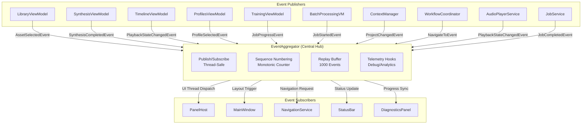

### 15.2 Panel Event Subscription Matrix

This matrix shows exactly which panels subscribe to which events, enabling precise understanding of cross-panel coordination.

| Event Type | LibraryView | Timeline | Synthesis | Profiles | Training | Batch | Diagnostics |
|------------|:-----------:|:--------:|:---------:|:--------:|:--------:|:-----:|:-----------:|
| `ProfileSelectedEvent` | - | ✓ | ✓ | - | ✓ | ✓ | - |
| `ProfileUpdatedEvent` | - | - | ✓ | ✓ | - | - | - |
| `AssetSelectedEvent` | - | ✓ | - | - | - | ✓ | - |
| `AssetAddedEvent` | ✓ | ✓ | - | - | - | - | - |
| `ProjectChangedEvent` | ✓ | ✓ | ✓ | ✓ | ✓ | ✓ | ✓ |
| `JobStartedEvent` | - | - | - | - | - | ✓ | ✓ |
| `JobProgressEvent` | - | - | - | - | ✓ | ✓ | ✓ |
| `PlaybackStateChangedEvent` | - | ✓ | - | - | - | - | - |
| `EngineChangedEvent` | - | - | ✓ | - | ✓ | ✓ | ✓ |
| `SynthesisCompletedEvent` | ✓ | ✓ | - | - | - | - | - |
| `WorkspaceChangedEvent` | ✓ | ✓ | ✓ | ✓ | ✓ | ✓ | ✓ |
| `CloneReferenceSelectedEvent` | - | - | - | - | - | - | - |

### 15.3 Interaction Intent System

Events carry an `InteractionIntent` that allows subscribers to respond differently based on context.

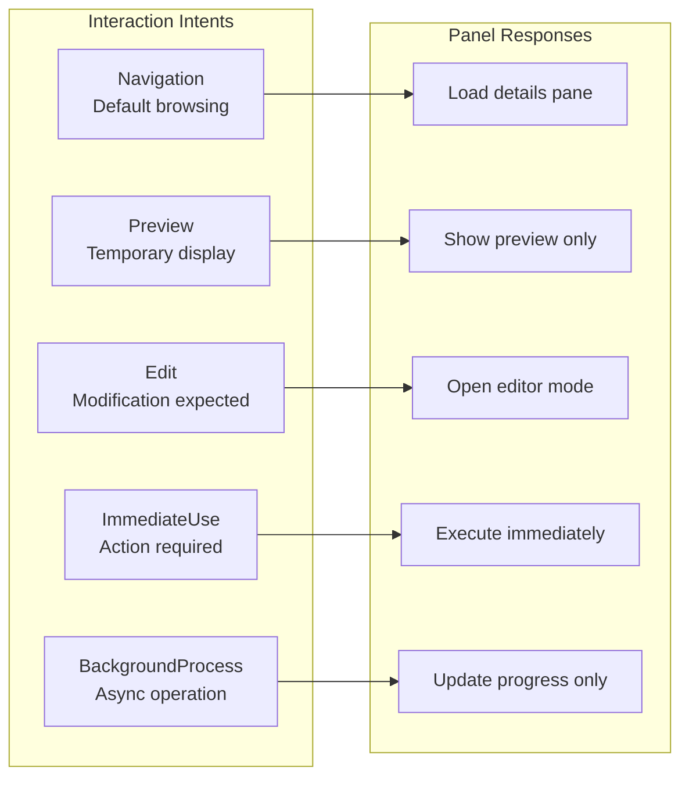

### 15.4 Event Sequence Numbering and Ordering

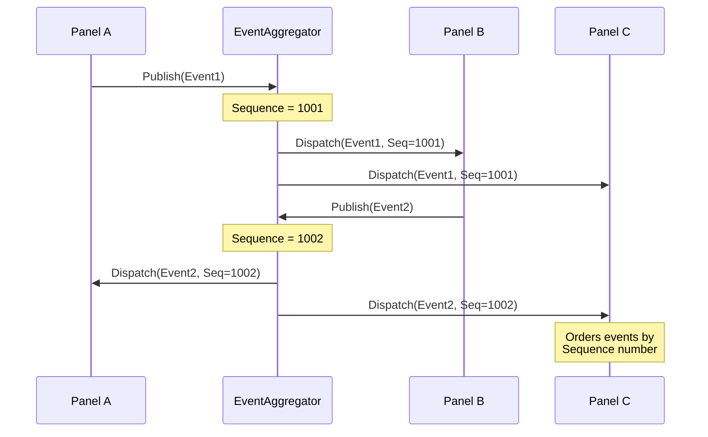

### 15.5 Cross-Panel State Synchronization

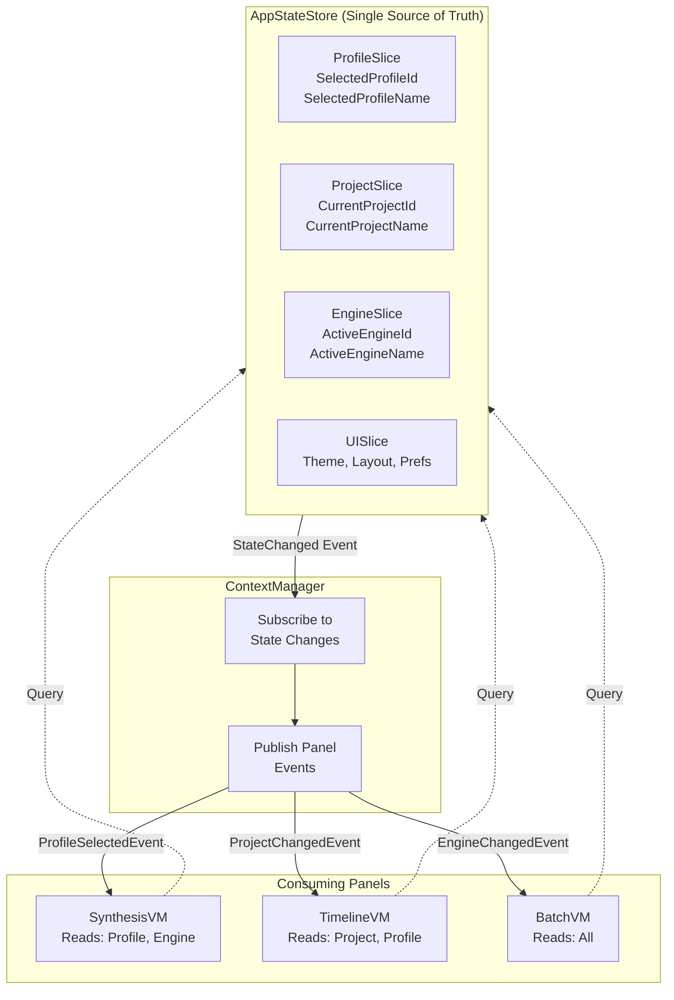

---

## 16. Service Coordination Patterns

This section details how frontend services coordinate as a team to accomplish complex tasks.

### 16.1 Service Dependency Graph (Frontend)

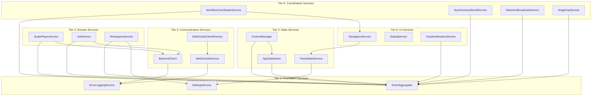

### 16.2 Service Initialization Order

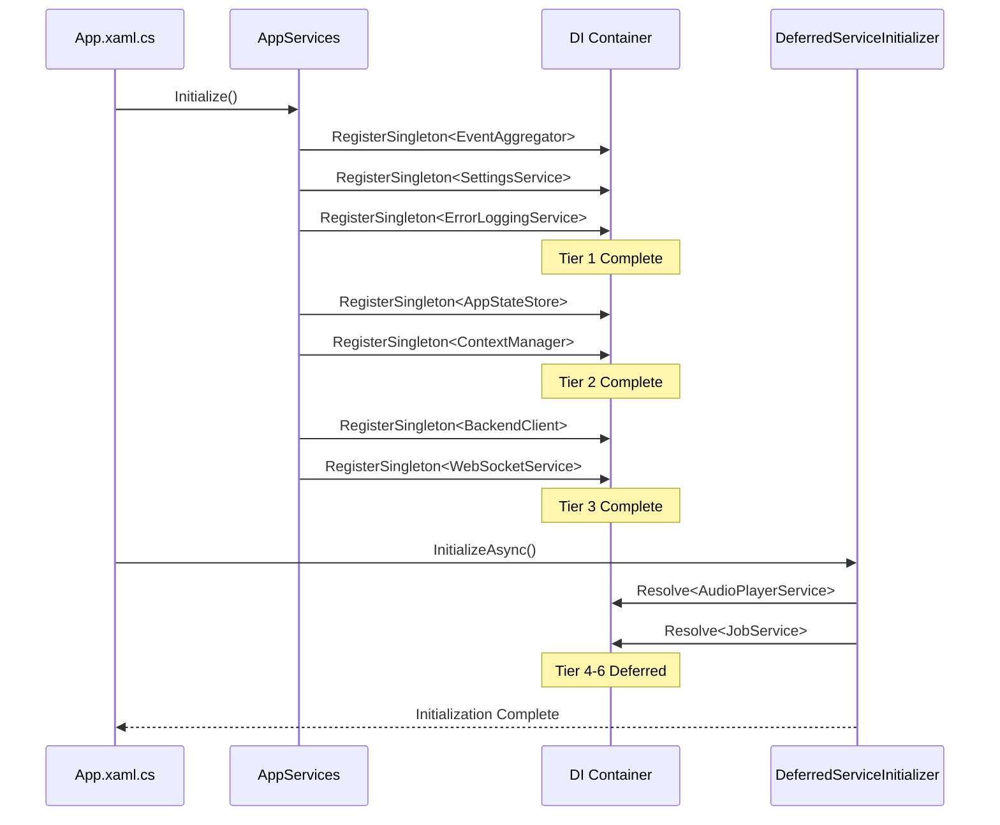

### 16.3 Multi-Service Collaboration Example: Clone from Library

This sequence shows how multiple services coordinate to accomplish a single user action.

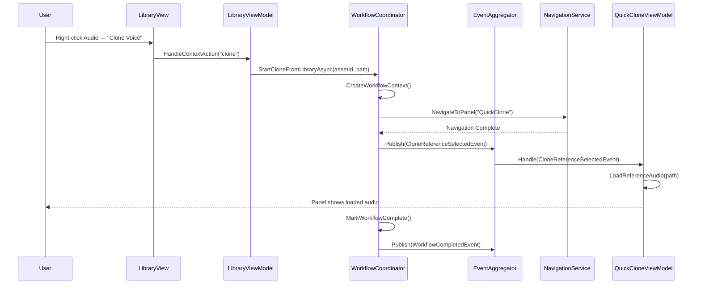

### 16.4 Error Propagation Chain

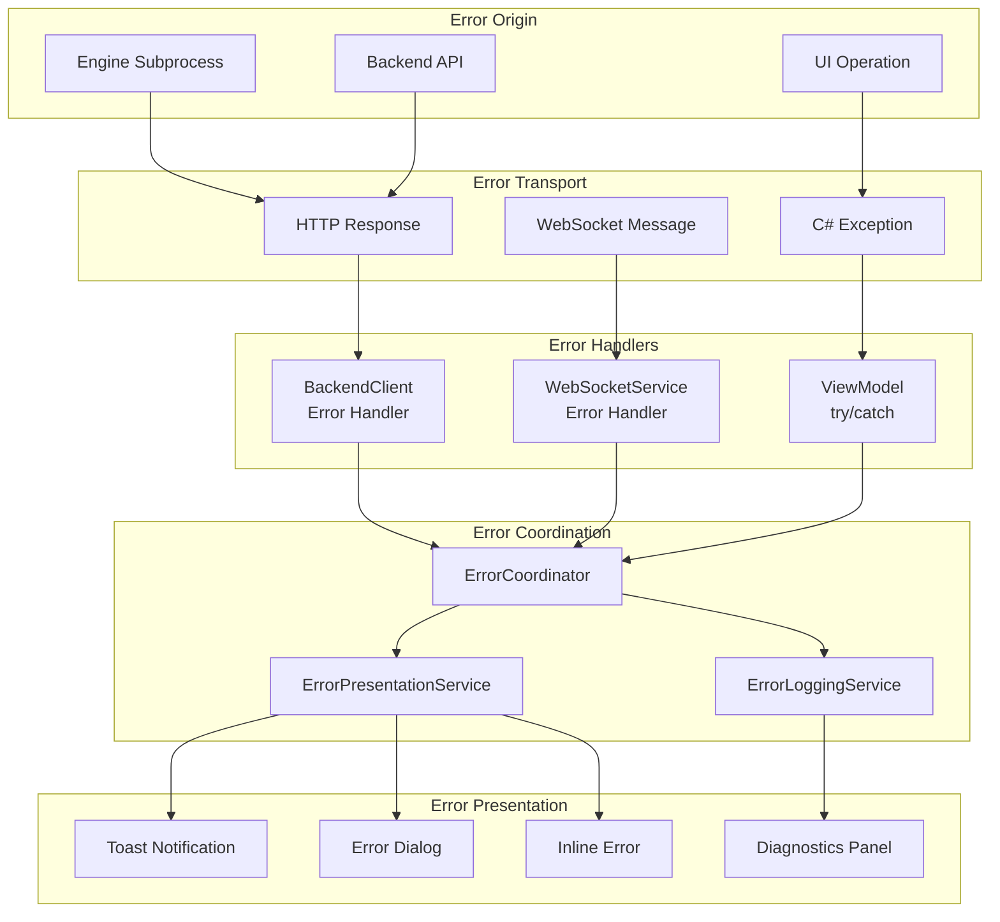

---

## 17. Micro-Level Data Flow Patterns

This section documents the subtle differences in how data flows through different pathways in the system.

### 17.1 Request-Response vs. Fire-and-Forget

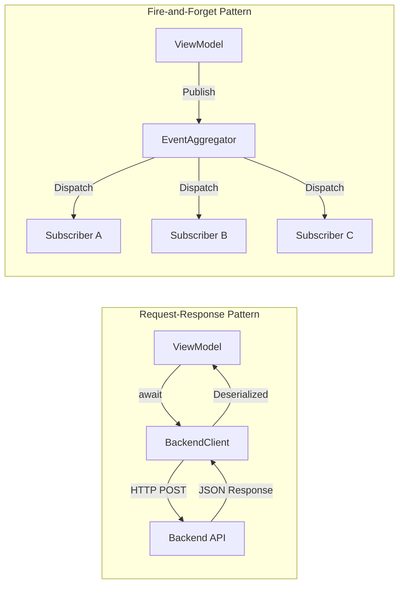

### 17.2 Data Transformation Pipeline

Shows the exact transformations as data moves between layers.

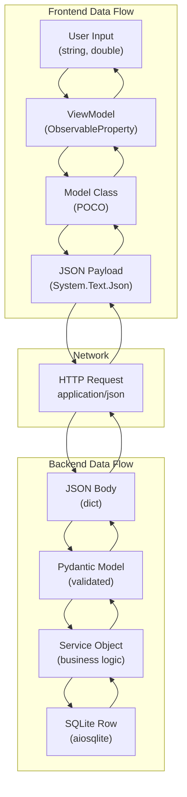

### 17.3 Type Mapping Differences

| Source Type (C#) | Wire Format | Target Type (Python) | Notes |
|------------------|-------------|---------------------|-------|
| `string` | `"value"` | `str` | Direct mapping |
| `int` | `123` | `int` | Direct mapping |
| `double` | `1.23` | `float` | Precision differences |
| `bool` | `true`/`false` | `bool` | Direct mapping |
| `DateTime` | `"2026-02-16T..."` | `datetime` | ISO 8601 format |
| `TimeSpan` | `"00:01:30"` or `90.0` | `float` (seconds) | **Inconsistent** |
| `Guid` | `"uuid-string"` | `str` | Not UUID type |
| `List<T>` | `[...]` | `list` | Direct mapping |
| `Dictionary<K,V>` | `{...}` | `dict` | Direct mapping |
| `enum` | `"EnumValue"` or `0` | `str` or `int` | **Inconsistent** |
| `null` | `null` | `None` | Direct mapping |

### 17.4 Audio Data Flow Differences

```mermaid
flowchart TB
    subgraph Synthesis["Synthesis Path"]
        S1["Text Input"] --> S2["Backend API"]
        S2 --> S3["Engine Subprocess"]
        S3 -->|WAV bytes| S4["File System"]
        S4 -->|File path| S2
        S2 -->|JSON + path| S5["Frontend"]
        S5 -->|Load file| S6["NAudio"]
    end

    subgraph Streaming["Streaming Path"]
        T1["Text Input"] --> T2["WebSocket"]
        T2 --> T3["Engine Subprocess"]
        T3 -->|Audio chunks| T2
        T2 -->|Base64 chunks| T4["StreamingAudioPlayer"]
        T4 -->|Decode + buffer| T5["NAudio"]
    end

    subgraph Recording["Recording Path"]
        R1["Microphone"] --> R2["NAudio Capture"]
        R2 -->|PCM samples| R3["MicrophoneRecordingService"]
        R3 -->|Save WAV| R4["File System"]
        R4 -->|File path| R5["Backend Upload"]
    end
```

### 17.5 Caching Behavior Differences

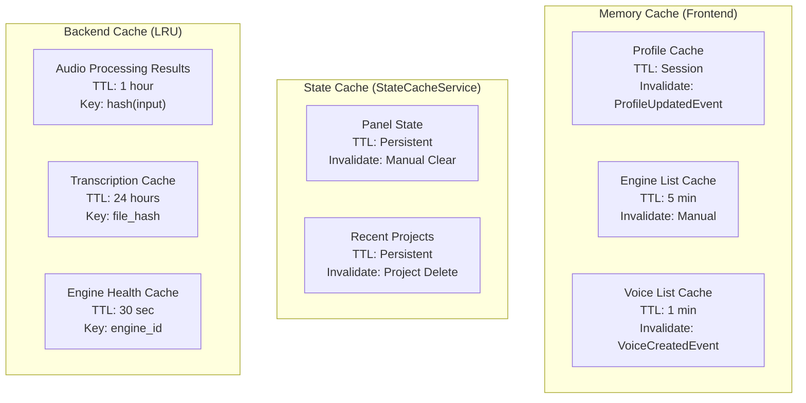

---

## 18. Event Propagation and Synchronization

### 18.1 UI Thread Dispatch Patterns

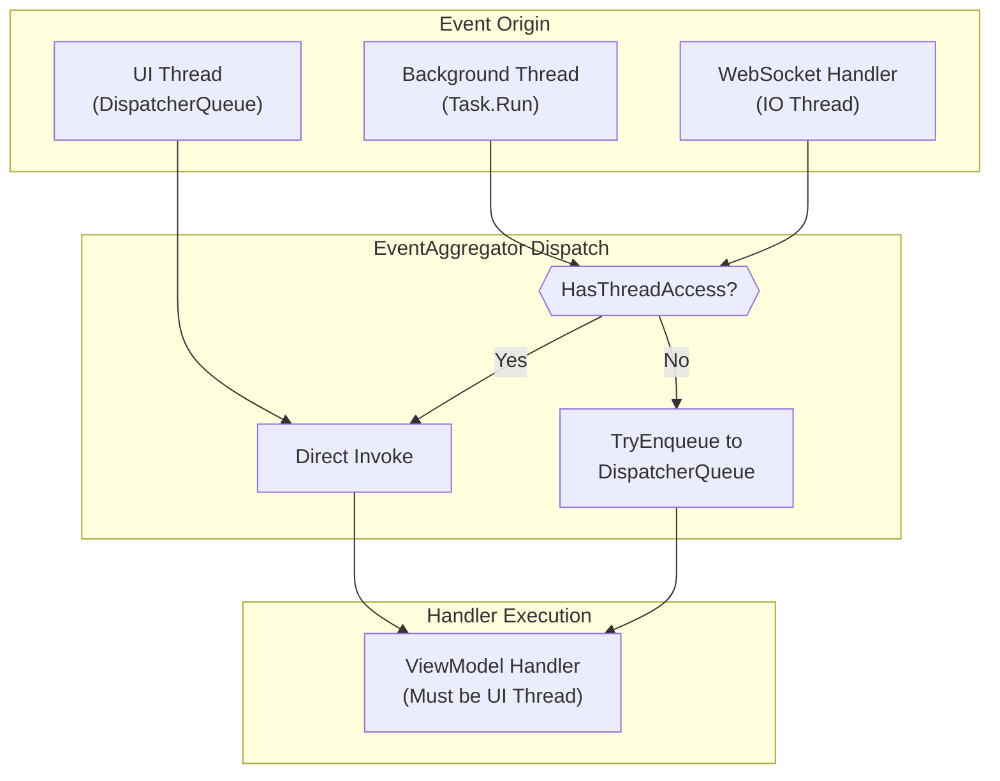

### 18.2 Event Deduplication and Coalescing

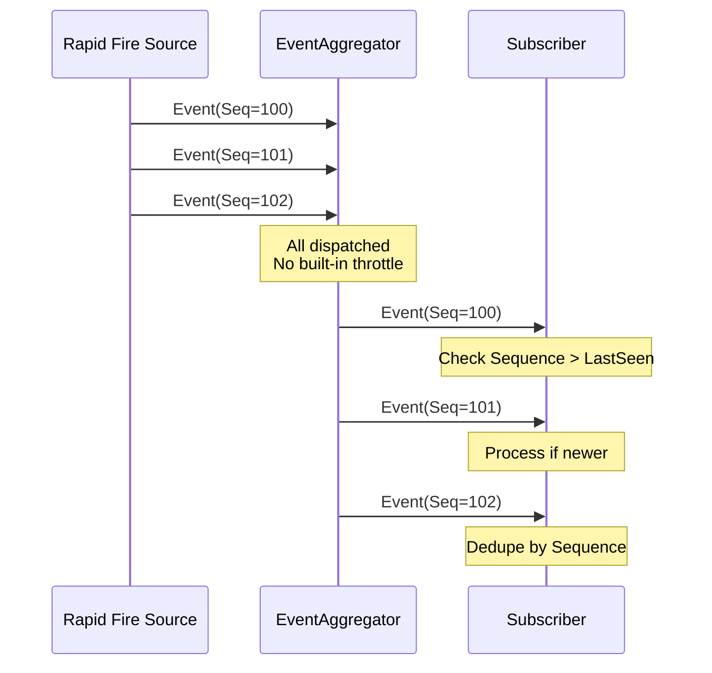

**Gap Identified**: No built-in throttling for high-frequency events. Subscribers must implement their own deduplication logic using `Sequence` numbers.

### 18.3 Replay Buffer for Debugging

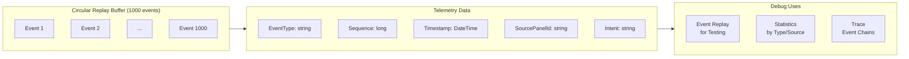

### 18.4 Cross-Panel Synchronization Timing

```mermaid
gantt
    title Event Propagation Timing
    dateFormat X
    axisFormat %L ms

    section Panel A
    User Action           :0, 5
    Publish Event         :5, 10

    section EventAggregator
    Assign Sequence       :10, 11
    Record Telemetry      :11, 12
    Dispatch Start        :12, 15

    section Panel B
    Receive Event         :15, 16
    UI Thread Queue       :16, 20
    Handler Execute       :20, 30

    section Panel C
    Receive Event         :15, 16
    UI Thread Queue       :16, 18
    Handler Execute       :18, 25
```

**Typical Latencies:**
- Event publish to dispatch: 2-5ms
- UI thread queue wait: 0-15ms (depends on UI load)
- Handler execution: 5-50ms (depends on complexity)
- Total end-to-end: 10-70ms

---

## 19. Resource Sharing and Coordination

### 19.1 Shared Resource Map

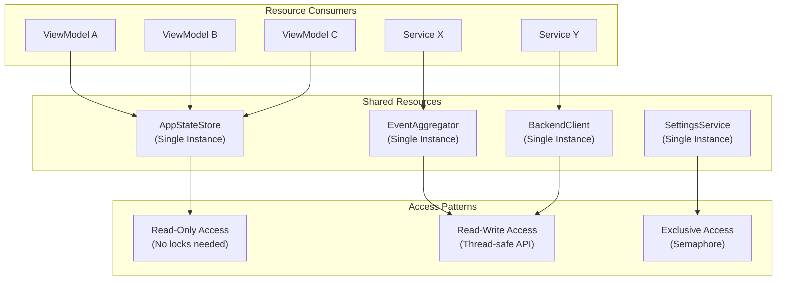

### 19.2 Concurrency Control Points

| Resource | Concurrency Mechanism | Contention Risk | Notes |
|----------|----------------------|-----------------|-------|
| AppStateStore | Immutable state + events | Low | Copy-on-write pattern |
| EventAggregator | ConcurrentDictionary + lock | Low | Per-event-type locking |
| BackendClient | HttpClient (thread-safe) | Medium | Connection pool limits |
| SettingsService | File lock + SemaphoreSlim | High | Disk I/O bottleneck |
| PanelStateService | Per-panel locks | Low | Isolated by panel ID |
| AudioPlayerService | SemaphoreSlim(1,1) | High | Only one playback at a time |
| WorkspaceService | ReaderWriterLockSlim | Medium | Multiple readers, single writer |

### 19.3 Audio Resource Contention

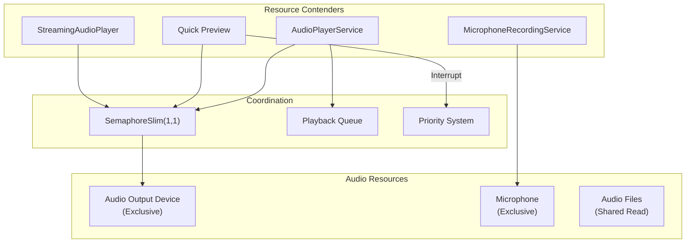

### 19.4 Backend Connection Pool Management

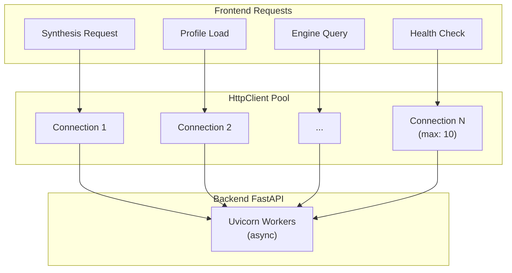

### 19.5 Memory Management Coordination

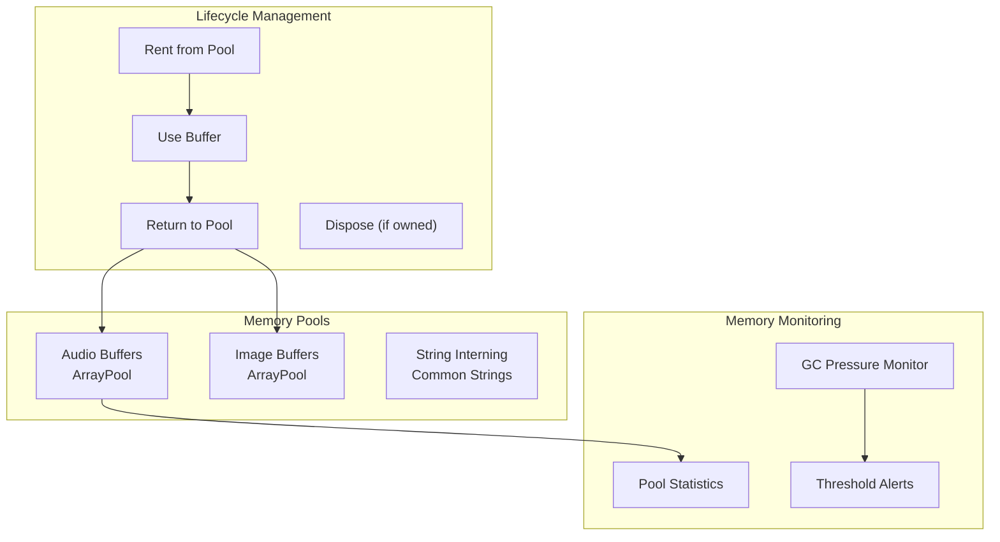

---

## 20. Backend Service Coordination

### 20.1 Backend Service Dependency Graph

```mermaid
flowchart TB
    subgraph Core["Core Services"]
        Engine["EngineService"]
        EngineConfig["EngineConfigService"]
        EngineInt["EngineIntegrationService"]
    end

    subgraph Domain["Domain Services"]
        InstantClone["InstantCloningService"]
        Translation["TranslationService"]
        LipSync["LipSyncService"]
        Dubbing["MultiSpeakerDubbingService"]
        Enhancement["AIAudioEnhancementService"]
    end

    subgraph Infra["Infrastructure Services"]
        Config["UnifiedConfigService"]
        Backup["BackupService"]
        Telemetry["TelemetryService"]
        Diagnostics["DiagnosticsService"]
        ErrorAnalysis["ErrorAnalysisService"]
    end

    subgraph Support["Support Services"]
        Security["SecurityService"]
        DataRetention["DataRetentionService"]
        Metrics["MetricsCleanupService"]
        ABTesting["ABTestingService"]
    end

    %% Dependencies
    InstantClone --> Engine
    Translation --> Engine
    LipSync --> Engine
    Dubbing --> Engine
    Dubbing --> Translation
    Enhancement --> Engine

    Engine --> EngineConfig
    Engine --> EngineInt

    InstantClone --> Config
    Backup --> Config
    Telemetry --> Config
```

### 20.2 Request Processing Pipeline

```mermaid
sequenceDiagram
    participant Client as Frontend
    participant Mid as Middleware Stack
    participant Route as Route Handler
    participant Svc as Service Layer
    participant Engine as Engine Subprocess

    Client->>Mid: HTTP Request
    
    rect rgb(240, 248, 255)
        Note over Mid: Middleware Chain
        Mid->>Mid: Request ID Middleware
        Mid->>Mid: CORS Middleware
        Mid->>Mid: Error Handler Middleware
        Mid->>Mid: Timing Middleware
    end

    Mid->>Route: Processed Request
    Route->>Route: Pydantic Validation
    Route->>Svc: Service Method Call

    rect rgb(255, 248, 240)
        Note over Svc: Service Logic
        Svc->>Svc: Business Validation
        Svc->>Engine: Subprocess Call (IPC)
        Engine-->>Svc: Result
        Svc->>Svc: Post-Processing
    end

    Svc-->>Route: Service Result
    Route-->>Mid: HTTP Response
    Mid-->>Client: JSON Response
```

### 20.3 Engine Subprocess Coordination

```mermaid
flowchart TB
    subgraph Backend["Backend Process"]
        Router["Engine Router"]
        Pool["Subprocess Pool"]
        Health["Health Monitor"]
    end

    subgraph Subprocesses["Engine Subprocesses"]
        E1["XTTS Engine<br/>PID: 1234"]
        E2["Bark Engine<br/>PID: 1235"]
        E3["Whisper Engine<br/>PID: 1236"]
    end

    subgraph IPC["IPC Channels"]
        Stdin["stdin (JSON request)"]
        Stdout["stdout (JSON response)"]
        Stderr["stderr (logs)"]
    end

    subgraph Lifecycle["Lifecycle Events"]
        Start["Start on Demand"]
        Idle["Idle Timeout"]
        Crash["Crash Recovery"]
        OOM["OOM Kill"]
    end

    Router --> Pool
    Pool --> E1
    Pool --> E2
    Pool --> E3

    E1 <--> Stdin
    E1 <--> Stdout
    E1 --> Stderr

    Health --> E1
    Health --> E2
    Health --> E3

    Crash --> Pool
    OOM --> Pool
```

---

## 21. Additional Interconnectivity Gaps

Based on the deep dive into interconnectivity patterns, the following additional gaps have been identified:

### 21.1 Frontend Interconnectivity Gaps

| ID | Severity | Gap | Impact | Recommended Fix |
|----|----------|-----|--------|-----------------|
| **GAP-I01** | Medium | No event throttling/coalescing | High-frequency events can overwhelm UI | Add built-in throttle to EventAggregator |
| **GAP-I02** | Medium | Inconsistent TimeSpan serialization | String vs. seconds float confusion | Standardize on ISO 8601 duration or seconds |
| **GAP-I03** | Low | No event priority system | Critical events wait behind updates | Add priority queue to EventAggregator |
| **GAP-I04** | Medium | Manual deduplication required | Subscribers must track sequences | Add automatic deduplication option |
| **GAP-I05** | Low | No event batching | Many small events vs. one batch | Add batch publish capability |

### 21.2 Backend Interconnectivity Gaps

| ID | Severity | Gap | Impact | Recommended Fix |
|----|----------|-----|--------|-----------------|
| **GAP-I06** | Medium | No service health aggregation | Individual checks, no system view | Create HealthAggregator service |
| **GAP-I07** | Medium | Engine subprocess orphan risk | Crashed parent leaves orphans | Implement proper process groups |
| **GAP-I08** | Low | No request correlation across services | Hard to trace multi-service calls | Add correlation ID propagation |
| **GAP-I09** | Medium | Inconsistent error code mapping | Engine errors vs. HTTP codes | Create unified error code registry |

### 21.3 Cross-Layer Interconnectivity Gaps

| ID | Severity | Gap | Impact | Recommended Fix |
|----|----------|-----|--------|-----------------|
| **GAP-I10** | High | No contract version negotiation | Breaking changes break clients | Implement version negotiation header |
| **GAP-I11** | Medium | Enum serialization inconsistency | String vs. int across boundaries | Standardize on string enums |
| **GAP-I12** | Low | No structured logging correlation | UI errors don't link to backend | Add trace ID to all layers |

---

## 22. Micro-Level Component Coordination

This section details the exact function-level interactions and handoffs that occur between components.

### 22.1 ViewModel Lifecycle Coordination

Each ViewModel goes through a precise lifecycle with specific coordination points.

```mermaid
sequenceDiagram
    participant View as View (XAML)
    participant DI as DI Container
    participant VM as ViewModel
    participant EA as EventAggregator
    participant Svc as Services

    Note over View: View Loaded
    View->>DI: Resolve<TViewModel>()
    DI->>VM: Constructor(dependencies)
    
    rect rgb(240, 255, 240)
        Note over VM: Initialization Phase
        VM->>VM: InitializeCommands()
        VM->>Svc: GetInitialData()
        Svc-->>VM: Data
        VM->>VM: PopulateProperties()
    end

    rect rgb(240, 240, 255)
        Note over VM: Subscription Phase
        VM->>EA: Subscribe<ProfileSelectedEvent>()
        EA-->>VM: ISubscriptionToken
        VM->>EA: Subscribe<ProjectChangedEvent>()
        EA-->>VM: ISubscriptionToken
    end

    View->>VM: OnNavigatedTo(params)
    VM->>VM: LoadStateFromParams()

    Note over View: User Interaction...

    View->>VM: OnNavigatingFrom()
    VM->>VM: SaveState()
    
    Note over View: View Unloaded
    View->>VM: Dispose()
    VM->>EA: Unsubscribe(tokens)
    VM->>Svc: Cleanup()
```

### 22.2 Panel Handoff Sequence

When one panel hands off work to another, this exact sequence occurs.

```mermaid
sequenceDiagram
    participant SourcePanel as Source Panel
    participant Workflow as WorkflowCoordinator
    participant NavSvc as NavigationService
    participant PanelHost as PanelHost
    participant TargetPanel as Target Panel
    participant EA as EventAggregator

    SourcePanel->>Workflow: StartWorkflowAsync(type, data)
    Workflow->>Workflow: CreateWorkflowContext()
    Workflow->>Workflow: ValidatePrerequisites()
    
    Workflow->>NavSvc: NavigateToPanel(targetId, params)
    NavSvc->>NavSvc: SaveCurrentPanelState()
    NavSvc->>PanelHost: ActivatePanel(targetId)
    
    PanelHost->>PanelHost: DeactivateCurrentPanel()
    PanelHost->>TargetPanel: Activate()
    TargetPanel->>TargetPanel: OnNavigatedTo(params)
    
    PanelHost-->>NavSvc: Panel Activated
    NavSvc-->>Workflow: Navigation Complete
    
    Workflow->>EA: Publish(HandoffEvent)
    EA->>TargetPanel: Handle(HandoffEvent)
    
    TargetPanel->>TargetPanel: ProcessHandoffData()
    TargetPanel-->>Workflow: Handoff Acknowledged
    
    Workflow->>Workflow: UpdateWorkflowStatus(Complete)
```

### 22.3 Service Method Call Chain

This shows the exact chain of method calls for a typical service operation.

```mermaid
flowchart TB
    subgraph ViewModel["ViewModel Layer"]
        VMMethod["SynthesisViewModel.SynthesizeAsync()"]
        VMValidate["ValidateInput()"]
        VMPrepare["PrepareRequest()"]
    end

    subgraph Gateway["Gateway Layer"]
        GWMethod["SynthesisGateway.SynthesizeAsync()"]
        GWMap["MapToRequest()"]
        GWCall["CallBackendAsync()"]
        GWParse["ParseResponse()"]
    end

    subgraph Client["BackendClient Layer"]
        ClientPost["PostAsync<T>()"]
        ClientSerialize["SerializeContent()"]
        ClientSend["HttpClient.SendAsync()"]
        ClientDeserialize["DeserializeResponse()"]
    end

    subgraph Error["Error Handling"]
        ErrCheck["CheckStatusCode()"]
        ErrMap["MapToException()"]
        ErrLog["LogError()"]
    end

    VMMethod --> VMValidate
    VMValidate -->|Valid| VMPrepare
    VMPrepare --> GWMethod

    GWMethod --> GWMap
    GWMap --> GWCall
    GWCall --> ClientPost

    ClientPost --> ClientSerialize
    ClientSerialize --> ClientSend
    ClientSend --> ErrCheck
    
    ErrCheck -->|Success| ClientDeserialize
    ErrCheck -->|Failure| ErrMap
    ErrMap --> ErrLog

    ClientDeserialize --> GWParse
    GWParse --> VMMethod
```

### 22.4 Specific Method Signatures and Contracts

| Layer | Method | Parameters | Returns | Side Effects |
|-------|--------|------------|---------|--------------|
| ViewModel | `SynthesizeAsync()` | `string text, CancellationToken ct` | `Task<SynthesisResult>` | Updates IsProcessing, publishes events |
| Gateway | `SynthesizeAsync()` | `SynthesisRequest request` | `Task<SynthesisResponse>` | None |
| BackendClient | `PostAsync<T>()` | `string path, object content` | `Task<T>` | Logs request/response |
| Backend Route | `synthesize()` | `SynthesisRequest body` | `SynthesisResponse` | Creates audio file, updates job status |
| Engine Service | `synthesize()` | `text, voice_id, params` | `AudioResult` | Loads model, generates audio |

### 22.5 Parameter Transformation at Each Boundary

```mermaid
flowchart LR
    subgraph UI["UI Layer (C#)"]
        UI1["string Text"]
        UI2["VoiceProfile SelectedVoice"]
        UI3["double Speed"]
    end

    subgraph Request["Request Object"]
        R1["text: string"]
        R2["voice_id: string"]
        R3["speed: double"]
    end

    subgraph JSON["JSON Wire Format"]
        J1['"text": "Hello"']
        J2['"voice_id": "uuid"']
        J3['"speed": 1.0']
    end

    subgraph Pydantic["Pydantic Model"]
        P1["text: str"]
        P2["voice_id: str"]
        P3["speed: float"]
    end

    subgraph Engine["Engine Parameters"]
        E1["text: str"]
        E2["voice_config: dict"]
        E3["speed_factor: float"]
    end

    UI1 --> R1 --> J1 --> P1 --> E1
    UI2 -->|".Id"| R2 --> J2 --> P2 -->|"load config"| E2
    UI3 --> R3 --> J3 --> P3 --> E3
```

---

## 23. Function-Level Data Handoffs

### 23.1 Audio Data Handoff Points

```mermaid
flowchart TB
    subgraph Generation["Audio Generation"]
        Gen1["Engine generates<br/>numpy.ndarray (float32)"]
        Gen2["Convert to bytes<br/>struct.pack()"]
        Gen3["Write WAV file<br/>scipy.io.wavfile"]
    end

    subgraph Backend["Backend Processing"]
        Back1["Read WAV file<br/>audio_utils.load()"]
        Back2["Process (normalize)<br/>numpy operations"]
        Back3["Save result<br/>soundfile.write()"]
    end

    subgraph Response["Response Handling"]
        Resp1["Return file path<br/>str"]
        Resp2["JSON serialize<br/>{'path': '/...'}"]
        Resp3["HTTP response<br/>200 OK + JSON"]
    end

    subgraph Frontend["Frontend Loading"]
        Front1["Parse JSON<br/>System.Text.Json"]
        Front2["Create Uri<br/>new Uri(path)"]
        Front3["Load audio<br/>NAudio.Open()"]
    end

    Gen1 --> Gen2 --> Gen3
    Gen3 --> Back1 --> Back2 --> Back3
    Back3 --> Resp1 --> Resp2 --> Resp3
    Resp3 --> Front1 --> Front2 --> Front3
```

### 23.2 Profile Data Handoff

| Handoff Point | Source Format | Target Format | Transformation |
|---------------|---------------|---------------|----------------|
| UI → ViewModel | `SelectedItem` (object) | `VoiceProfile` | Direct cast |
| ViewModel → Gateway | `VoiceProfile` | `ProfileRequest` | Property mapping |
| Gateway → BackendClient | `ProfileRequest` | `JsonContent` | Serialize |
| HTTP → Backend | `bytes` | `dict` | JSON parse |
| Backend → Pydantic | `dict` | `ProfileModel` | Validation |
| Pydantic → Service | `ProfileModel` | `Profile` entity | ORM mapping |
| Service → Repository | `Profile` | SQL parameters | Column mapping |
| Repository → SQLite | SQL params | Row data | Type coercion |

### 23.3 Return Value Propagation

```mermaid
sequenceDiagram
    participant Engine as Engine Subprocess
    participant Service as Backend Service
    participant Route as Route Handler
    participant Client as BackendClient
    participant VM as ViewModel
    participant UI as UI Binding

    Engine->>Service: {"success": true, "audio_path": "/path"}
    Note over Service: Validate result
    Service->>Service: Add metadata
    Service->>Route: AudioResult(path, duration, format)
    
    Route->>Route: Convert to response model
    Route->>Client: HTTP 200 + JSON body
    
    Client->>Client: Deserialize to SynthesisResponse
    Client->>VM: Task<SynthesisResponse> completes
    
    VM->>VM: Extract properties
    VM->>VM: Update ObservableProperties
    VM->>UI: PropertyChanged notifications
    
    UI->>UI: Rebind controls
    UI->>UI: Update visual state
```

### 23.4 Null Handling Across Boundaries

| Boundary | C# Null | Wire Format | Python Equivalent | Handling Strategy |
|----------|---------|-------------|-------------------|-------------------|
| ViewModel → Request | `null` | Omitted or `null` | Missing key or `None` | Optional fields |
| Request → JSON | `null` | `"field": null` | `None` | Explicit null |
| JSON → Pydantic | `null` | `None` | `Optional[T]` | Default values |
| Pydantic → Service | `None` | N/A | `None` | Guard clauses |
| Service → DB | `None` | `NULL` | SQL NULL | Nullable columns |
| DB → Service | `NULL` | `None` | `None` | Handle in code |
| Response → Client | `null` | Nullable property | `null` | Null-conditional |

---

## 24. Concurrent Operation Coordination

### 24.1 Lock Acquisition Order

To prevent deadlocks, services acquire locks in a consistent order.

```mermaid
flowchart TB
    subgraph LockOrder["Lock Acquisition Order (Always Top-to-Bottom)"]
        L1["1. AppStateStore._lock"]
        L2["2. EventAggregator._lock"]
        L3["3. SettingsService._semaphore"]
        L4["4. AudioPlayerService._playbackLock"]
        L5["5. WorkspaceService._rwLock"]
        L6["6. PanelStateService._panelLocks[id]"]
    end

    L1 --> L2 --> L3 --> L4 --> L5 --> L6

    subgraph Violation["DEADLOCK RISK"]
        V1["Thread A: Lock(L4) → Lock(L2)"]
        V2["Thread B: Lock(L2) → Lock(L4)"]
    end
```

### 24.2 Async Coordination Patterns

```mermaid
sequenceDiagram
    participant UI as UI Thread
    participant BG as Background Task
    participant Sem as SemaphoreSlim
    participant Resource as Shared Resource

    UI->>BG: Task.Run(operation)
    BG->>Sem: WaitAsync()
    Note over Sem: Count: 1 → 0
    Sem-->>BG: Acquired

    BG->>Resource: Read/Write
    Resource-->>BG: Result

    BG->>Sem: Release()
    Note over Sem: Count: 0 → 1

    BG->>UI: DispatcherQueue.TryEnqueue()
    UI->>UI: Update UI
```

### 24.3 Cancellation Token Propagation

```mermaid
flowchart TB
    subgraph Sources["Cancellation Sources"]
        User["User Cancel Button"]
        Timeout["Operation Timeout"]
        Dispose["ViewModel Dispose"]
    end

    subgraph Linking["Token Linking"]
        CTS["CancellationTokenSource"]
        Linked["CreateLinkedTokenSource()"]
        Token["CancellationToken"]
    end

    subgraph Propagation["Token Propagation"]
        VM["ViewModel method"]
        Gateway["Gateway method"]
        Client["HttpClient.SendAsync()"]
        Backend["Backend (timeout only)"]
    end

    User --> CTS
    Timeout --> CTS
    Dispose --> CTS

    CTS --> Linked
    Linked --> Token

    Token --> VM
    VM -->|Pass token| Gateway
    Gateway -->|Pass token| Client
    Client -->|Aborts request| Backend
```

### 24.4 Race Condition Prevention Points

| Location | Race Condition Risk | Prevention Mechanism |
|----------|---------------------|---------------------|
| `EventAggregator.Publish()` | Concurrent subscription modification | `ConcurrentDictionary` + lock on list |
| `AppStateStore.Dispatch()` | Concurrent state mutations | Single-threaded dispatch queue |
| `AudioPlayerService.Play()` | Multiple concurrent plays | `SemaphoreSlim(1,1)` |
| `SettingsService.Save()` | Concurrent file writes | File lock + semaphore |
| `BackendClient.SendAsync()` | Connection pool exhaustion | `HttpClient` connection limits |
| `WorkspaceService.Save()` | Read during write | `ReaderWriterLockSlim` |

---

## 25. Teamwork Patterns

This section describes how components work together as a team to accomplish complex tasks.

### 25.1 Panel Communication Matrix

Detailed matrix showing which panels send events to which other panels.

```mermaid
flowchart TB
    subgraph Senders["Event Senders"]
        S1["Library"]
        S2["Synthesis"]
        S3["Timeline"]
        S4["Profiles"]
        S5["Training"]
        S6["Batch"]
    end

    subgraph Events["Event Types"]
        E1["AssetSelected"]
        E2["SynthesisCompleted"]
        E3["PlaybackStateChanged"]
        E4["ProfileSelected"]
        E5["JobProgress"]
        E6["JobStarted"]
    end

    subgraph Receivers["Event Receivers"]
        R1["Timeline"]
        R2["Library"]
        R3["AudioMeter"]
        R4["Synthesis"]
        R5["Diagnostics"]
        R6["StatusBar"]
    end

    S1 --> E1 --> R1
    S2 --> E2 --> R2
    S2 --> E2 --> R1
    S3 --> E3 --> R3
    S4 --> E4 --> R4
    S5 --> E5 --> R5
    S5 --> E5 --> R6
    S6 --> E6 --> R5
    S6 --> E6 --> R6
```

### 25.2 Service Teamwork for Synthesis Workflow

```mermaid
flowchart TB
    subgraph Team["Service Team"]
        VM["SynthesisViewModel<br/>(Coordinator)"]
        Context["ContextManager<br/>(State Provider)"]
        Gateway["SynthesisGateway<br/>(Communication)"]
        Job["JobService<br/>(Progress Tracking)"]
        Audio["AudioPlayerService<br/>(Playback)"]
        EA["EventAggregator<br/>(Notification)"]
    end

    subgraph Workflow["Synthesis Workflow"]
        W1["1. Get active profile"]
        W2["2. Validate input"]
        W3["3. Create job"]
        W4["4. Call backend"]
        W5["5. Track progress"]
        W6["6. Play result"]
        W7["7. Notify panels"]
    end

    VM --> W1
    W1 --> Context
    Context --> W2

    W2 --> W3
    W3 --> Job

    W3 --> W4
    W4 --> Gateway

    Gateway --> W5
    W5 --> Job
    Job --> EA

    W5 --> W6
    W6 --> Audio

    W6 --> W7
    W7 --> EA
```

### 25.3 Cross-Layer Handoff Protocol

The complete protocol for handing data across all three layers.

```mermaid
sequenceDiagram
    participant UI as UI Layer
    participant Backend as Backend Layer
    participant Engine as Engine Layer

    Note over UI,Engine: Phase 1: Request Preparation
    UI->>UI: Validate user input
    UI->>UI: Serialize to JSON
    UI->>Backend: HTTP POST /api/v3/synthesize

    Note over UI,Engine: Phase 2: Backend Processing
    Backend->>Backend: Validate request (Pydantic)
    Backend->>Backend: Authorize operation
    Backend->>Backend: Select engine (Router)
    Backend->>Engine: IPC: JSON request via stdin

    Note over UI,Engine: Phase 3: Engine Execution
    Engine->>Engine: Load model (if needed)
    Engine->>Engine: Process request
    Engine->>Engine: Generate output
    Engine->>Backend: IPC: JSON response via stdout

    Note over UI,Engine: Phase 4: Response Handling
    Backend->>Backend: Validate engine response
    Backend->>Backend: Post-process (normalize, etc.)
    Backend->>Backend: Store result (file + DB)
    Backend->>UI: HTTP 200 + JSON response

    Note over UI,Engine: Phase 5: UI Update
    UI->>UI: Deserialize response
    UI->>UI: Update ViewModel properties
    UI->>UI: Trigger UI bindings
    UI->>UI: Publish completion event
```

### 25.4 Failure Recovery Coordination

When a component fails, other components coordinate recovery.

| Failing Component | Detecting Component | Recovery Action | Coordinator |
|-------------------|---------------------|-----------------|-------------|
| Engine subprocess | EngineService | Restart subprocess | Backend |
| Backend API | BackendConnectionMonitor | Show offline banner, queue requests | Frontend |
| WebSocket | WebSocketService | Reconnect with backoff | Frontend |
| Audio playback | AudioPlayerService | Release resources, notify user | Frontend |
| File save | SettingsService | Retry with backup location | Frontend |
| Database | Repository | Return cached data, queue writes | Backend |

### 25.5 Coordination Timing Requirements

| Coordination Point | Max Latency | Timeout | Retry Strategy |
|--------------------|-------------|---------|----------------|
| Panel event dispatch | 50ms | N/A | Fire-and-forget |
| Backend API call | 30s | 60s | 3 retries with backoff |
| Engine subprocess start | 30s | 120s | 1 retry |
| WebSocket reconnect | 100ms | 30s | Exponential backoff |
| File system operation | 5s | 30s | 3 retries |
| Database query | 1s | 10s | 2 retries |

### 25.6 Team Responsibility Matrix (RACI)

| Task | ViewModel | Service | Gateway | Backend | Engine |
|------|:---------:|:-------:|:-------:|:-------:|:------:|
| User input validation | **R** | C | - | - | - |
| State management | A | **R** | - | - | - |
| API communication | A | - | **R** | I | - |
| Business logic | I | A | - | **R** | - |
| ML inference | - | - | - | A | **R** |
| Error presentation | **R** | C | I | - | - |
| Progress reporting | A | **R** | I | C | C |

**R** = Responsible, **A** = Accountable, **C** = Consulted, **I** = Informed

---

## 26. Exact Data Structures and Memory Layouts

This section documents the precise in-memory representations of key data structures.

### 26.1 AppStateStore Internal Structure

```mermaid
classDiagram
    class AppStateStore {
        -object _lock
        -Stack~UndoFrame~ _undoStack
        -Stack~UndoFrame~ _redoStack
        -List~SubscriptionEntry~ _subscriptions
        -int _maxUndoHistory [default: 100]
        -AppState _state
        -int _subscriptionId
        +State: AppState
        +CanUndo: bool
        +CanRedo: bool
        +UndoCount: int
        +RedoCount: int
        +Dispatch(IStateCommand)
        +Subscribe(selector, callback): IDisposable
        +Undo(): bool
        +Redo(): bool
    }

    class UndoFrame {
        +AppState PreviousState
        +IStateCommand Command
        +DateTime Timestamp
        +string Description
    }

    class SubscriptionEntry {
        +int Id
        +Func~AppState,object~ Selector
        +Action~object~ Callback
        +object LastValue
    }

    AppStateStore *-- UndoFrame : contains
    AppStateStore *-- SubscriptionEntry : manages
```

### 26.2 Memory Usage by Component

| Component | Typical Size | Max Size | Growth Pattern |
|-----------|--------------|----------|----------------|
| AppStateStore | 2-5 MB | 50 MB | Linear with undo history |
| EventAggregator replay buffer | 100 KB | 10 MB | Circular (capped at 1000 events) |
| BackendClient connection pool | 1 MB | 5 MB | Fixed pool size |
| Audio playback buffer | 64 KB | 4 MB | Per-stream allocation |
| ViewModel cache | 500 KB | 20 MB | LRU eviction |
| Engine model (GPU) | 500 MB | 8 GB | Per-engine, lazy loaded |

### 26.3 EventAggregator Internal Structure

```mermaid
classDiagram
    class EventAggregator {
        -ConcurrentDictionary~Type,List~Subscription~~ _subscriptions
        -object _lock
        -DispatcherQueue? _dispatcherQueue
        -long _sequenceCounter
        -Action~EventTelemetry~? _telemetryCallback
        -ConcurrentQueue~EventTelemetry~ _replayBuffer
        -const int MaxReplayBufferSize = 1000
        +IsTelemetryEnabled: bool
        +Publish~T~(event): long
        +Subscribe~T~(handler): ISubscriptionToken
        +EnableTelemetry(callback)
        +GetReplayBuffer(): IReadOnlyList
    }

    class Subscription {
        +int Id
        +Action~object~ Handler
        +WeakReference~object~? WeakTarget
        +bool DispatchToUIThread
    }

    class EventTelemetry {
        +long SequenceNumber
        +Type EventType
        +DateTime Timestamp
        +string SourcePanel
        +int SubscriberCount
        +TimeSpan DispatchDuration
    }

    EventAggregator *-- Subscription : manages
    EventAggregator *-- EventTelemetry : records
```

### 26.4 Exact Field Sizes (C# Types)

| Type | Field | CLR Size | Notes |
|------|-------|----------|-------|
| `AppState` | Root | 24 bytes | Reference type header |
| `UndoFrame` | Each | 48 bytes | Plus referenced data |
| `Subscription` | Each | 32 bytes | Plus handler delegate |
| `EventTelemetry` | Each | 64 bytes | Plus string allocations |
| `SynthesisRequest` | Typical | 256 bytes | Excluding audio data |
| `VoiceProfile` | Each | 512 bytes | Plus embedding vectors |

---

## 27. Circuit Breaker and Resilience Patterns

### 27.1 Circuit Breaker State Machine

```mermaid
stateDiagram-v2
    [*] --> CLOSED
    
    CLOSED --> OPEN : failure_count >= threshold
    CLOSED --> CLOSED : success (reset counter)
    
    OPEN --> HALF_OPEN : recovery_timeout elapsed
    OPEN --> OPEN : request blocked
    
    HALF_OPEN --> CLOSED : success_count >= success_threshold
    HALF_OPEN --> OPEN : any failure
    HALF_OPEN --> HALF_OPEN : success (increment)
```

### 27.2 Circuit Breaker Configuration Values

| Parameter | Default | Range | Purpose |
|-----------|---------|-------|---------|
| `failure_threshold` | 3 | 1-10 | Failures before opening |
| `success_threshold` | 2 | 1-5 | Successes to close from half-open |
| `recovery_timeout` | 60.0s | 10-300s | Wait before half-open |
| `half_open_max_calls` | 3 | 1-10 | Max concurrent in half-open |

### 27.3 Per-Engine Circuit Breaker Settings

| Engine | Failure Threshold | Recovery Timeout | Notes |
|--------|-------------------|------------------|-------|
| XTTS v2 | 3 | 60s | GPU memory issues common |
| Bark | 2 | 90s | High resource usage |
| Piper | 5 | 30s | CPU-only, more resilient |
| Whisper | 3 | 45s | Model loading delays |
| OpenVoice | 3 | 60s | Default settings |
| Chatterbox | 3 | 60s | Default settings |

### 27.4 Circuit Breaker Statistics Tracking

```mermaid
flowchart TB
    subgraph Stats["CircuitBreakerStats Fields"]
        S1["name: str"]
        S2["state: CircuitState"]
        S3["failure_count: int"]
        S4["success_count: int"]
        S5["last_failure_time: float | None"]
        S6["last_success_time: float | None"]
        S7["open_count: int"]
        S8["total_calls: int"]
        S9["total_failures: int"]
        S10["total_blocked: int"]
    end

    subgraph Metrics["Derived Metrics"]
        M1["failure_rate = total_failures / total_calls"]
        M2["block_rate = total_blocked / total_calls"]
        M3["mttr = avg(recovery_time)"]
    end

    Stats --> Metrics
```

---

## 28. GPU Orchestration Details

### 28.1 GPU Memory State Thresholds

```mermaid
flowchart LR
    subgraph States["GPUMemoryState"]
        LOW["LOW<br/>< 50%"]
        MEDIUM["MEDIUM<br/>50-80%"]
        HIGH["HIGH<br/>80-95%"]
        CRITICAL["CRITICAL<br/>> 95%"]
    end

    LOW -->|"utilization increases"| MEDIUM
    MEDIUM -->|"utilization increases"| HIGH
    HIGH -->|"utilization increases"| CRITICAL
    CRITICAL -->|"model unloaded"| HIGH
    HIGH -->|"model unloaded"| MEDIUM
    MEDIUM -->|"model unloaded"| LOW
```

### 28.2 GPU Selection Algorithm

```mermaid
flowchart TB
    Start["Request Arrives"] --> Detect["Detect Available GPUs"]
    Detect --> Filter["Filter by Requirements"]
    
    Filter --> Check1{"Memory<br/>Sufficient?"}
    Check1 -->|No| NextGPU["Try Next GPU"]
    Check1 -->|Yes| Check2{"Memory State<br/>< HIGH?"}
    
    Check2 -->|No| NextGPU
    Check2 -->|Yes| Check3{"Temp < 85°C?"}
    
    Check3 -->|No| NextGPU
    Check3 -->|Yes| Score["Calculate Score"]
    
    Score --> Select["Select Highest Score"]
    Select --> Assign["Assign Workload"]
    
    NextGPU --> Check1
    NextGPU -->|"No more GPUs"| Fallback["Use CPU Fallback"]
```

### 28.3 GPU Scoring Formula

```
Score = (AvailableMemory / TotalMemory) * 0.4
      + (1 - Utilization) * 0.3
      + (1 - (Temperature / 100)) * 0.2
      + ComputeCapabilityBonus * 0.1

ComputeCapabilityBonus:
  - SM 8.0+ (Ampere): 1.0
  - SM 7.5 (Turing): 0.8
  - SM 7.0 (Volta): 0.6
  - SM 6.x (Pascal): 0.4
  - Earlier: 0.2
```

### 28.4 GPU Info Data Structure

| Field | Type | Source | Update Frequency |
|-------|------|--------|------------------|
| `device_id` | int | Driver | Static |
| `name` | str | Driver | Static |
| `vendor` | GPUVendor | Detection | Static |
| `total_memory_mb` | int | Driver | Static |
| `available_memory_mb` | int | nvidia-smi | 1s |
| `compute_capability` | tuple | Driver | Static |
| `temperature_c` | float | nvidia-smi | 1s |
| `utilization_percent` | float | nvidia-smi | 1s |
| `power_usage_watts` | float | nvidia-smi | 1s |
| `is_available` | bool | Computed | On-demand |

---

## 29. Precise Timing and Latency Budgets

### 29.1 End-to-End Latency Breakdown (Synthesis)

```mermaid
gantt
    title Synthesis Request Latency Breakdown
    dateFormat X
    axisFormat %L ms
    
    section Frontend
    Input validation      :0, 5
    Request serialization :5, 10
    HTTP overhead         :10, 25
    
    section Network
    Request transit       :25, 35
    
    section Backend
    Request parsing       :35, 40
    Auth/validation       :40, 45
    Engine routing        :45, 50
    IPC to engine         :50, 55
    
    section Engine
    Model load (cached)   :55, 60
    Inference             :60, 500
    Audio encoding        :500, 520
    
    section Backend Return
    IPC from engine       :520, 525
    Response assembly     :525, 530
    
    section Network
    Response transit      :530, 540
    
    section Frontend
    Response parsing      :540, 545
    UI update dispatch    :545, 550
    Audio player load     :550, 560
```

### 29.2 Component-Level SLAs

| Component | P50 | P95 | P99 | Max |
|-----------|-----|-----|-----|-----|
| ViewModel command | 1ms | 5ms | 20ms | 100ms |
| EventAggregator dispatch | 0.1ms | 1ms | 5ms | 50ms |
| BackendClient roundtrip | 15ms | 50ms | 150ms | 5000ms |
| Engine inference (short) | 200ms | 500ms | 1000ms | 5000ms |
| Engine inference (long) | 2000ms | 5000ms | 10000ms | 60000ms |
| File write | 5ms | 20ms | 100ms | 1000ms |
| SQLite query | 1ms | 5ms | 20ms | 500ms |

### 29.3 Timeout Configuration Matrix

| Operation | Connect | Read | Write | Total | Retry |
|-----------|---------|------|-------|-------|-------|
| Backend health check | 2s | 5s | - | 10s | 3x |
| Synthesis request | 5s | 60s | - | 120s | 1x |
| Streaming audio | 5s | ∞ | - | - | Auto-reconnect |
| File upload | 5s | - | 120s | 180s | 2x |
| WebSocket connect | 5s | - | - | 30s | Exp. backoff |
| Engine subprocess | 30s | - | - | 120s | 1x |

### 29.4 Memory Pool Configurations

| Pool | Initial Size | Max Size | Growth | Shrink |
|------|--------------|----------|--------|--------|
| HTTP connections | 10 | 100 | +10 on demand | -10 every 60s idle |
| WebSocket buffers | 4 KB | 64 KB | 2x on overflow | On close |
| Audio buffers | 64 KB | 4 MB | As needed | On stop |
| String interns | 1000 | 10000 | LRU | Never |

---

## 30. Error Classification Taxonomy

### 30.1 Error Severity Levels

```mermaid
flowchart TB
    subgraph Severity["Error Severity Classification"]
        S0["S0: CRITICAL<br/>System unusable"]
        S1["S1: HIGH<br/>Feature broken"]
        S2["S2: MEDIUM<br/>Degraded experience"]
        S3["S3: LOW<br/>Minor inconvenience"]
        S4["S4: INFO<br/>Logged only"]
    end

    subgraph Response["Response SLA"]
        R0["Immediate escalation<br/>P0 incident"]
        R1["Fix within 4 hours"]
        R2["Fix within 24 hours"]
        R3["Next sprint"]
        R4["No action required"]
    end

    S0 --> R0
    S1 --> R1
    S2 --> R2
    S3 --> R3
    S4 --> R4
```

### 30.2 Error Code Ranges

| Range | Category | Layer | Example |
|-------|----------|-------|---------|
| 1000-1999 | Validation | Frontend | 1001: Invalid input format |
| 2000-2999 | Network | Frontend | 2001: Connection timeout |
| 3000-3999 | Business Logic | Backend | 3001: Voice not found |
| 4000-4999 | Engine | Engine | 4001: Model load failed |
| 5000-5999 | Infrastructure | Any | 5001: Disk full |
| 6000-6999 | Security | Any | 6001: Auth failed |
| 7000-7999 | Resource | Any | 7001: GPU OOM |

### 30.3 Error Propagation Rules

| Origin | Frontend Action | User Message | Log Level |
|--------|-----------------|--------------|-----------|
| Validation (1xxx) | Inline field error | Specific guidance | DEBUG |
| Network (2xxx) | Toast + retry option | "Connection issue" | WARN |
| Business (3xxx) | Dialog with details | Error details | INFO |
| Engine (4xxx) | Dialog + suggest fallback | "Processing failed" | ERROR |
| Infrastructure (5xxx) | Critical alert | "System error" | ERROR |
| Security (6xxx) | Force re-auth | "Session expired" | WARN |
| Resource (7xxx) | Dialog + suggest action | "Resource exhausted" | ERROR |

### 30.4 Recovery Action Matrix

| Error Category | Auto-Retry | User Action Required | Fallback Available |
|----------------|------------|---------------------|-------------------|
| Transient network | Yes (3x exp. backoff) | No | No |
| Engine timeout | Yes (1x) | No | Different engine |
| GPU OOM | No | Close other apps | CPU fallback |
| Invalid input | No | Fix input | No |
| Auth expired | No | Re-authenticate | No |
| Model missing | No | Download model | Different engine |
| Disk full | No | Free space | No |

---

## 31. Distributed Tracing Implementation

### 31.1 Trace Context Propagation

```mermaid
sequenceDiagram
    participant UI as Frontend
    participant Handler as CorrelationIdHandler
    participant Backend as Backend API
    participant Engine as Engine Subprocess

    UI->>Handler: HTTP Request
    Note over Handler: Generate if missing:<br/>X-Correlation-Id: guid<br/>traceparent: 00-trace-span-01
    Handler->>Backend: Request + Headers

    Backend->>Backend: Extract trace context
    Note over Backend: Log with trace_id
    Backend->>Engine: IPC + trace_id in payload

    Engine->>Engine: Log with trace_id
    Engine->>Backend: Response + trace_id
    Backend->>UI: Response + trace headers
```

### 31.2 Trace Header Format

| Header | Format | Example |
|--------|--------|---------|
| `X-Correlation-Id` | GUID (N format) | `a1b2c3d4e5f6...` |
| `traceparent` | `version-traceid-spanid-flags` | `00-abc123...-def456...-01` |
| `X-Trace-Id` | GUID (N format) | `abc123...` |
| `X-Span-Id` | 16 hex chars | `def456...` |

### 31.3 Log Correlation Fields

| Field | Description | Example |
|-------|-------------|---------|
| `correlation_id` | Request correlation | `a1b2c3d4...` |
| `trace_id` | Distributed trace ID | `abc123...` |
| `span_id` | Current operation span | `def456...` |
| `parent_span_id` | Parent operation | `ghi789...` |
| `service` | Service name | `backend`, `xtts_v2` |
| `operation` | Operation name | `synthesize`, `load_model` |
| `duration_ms` | Operation duration | `250` |

---

## 32. Button Interconnectivity Architecture

This section documents the complete button/command infrastructure and identifies all interconnectivity gaps.

### 32.1 Command System Architecture

```mermaid
flowchart TB
    subgraph UI["UI Layer"]
        Button["Button/MenuItem"]
        Shortcut["Keyboard Shortcut"]
        Palette["Command Palette"]
        Toolbar["Customizable Toolbar"]
    end

    subgraph Routing["Command Routing"]
        Router["CommandRouter"]
        Registry["UnifiedCommandRegistry"]
        KBService["KeyboardShortcutService"]
    end

    subgraph Execution["Command Execution"]
        Handler["ICommandHandler"]
        SyncH["ISyncCommandHandler"]
        AsyncH["IAsyncCommandHandler"]
    end

    subgraph State["State Updates"]
        CanExec["CanExecuteChanged"]
        VM["ViewModel"]
        EA["EventAggregator"]
    end

    Button --> Router
    Shortcut --> KBService
    Palette --> Registry
    Toolbar --> Router

    KBService --> Registry
    Router --> Registry
    Registry --> Handler

    Handler --> SyncH
    Handler --> AsyncH

    SyncH --> VM
    AsyncH --> VM
    VM --> CanExec
    VM --> EA
    
    CanExec -.->|"Notify"| Button
    CanExec -.->|"Notify"| Toolbar
```

### 32.2 Button-to-Command Binding Patterns

| Pattern | Usage Count | Example | Gap Status |
|---------|-------------|---------|------------|
| `x:Bind ViewModel.Command` | ~150 | `Command="{x:Bind ViewModel.PlayCommand}"` | ✅ Works |
| `Command={Binding}` | ~40 | `Command="{Binding SaveCommand}"` | ⚠️ Mixed patterns |
| `Click` event handler | ~200 | `Click="OnPlayClicked"` | ⚠️ Not routed through registry |
| `CommandRouter.CreateClickHandler` | ~30 | `Click="{x:Bind _router.CreateClickHandler('play')}"` | ✅ Unified |
| Tag-based routing | ~20 | `Tag="profile.123"` | ⚠️ Fragile |

### 32.3 Command Registration Flow

```mermaid
sequenceDiagram
    participant VM as ViewModel
    participant Reg as UnifiedCommandRegistry
    participant KB as KeyboardShortcutService
    participant UI as Button

    Note over VM: Initialization
    VM->>Reg: Register(descriptor, handler)
    Reg->>Reg: Store in _commands dict
    Reg->>Reg: Create RegistryRelayCommand wrapper
    
    alt Has Keyboard Shortcut
        Reg->>KB: RegisterHandler(commandId, callback)
        KB->>KB: Store in _handlers dict
    end

    Reg-->>VM: Registration complete
    
    Note over UI: Button Loaded
    UI->>Reg: GetCommand(commandId)
    Reg-->>UI: ICommand wrapper
    
    Note over UI: User Click
    UI->>Reg: ExecuteAsync(commandId)
    Reg->>VM: handler.Execute()
    VM->>VM: Business logic
    VM->>Reg: RaiseCanExecuteChanged (if needed)
    Reg->>UI: CanExecuteChanged event
```

### 32.4 CanExecuteChanged Propagation Gaps

```mermaid
flowchart TB
    subgraph Problem["Current State"]
        VM1["ViewModel A<br/>Changes state"]
        VM2["ViewModel B<br/>Has dependent command"]
        Button["Button in Panel B<br/>Shows stale enabled state"]
    end

    subgraph Gap["GAP: No Cross-VM Propagation"]
        NoLink["VM A doesn't notify VM B"]
        Stale["Button remains enabled<br/>when it shouldn't be"]
    end

    VM1 -->|"State change"| NoLink
    NoLink --> Stale
    Stale --> Button

    style Gap fill:#ffcccc
```

### 32.5 Button Interconnectivity Gap Matrix

| Source Panel | Target Panel | Trigger | Expected Behavior | Actual Behavior | Gap ID |
|--------------|--------------|---------|-------------------|-----------------|--------|
| Library | Synthesis | Select voice | Enable "Use Voice" button | Sometimes stale | GAP-B01 |
| Profiles | Library | Profile deleted | Update library filter | No update | GAP-B02 |
| Timeline | Transport | Clip selected | Enable transport controls | Manual refresh needed | GAP-B03 |
| Synthesis | Timeline | Audio generated | Enable "Add to Timeline" | Always enabled | GAP-B04 |
| Training | Profiles | Training complete | Refresh profile list | Manual refresh | GAP-B05 |
| Batch | All | Job running | Disable conflicting buttons | Not enforced | GAP-B06 |

### 32.6 Keyboard Shortcut Conflicts

| Shortcut | Command 1 | Command 2 | Resolution | Gap |
|----------|-----------|-----------|------------|-----|
| `Ctrl+P` | `synthesis.preview` | `tools.commandPalette` (Ctrl+Shift+P) | ✅ Different modifiers | - |
| `Ctrl+R` | `playback.record` | `synthesis.regenerate` (Ctrl+Shift+R) | ✅ Different modifiers | - |
| `Space` | `playback.play` | Text input in textbox | ⚠️ Context-dependent | GAP-B07 |
| `Escape` | `playback.stop` | Dialog close | ⚠️ Context-dependent | GAP-B08 |
| `Delete` | `edit.delete` | Text deletion | ⚠️ Focus-dependent | GAP-B09 |

### 32.7 Command State Consistency Issues

```mermaid
flowchart LR
    subgraph Toolbar["Toolbar Button"]
        TB["Play Button<br/>Enabled: true"]
    end

    subgraph Panel["Panel Button"]
        PB["Play Button<br/>Enabled: false"]
    end

    subgraph Root["Root Cause"]
        RC["Different ICommand instances<br/>pointing to same action"]
    end

    TB -.->|"Different state"| PB
    RC -->|"Causes"| TB
    RC -->|"Causes"| PB

    style Root fill:#ffeecc
```

### 32.8 Command Descriptor Schema

```json
{
  "id": "synthesis.generate",
  "displayName": "Generate Audio",
  "description": "Synthesize speech from the current text",
  "category": "Synthesis",
  "keyboardShortcut": "Ctrl+Enter",
  "icon": "Play",
  "isAsync": true,
  "requiresConfirmation": false,
  "canExecuteWhen": {
    "hasText": true,
    "hasVoice": true,
    "notBusy": true
  }
}
```

### 32.9 Missing Command Infrastructure

| Feature | Description | Priority | Gap ID |
|---------|-------------|----------|--------|
| Command Groups | Group related commands for bulk enable/disable | High | GAP-B10 |
| Command History | Track command execution for debugging | Medium | GAP-B11 |
| Command Queueing | Queue commands when system is busy | Medium | GAP-B12 |
| Command Undo | Undo command execution (separate from state undo) | Low | GAP-B13 |
| Cross-Panel Commands | Commands that affect multiple panels | High | GAP-B14 |
| Conditional Commands | Commands with complex enable conditions | Medium | GAP-B15 |
| Command Telemetry | Track command usage analytics | Low | GAP-B16 |
| Command Theming | Theme-aware button states | Low | GAP-B17 |

### 32.10 Button State Synchronization Flow

```mermaid
sequenceDiagram
    participant User as User Action
    participant VM1 as ViewModel A
    participant State as AppStateStore
    participant EA as EventAggregator
    participant VM2 as ViewModel B
    participant Cmd as Command B
    participant Btn as Button B

    User->>VM1: Action (e.g., select profile)
    VM1->>State: Dispatch(SelectProfileCommand)
    State->>State: Update state
    State->>EA: Publish(ProfileSelectedEvent)
    EA->>VM2: Handle event
    
    Note over VM2,Cmd: GAP: Manual refresh required
    VM2->>Cmd: RaiseCanExecuteChanged()
    Cmd->>Btn: CanExecuteChanged event
    Btn->>Btn: Update enabled state
```

### 32.11 Toolbar Button Configuration

| Button ID | Section | Default Visible | Shortcut | Registry Command |
|-----------|---------|-----------------|----------|------------------|
| `transport.play` | Transport | ✅ | Space | `playback.play` |
| `transport.stop` | Transport | ✅ | Escape | `playback.stop` |
| `transport.record` | Transport | ✅ | Ctrl+R | `playback.record` |
| `project.new` | Project | ✅ | Ctrl+N | `file.new` |
| `project.open` | Project | ✅ | Ctrl+O | `file.open` |
| `project.save` | Project | ✅ | Ctrl+S | `file.save` |
| `history.undo` | History | ✅ | Ctrl+Z | `edit.undo` |
| `history.redo` | History | ✅ | Ctrl+Y | `edit.redo` |

---

## 33. Exact Wire Format Specifications

### 32.1 JSON Serialization Settings

**C# (System.Text.Json)**
```json
{
  "PropertyNamingPolicy": "CamelCase",
  "PropertyNameCaseInsensitive": true,
  "DefaultIgnoreCondition": "WhenWritingNull",
  "WriteIndented": false,
  "Converters": [
    "JsonStringEnumConverter",
    "TimeSpanConverter (ISO 8601)",
    "DateTimeConverter (ISO 8601 UTC)"
  ]
}
```

**Python (json/orjson)**
```python
{
    "ensure_ascii": False,
    "default": custom_encoder,  # handles datetime, Path, Enum
    "indent": None  # compact output
}
```

### 32.2 Request/Response Payload Examples

**Synthesis Request (Exact Bytes)**
```json
{"text":"Hello world","voice_id":"abc123","engine":"xtts_v2","params":{"speed":1.0,"temperature":0.7,"top_p":0.9}}
```
Size: ~120 bytes typical, max ~10KB with SSML

**Synthesis Response (Exact Bytes)**
```json
{"success":true,"audio_path":"/data/audio/out_1234567890.wav","duration_ms":1250,"sample_rate":24000,"format":"wav","engine_time_ms":450}
```
Size: ~180 bytes typical

### 32.3 WebSocket Message Formats

| Message Type | Direction | Format |
|--------------|-----------|--------|
| Progress | Server→Client | `{"type":"progress","job_id":"...","percent":50,"stage":"inference"}` |
| Audio chunk | Server→Client | `{"type":"audio","chunk":"base64...","sequence":1,"final":false}` |
| Error | Server→Client | `{"type":"error","code":4001,"message":"...","details":{}}` |
| Cancel | Client→Server | `{"type":"cancel","job_id":"..."}` |
| Ping | Client→Server | `{"type":"ping","timestamp":1234567890}` |
| Pong | Server→Client | `{"type":"pong","timestamp":1234567890}` |

### 32.4 IPC Message Format (Backend ↔ Engine)

```
[4 bytes: message length (big-endian uint32)]
[N bytes: JSON payload (UTF-8)]
```

**Request Payload:**
```json
{"method":"synthesize","params":{"text":"Hello","voice_id":"..."},"id":"req_001"}
```

**Response Payload:**
```json
{"result":{"audio_path":"/tmp/out.wav"},"id":"req_001","elapsed_ms":450}
```

**Error Payload:**
```json
{"error":{"code":-32000,"message":"Model not loaded"},"id":"req_001"}
```

---

## 33. Event Payload Structures

### 33.1 PanelEventBase Fields

| Field | Type | Size | Description |
|-------|------|------|-------------|
| `SequenceNumber` | long | 8 bytes | Monotonic counter (thread-safe) |
| `Timestamp` | DateTimeOffset | 16 bytes | UTC timestamp |
| `SourcePanelId` | string? | Variable | Originating panel ID |
| `Intent` | InteractionIntent | 4 bytes | Purpose enum |

### 33.2 Specific Event Payloads

**ProfileSelectedEvent**
```csharp
{
    SequenceNumber: 1042,
    Timestamp: "2026-02-16T10:30:00Z",
    SourcePanelId: "ProfilesPanel",
    Intent: InteractionIntent.Navigation,
    ProfileId: "guid-here",
    ProfileName: "My Voice",
    EngineId: "xtts_v2"
}
```

**SynthesisCompletedEvent**
```csharp
{
    SequenceNumber: 1043,
    Timestamp: "2026-02-16T10:30:05Z",
    SourcePanelId: "SynthesisPanel",
    Intent: InteractionIntent.BackgroundProcess,
    JobId: "job-guid",
    AudioPath: "C:/data/audio/out.wav",
    DurationMs: 1250,
    Success: true
}
```

**JobProgressEvent**
```csharp
{
    SequenceNumber: 1044,
    Timestamp: "2026-02-16T10:30:02Z",
    SourcePanelId: null,  // Backend-originated
    Intent: InteractionIntent.BackgroundProcess,
    JobId: "job-guid",
    Progress: 0.65,
    Stage: "inference",
    Message: "Generating audio..."
}
```

### 33.3 Event Size Budget

| Event Type | Typical Size | Max Size | Frequency |
|------------|--------------|----------|-----------|
| ProfileSelectedEvent | 256 bytes | 1 KB | Low (user action) |
| SynthesisCompletedEvent | 384 bytes | 2 KB | Medium |
| JobProgressEvent | 192 bytes | 512 bytes | High (10/sec during job) |
| PlaybackStateChangedEvent | 128 bytes | 256 bytes | High (audio updates) |
| WorkspaceChangedEvent | 512 bytes | 4 KB | Low |

---

## 34. Configuration Schema Details

### 34.1 Engine Manifest Schema

```json
{
  "$schema": "https://voicestudio.local/schemas/engine-manifest.json",
  "type": "object",
  "required": ["id", "name", "version", "capabilities"],
  "properties": {
    "id": {
      "type": "string",
      "pattern": "^[a-z][a-z0-9_]*$",
      "maxLength": 32
    },
    "name": { "type": "string", "maxLength": 64 },
    "version": { "type": "string", "pattern": "^\\d+\\.\\d+\\.\\d+$" },
    "capabilities": {
      "type": "object",
      "properties": {
        "synthesis": { "type": "boolean" },
        "voice_cloning": { "type": "boolean" },
        "transcription": { "type": "boolean" },
        "streaming": { "type": "boolean" },
        "multi_speaker": { "type": "boolean" }
      }
    },
    "requirements": {
      "type": "object",
      "properties": {
        "min_vram_mb": { "type": "integer", "minimum": 0 },
        "min_ram_mb": { "type": "integer", "minimum": 256 },
        "gpu_required": { "type": "boolean" },
        "python_version": { "type": "string" }
      }
    },
    "parameters": {
      "type": "array",
      "items": {
        "type": "object",
        "required": ["name", "type"],
        "properties": {
          "name": { "type": "string" },
          "type": { "enum": ["float", "int", "bool", "string", "enum"] },
          "default": {},
          "min": { "type": "number" },
          "max": { "type": "number" },
          "choices": { "type": "array" }
        }
      }
    }
  }
}
```

### 34.2 User Settings Schema

| Setting | Type | Default | Range | Persisted |
|---------|------|---------|-------|-----------|
| `theme` | string | "system" | system/light/dark | Yes |
| `defaultEngine` | string | "xtts_v2" | Engine IDs | Yes |
| `autoPlayPreview` | bool | true | - | Yes |
| `audioOutputDevice` | string | "default" | Device IDs | Yes |
| `undoHistoryLimit` | int | 100 | 10-500 | Yes |
| `telemetryEnabled` | bool | false | - | Yes |
| `backendPort` | int | 8765 | 1024-65535 | Yes |
| `cacheDirectory` | string | "%APPDATA%/VoiceStudio/cache" | Valid path | Yes |

### 34.3 Project File Schema (Simplified)

```json
{
  "version": "1.0",
  "project": {
    "id": "uuid",
    "name": "My Project",
    "created": "2026-02-16T10:00:00Z",
    "modified": "2026-02-16T12:00:00Z"
  },
  "timeline": {
    "tracks": [
      {
        "id": "track_1",
        "type": "audio",
        "clips": [
          {
            "id": "clip_1",
            "asset_id": "asset_uuid",
            "start_ms": 0,
            "duration_ms": 5000,
            "volume": 1.0
          }
        ]
      }
    ]
  },
  "assets": {
    "asset_uuid": {
      "type": "audio",
      "path": "relative/path.wav",
      "metadata": {}
    }
  }
}
```

---

## 35. Algorithm Implementations

### 35.1 Undo/Redo Algorithm (Command Pattern)

```
DISPATCH(command):
    LOCK(_lock)
    previousState = _state.Clone()
    newState = command.Execute(_state)
    
    IF newState != _state:
        _state = newState
        _undoStack.Push(UndoFrame(previousState, command))
        _redoStack.Clear()
        
        IF _undoStack.Count > _maxUndoHistory:
            _undoStack.RemoveBottom()
        
        NotifySubscribers(previousState, newState)
    UNLOCK(_lock)

UNDO():
    LOCK(_lock)
    IF _undoStack.IsEmpty: RETURN false
    
    frame = _undoStack.Pop()
    _redoStack.Push(UndoFrame(_state, frame.Command))
    _state = frame.PreviousState
    NotifySubscribers()
    UNLOCK(_lock)
    RETURN true

REDO():
    LOCK(_lock)
    IF _redoStack.IsEmpty: RETURN false
    
    frame = _redoStack.Pop()
    _undoStack.Push(UndoFrame(_state, frame.Command))
    _state = frame.Command.Execute(_state)
    NotifySubscribers()
    UNLOCK(_lock)
    RETURN true
```

### 35.2 Event Dispatch Algorithm

```
PUBLISH<T>(event):
    sequence = Interlocked.Increment(ref _sequenceCounter)
    event.SequenceNumber = sequence
    event.Timestamp = DateTimeOffset.UtcNow
    
    IF IsTelemetryEnabled:
        RecordToReplayBuffer(event)
    
    subscriptions = _subscriptions.GetOrDefault(typeof(T), [])
    
    FOR EACH subscription IN subscriptions:
        IF subscription.DispatchToUIThread AND _dispatcherQueue != null:
            _dispatcherQueue.TryEnqueue(() => 
                subscription.Handler(event))
        ELSE:
            subscription.Handler(event)
    
    IF _telemetryCallback != null:
        _telemetryCallback(CreateTelemetry(event, subscriptions.Count))
    
    RETURN sequence
```

### 35.3 Circuit Breaker Decision Algorithm

```
ALLOW_REQUEST():
    LOCK(_lock)
    
    SWITCH _state:
        CASE CLOSED:
            _stats.total_calls += 1
            RETURN true
            
        CASE OPEN:
            elapsed = time.Now() - _last_failure_time
            IF elapsed >= _config.recovery_timeout:
                _state = HALF_OPEN
                _stats.success_count = 0
                _stats.total_calls += 1
                RETURN true
            ELSE:
                _stats.total_blocked += 1
                RETURN false
                
        CASE HALF_OPEN:
            IF _half_open_calls < _config.half_open_max_calls:
                _half_open_calls += 1
                _stats.total_calls += 1
                RETURN true
            ELSE:
                _stats.total_blocked += 1
                RETURN false
    
    UNLOCK(_lock)

RECORD_SUCCESS():
    LOCK(_lock)
    _stats.success_count += 1
    _stats.last_success_time = time.Now()
    
    IF _state == HALF_OPEN:
        IF _stats.success_count >= _config.success_threshold:
            _state = CLOSED
            _stats.failure_count = 0
            _half_open_calls = 0
    ELIF _state == CLOSED:
        _stats.failure_count = 0  # Reset on success
    
    UNLOCK(_lock)

RECORD_FAILURE():
    LOCK(_lock)
    _stats.failure_count += 1
    _stats.total_failures += 1
    _stats.last_failure_time = time.Now()
    
    IF _state == CLOSED:
        IF _stats.failure_count >= _config.failure_threshold:
            _state = OPEN
            _stats.open_count += 1
    ELIF _state == HALF_OPEN:
        _state = OPEN
        _half_open_calls = 0
        _stats.open_count += 1
    
    UNLOCK(_lock)
```

### 35.4 GPU Selection Algorithm (Pseudocode)

```
SELECT_GPU(requirements):
    candidates = []
    
    FOR EACH gpu IN DetectGPUs():
        IF NOT gpu.is_available:
            CONTINUE
        IF gpu.available_memory_mb < requirements.min_vram_mb:
            CONTINUE
        IF gpu.memory_state == CRITICAL:
            CONTINUE
        IF gpu.temperature_c != null AND gpu.temperature_c > 85:
            CONTINUE
        
        score = CalculateScore(gpu)
        candidates.append((gpu, score))
    
    IF candidates.IsEmpty:
        IF requirements.gpu_required:
            RAISE NoGPUAvailableError
        ELSE:
            RETURN CPUFallback()
    
    candidates.SortByScoreDescending()
    RETURN candidates[0].gpu

CalculateScore(gpu):
    memory_score = (gpu.available_memory_mb / gpu.total_memory_mb) * 0.4
    util_score = (1 - gpu.utilization_percent / 100) * 0.3
    temp_score = (1 - (gpu.temperature_c or 50) / 100) * 0.2
    
    cc_bonus = 0.0
    IF gpu.compute_capability:
        major, minor = gpu.compute_capability
        IF major >= 8: cc_bonus = 1.0
        ELIF major == 7 AND minor >= 5: cc_bonus = 0.8
        ELIF major == 7: cc_bonus = 0.6
        ELIF major == 6: cc_bonus = 0.4
        ELSE: cc_bonus = 0.2
    
    cc_score = cc_bonus * 0.1
    
    RETURN memory_score + util_score + temp_score + cc_score
```

---

## 36. Byte-Level Protocol Details

### 36.1 Audio Buffer Format

| Offset | Size | Field | Description |
|--------|------|-------|-------------|
| 0 | 4 | Magic | "VSAB" (0x56534142) |
| 4 | 4 | Version | 1 |
| 8 | 4 | SampleRate | 24000, 44100, 48000 |
| 12 | 2 | Channels | 1 (mono), 2 (stereo) |
| 14 | 2 | BitsPerSample | 16, 24, 32 |
| 16 | 4 | FrameCount | Number of samples |
| 20 | 4 | Reserved | 0 |
| 24 | N | Data | PCM samples (little-endian) |

### 36.2 State Snapshot Format (Debug)

```
[Header: 16 bytes]
  Magic: "VSST" (4 bytes)
  Version: uint32
  Timestamp: int64 (Unix ms)

[State Sections]
  [Section Header: 8 bytes]
    Type: uint32 (1=AppState, 2=UndoStack, 3=Subscriptions)
    Length: uint32
  [Section Data: variable]
    Compressed JSON (LZ4)
```

### 36.3 HTTP Request Overhead

| Component | Size | Notes |
|-----------|------|-------|
| TCP headers | 40 bytes | Per packet |
| TLS overhead | ~50-100 bytes | Per message |
| HTTP headers | 200-500 bytes | Typical request |
| JSON overhead | 2-10% | Structural characters |
| **Total overhead** | **300-700 bytes** | Per request |

---

## Appendix A: Diagram Index

| Section | Diagram Name | Type |
|---------|--------------|------|
| 1.4 | System Context Diagram | C4 Context |
| 2.2 | Trust Boundary Diagram | Flowchart |
| 3.1 | Three-Layer Stack | Flowchart |
| 3.2 | Container Diagram | C4 Container |
| 3.3 | Voice Synthesis Sequence | Sequence |
| 4.1.1 | ViewModel Class Diagram | Class |
| 4.2.1 | Panel System Components | Flowchart |
| 4.2.2 | Panel Regions | Graph |
| 4.2.3 | Panel Navigation Sequence | Sequence |
| 4.3.1 | Service Layer Components | Flowchart |
| 4.3.2 | Gateway Pattern Sequence | Sequence |
| 4.4.1 | State Flow Diagram | Flowchart |
| 4.4.2 | Undo/Redo Sequence | Sequence |
| 4.5.1 | Control Taxonomy | Mindmap |
| 4.6.1 | Startup Sequence | Sequence |
| 4.6.2 | DI Registration | Flowchart |
| 5.1.1 | Route Category Map | Mindmap |
| 5.2.1 | Middleware Pipeline | Flowchart |
| 5.3.1 | Service Dependency Graph | Flowchart |
| 5.4.1 | Data Layer Class Diagram | Class |
| 5.4.2 | Entity Relationship Diagram | ERD |
| 5.5.1 | API Version Evolution | Flowchart |
| 5.6.1 | WebSocket Topics | Flowchart |
| 5.7.1 | Lifecycle Sequence | Sequence |
| 5.7.2 | Health Check Hierarchy | Flowchart |
| 6.1.1 | Engine Protocol Classes | Class |
| 6.2.1 | Engine Selection Flowchart | Flowchart |
| 6.2.3 | Memory Management | Flowchart |
| 6.4.1 | Engine Lifecycle State Machine | State |
| 6.4.2 | Runtime Components | Flowchart |
| 6.5.1 | Audio Processing Pipeline | Flowchart |
| 6.6.1 | Manifest Schema | Class |
| 7.1.1 | Contract Architecture | Flowchart |
| 7.2.1 | Error Handling | Flowchart |
| 7.3.1 | Security Layers | Flowchart |
| 7.4.1 | Observability Stack | Flowchart |
| 7.5.1 | Configuration Hierarchy | Flowchart |
| 7.6.1 | Cache Layers | Flowchart |
| 8.1.1 | SQLite Schema ERD | ERD |
| 8.2.1 | File Storage Layout | Flowchart |
| 8.3 | Project Versioning Sequence | Sequence |
| 9.1.1 | Deployment Diagram | Flowchart |
| 9.3.1 | Process Architecture | Flowchart |
| 9.4 | Auto-Start Sequence | Sequence |
| 10.1.1 | Test Pyramid | Graph |
| 10.2.1 | WinAppDriver Integration | Flowchart |
| 10.3 | Sentinel Workflow | Flowchart |
| 11.1 | Governance Flow | Flowchart |
| 11.3 | Verification Harness | Flowchart |
| 12.1 | Communication Patterns | Flowchart |
| 12.3.1 | Sync API Sequence | Sequence |
| 12.3.2 | WebSocket Sequence | Sequence |
| 13.6 | Quality Attribute Scenarios | Flowchart |
| **15.1** | EventAggregator Wiring Diagram | Flowchart |
| **15.3** | Interaction Intent System | Flowchart |
| **15.4** | Event Sequence Numbering | Sequence |
| **15.5** | Cross-Panel State Synchronization | Flowchart |
| **16.1** | Frontend Service Dependency Graph | Flowchart |
| **16.2** | Service Initialization Order | Sequence |
| **16.3** | Clone from Library Workflow | Sequence |
| **16.4** | Error Propagation Chain | Flowchart |
| **17.1** | Request-Response vs Fire-and-Forget | Flowchart |
| **17.2** | Data Transformation Pipeline | Flowchart |
| **17.4** | Audio Data Flow Differences | Flowchart |
| **17.5** | Caching Behavior Differences | Flowchart |
| **18.1** | UI Thread Dispatch Patterns | Flowchart |
| **18.2** | Event Deduplication and Coalescing | Sequence |
| **18.3** | Replay Buffer for Debugging | Flowchart |
| **18.4** | Cross-Panel Synchronization Timing | Gantt |
| **19.1** | Shared Resource Map | Flowchart |
| **19.3** | Audio Resource Contention | Flowchart |
| **19.4** | Backend Connection Pool Management | Flowchart |
| **19.5** | Memory Management Coordination | Flowchart |
| **20.1** | Backend Service Dependency Graph | Flowchart |
| **20.2** | Request Processing Pipeline | Sequence |
| **20.3** | Engine Subprocess Coordination | Flowchart |
| **22.1** | ViewModel Lifecycle Coordination | Sequence |
| **22.2** | Panel Handoff Sequence | Sequence |
| **22.3** | Service Method Call Chain | Flowchart |
| **23.1** | Function-Level Data Handoffs | Flowchart |
| **23.2** | Parameter Transformation Chain | Flowchart |
| **23.3** | Return Value Propagation | Sequence |
| **24.1** | Concurrent Operation Coordination | Flowchart |
| **24.2** | Lock Acquisition Order | Flowchart |
| **24.3** | Async Coordination Patterns | Sequence |
| **25.1** | Panel Communication Matrix | Flowchart |
| **25.2** | Service Teamwork Patterns | Flowchart |
| **25.3** | Cross-Layer Handoff Protocol | Sequence |
| **26.1** | AppStateStore Internal Structure | Class |
| **26.3** | EventAggregator Internal Structure | Class |
| **27.1** | Circuit Breaker State Machine | State |
| **27.4** | Circuit Breaker Statistics | Flowchart |
| **28.1** | GPU Memory State Thresholds | Flowchart |
| **28.2** | GPU Selection Algorithm | Flowchart |
| **29.1** | Synthesis Latency Breakdown | Gantt |
| **30.1** | Error Severity Classification | Flowchart |
| **31.1** | Trace Context Propagation | Sequence |
| **35.1** | Undo/Redo Algorithm | Pseudocode |
| **35.2** | Event Dispatch Algorithm | Pseudocode |
| **35.3** | Circuit Breaker Decision Algorithm | Pseudocode |
| **35.4** | GPU Selection Algorithm | Pseudocode |
| **32.1** | Command System Architecture | Flowchart |
| **32.3** | Command Registration Flow | Sequence |
| **32.4** | CanExecuteChanged Propagation Gaps | Flowchart |
| **32.7** | Command State Consistency Issues | Flowchart |
| **32.10** | Button State Synchronization Flow | Sequence |

**Total Diagrams: 102**

---

## Appendix B: Glossary

| Term | Definition |
|------|------------|
| **ADR** | Architecture Decision Record |
| **Coalescing** | Combining multiple rapid events into a single processed event |
| **Correlation ID** | Unique identifier that traces a request across service boundaries |
| **Deduplication** | Removing duplicate events using sequence numbers |
| **DispatcherQueue** | WinUI 3 mechanism for executing code on the UI thread |
| **DPAPI** | Data Protection API (Windows encryption) |
| **Engine** | ML inference component implementing EngineProtocol |
| **EventAggregator** | Central pub/sub hub for decoupled cross-panel communication |
| **Fire-and-Forget** | Publishing an event without waiting for subscriber responses |
| **Gateway** | Type-safe wrapper around BackendClient API calls |
| **InteractionIntent** | Enum indicating the purpose of an event (Navigation, Preview, Edit, etc.) |
| **IPC** | Inter-Process Communication between backend and engine subprocesses |
| **LUFS** | Loudness Units Full Scale (audio normalization standard) |
| **MCP** | Model Context Protocol |
| **MVVM** | Model-View-ViewModel architectural pattern |
| **Panel** | Dockable UI component implementing IPanelView |
| **PanelEventBase** | Base class for all cross-panel events with source, timestamp, intent, and sequence |
| **PESQ** | Perceptual Evaluation of Speech Quality |
| **Replay Buffer** | Circular buffer storing recent events for debugging |
| **RVC** | Retrieval-based Voice Conversion |
| **Sentinel** | Automated validation workflow |
| **Sequence Number** | Monotonically increasing ID for event ordering and deduplication |
| **STOI** | Short-Time Objective Intelligibility |
| **SubscriptionToken** | Handle for managing event subscriptions (supports Dispose pattern) |
| **Telemetry Hook** | Callback invoked for each event for analytics/debugging |
| **Throttling** | Limiting the rate of event processing to prevent UI overload |
| **TTS** | Text-to-Speech |
| **STT** | Speech-to-Text |
| **Venv Family** | Grouped virtual environment for engine dependencies |
| **WorkflowContext** | State object tracking multi-step coordinated workflows |
| **Lock Acquisition Order** | Defined sequence for acquiring locks to prevent deadlocks |
| **Panel Handoff** | Transfer of work context from one panel to another via workflow coordination |
| **Parameter Transformation** | Conversion of data types as they cross architectural boundaries |
| **RACI Matrix** | Responsibility assignment (Responsible, Accountable, Consulted, Informed) |
| **Recovery Coordination** | Process by which components coordinate failure recovery |
| **SemaphoreSlim** | Lightweight synchronization primitive for limiting concurrent access |
| **UnifiedCommandRegistry** | Centralized command registration, execution, and status tracking service |
| **CommandRouter** | Bridge between XAML UI elements and the command system |
| **CommandDescriptor** | Metadata for a command including ID, display name, shortcut, and icon |
| **CanExecuteChanged** | Event raised when a command's executability status changes |
| **ICommandHandler** | Interface for command execution (sync and async variants) |
| **ShortcutBinding** | Mapping of a keyboard combination to a command ID |
| **Command Group** | Logical grouping of related commands for bulk operations |
| **Tag-based Routing** | Pattern using UI element's Tag property to route commands |
| **Cross-Panel Command** | Command that coordinates actions across multiple panels |
| **SubscriptionToken** | Handle for managing event subscriptions (supports Dispose pattern) |
| **CancellationToken** | Token propagated to enable cooperative cancellation of async operations |
| **Type Coercion** | Automatic conversion between compatible data types at boundaries |
| **Wire Format** | JSON representation used for HTTP API communication |
| **Null Propagation** | How null/None/NULL values are handled across layer boundaries |
| **Fire-and-Forget** | Async pattern where caller doesn't await completion |
| **Request-Response** | Synchronous pattern where caller awaits response |
| **Exponential Backoff** | Retry strategy with exponentially increasing delays |
| **Connection Pool** | Managed set of reusable HTTP connections |
| **Guard Clause** | Early return validation pattern at function entry |
| **Wire Format** | Exact byte-level representation of data in network messages |
| **IPC Framing** | Length-prefix protocol for inter-process message boundaries |
| **LZ4** | Fast compression algorithm used for state snapshots |
| **PCM** | Pulse-code modulation, raw audio sample format |
| **Sample Rate** | Audio samples per second (e.g., 24000 Hz, 48000 Hz) |
| **Bit Depth** | Bits per audio sample (16, 24, or 32) |
| **orjson** | High-performance Python JSON library |
| **System.Text.Json** | .NET JSON serialization library |
| **UndoFrame** | Single entry in undo history containing previous state and command |
| **Command Pattern** | Design pattern encapsulating operations as objects |
| **Monotonic Counter** | Ever-increasing sequence number for ordering |
| **Interlocked** | Thread-safe atomic operations in .NET |
| **Compute Capability** | NVIDIA GPU architecture version (e.g., SM 8.0 = Ampere) |
| **Half-Open** | Circuit breaker state testing if service has recovered |
| **VRAM** | Video RAM, GPU memory for models and inference |
| **OOM** | Out of Memory error condition |
| **Base64** | Binary-to-text encoding for audio chunks in WebSocket |
| **traceparent** | W3C Trace Context header for distributed tracing |

---

## Appendix C: References

| Document | Location | Purpose |
|----------|----------|---------|
| Architecture Decisions | `docs/architecture/decisions/` | ADR history |
| API Reference | `docs/REFERENCE/API_REFERENCE.md` | Endpoint documentation |
| Development Guide | `docs/developer/` | Developer onboarding |
| Governance Guide | `docs/governance/` | Project governance |
| Quality Ledger | `docs/governance/QUALITY_LEDGER.md` | Issue tracking |
| Tech Debt Register | `docs/governance/TECH_DEBT_REGISTER.md` | Technical debt |
| Gap Register | `docs/architecture/ARCHITECTURE_GAP_REGISTER.md` | Gap tracking |

---

*Document generated: 2026-02-16*  
*Next review: Quarterly or upon major architectural changes*

