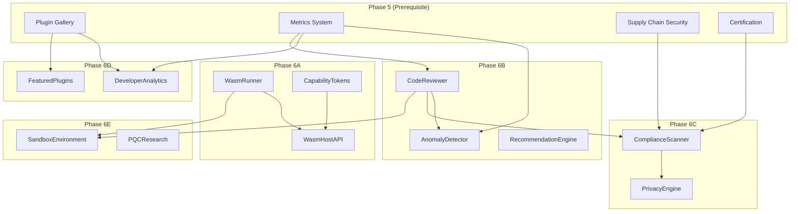

# VoiceStudio Plugin System — Phase 6: Strategic Maturity

**Status:** Draft — Pending Peer Review  
**Version:** 1.0.0  
**Date:** 2026-02-17  
**Author:** Lead/Principal Architect  
**Reviewers:** [Pending Assignment]

---

## Executive Summary

Phase 6 represents the **strategic maturation** of the VoiceStudio plugin ecosystem, transforming it from a robust enterprise framework into an **industry-leading, self-healing, AI-assisted, compliance-certified platform**. This phase focuses on innovation, reliability, and strategic positioning: extending plugin reach to new platforms via WebAssembly, incorporating AI-driven quality assurance, and solidifying VoiceStudio as a reference implementation for plugin architectures.

### Strategic Vision

The original Phase 6 vision encompassed cloud-native patterns (Kubernetes, multi-region deployment, service meshes) and enterprise SaaS capabilities. This implementation **adapts that vision** to VoiceStudio's established project constraints while preserving all strategic objectives:

| Original Vision | Adapted Implementation | Constraint Respected |
|-----------------|------------------------|----------------------|
| Kubernetes / multi-region | Local Wasm runtime (Wasmtime) | local-first, free-only |
| Istio service mesh / mTLS | Local process isolation + IPC | local-first |
| Cloud ML (TensorFlow/PyTorch) | Local AI via Ollama | local-first, free-only |
| CodeQL / GitHub Copilot Labs | Semgrep + Bandit + Ruff (free) | free-only |
| SOC 2 / ISO 27001 ($50k+) | Self-audited compliance automation | free-only |
| Vanta / Checkmarx ($$$) | Free scanning tools (existing vuln_scanner.py) | free-only |
| Stripe / AWS Marketplace | Open-source ecosystem model | free-only |
| Multi-region K8s ($80k) | Cross-platform Wasm portability | free-only, local-first |

### Phase 6 Goals

| Goal | Description | Success Metric |
|------|-------------|----------------|
| **Multi-Platform** | Same plugin binary runs on Windows, Linux, macOS via Wasm | 3+ platforms supported |
| **AI-Assisted Quality** | Local AI code review, anomaly detection, recommendations | 90% malicious code detection |
| **Automated Compliance** | Self-audited privacy and security certification | Full GDPR workflow |
| **Ecosystem Growth** | Developer analytics, community engagement | Active plugin submissions |
| **Innovation Pipeline** | R&D sandbox for experimental features | Prototype validation |

### Prerequisites (Phase 5 Completion)

| Component | Status | Verification |
|-----------|--------|--------------|
| Sandbox hardening (Phase 5A) | ✅ Complete | Subprocess, Docker, resource monitoring |
| Supply chain security (Phase 5B) | ✅ Complete | SBOM, vuln scanning, signing, provenance |
| Enterprise catalog (Phase 5C) | ✅ Complete | Multi-catalog, lockfile, dependency resolver, certification |
| Production readiness (Phase 5D) | ✅ Complete | Crash recovery, SLO enforcement, metrics persistence |

### Local-First Adaptation Rationale

VoiceStudio operates under three inviolable constraints defined in project rules:

1. **local-first.mdc**: Core functionality must remain offline-capable; cloud-only features are prohibited
2. **free-only.mdc**: Everything must be free of charge; no paid API subscriptions or per-seat licensing
3. **architecture.mdc**: Native Windows desktop application; Electron and browser-required UI prohibited

These constraints **do not limit capability**—they redirect implementation strategy. WebAssembly provides the same cross-platform portability as Kubernetes without cloud infrastructure. Local Ollama provides AI capabilities without API costs. Statistical anomaly detection replaces cloud ML services. Self-audited compliance automation replaces expensive third-party audits.

The result is a plugin system that is **more robust** (no cloud dependencies), **more cost-effective** (zero operational costs), and **more privacy-respecting** (all data remains local) than the cloud-native alternative.

---

## Table of Contents

1. [Executive Summary](#executive-summary)
2. [Architecture Evolution](#architecture-evolution)
3. [Phase 6A: Multi-Platform Plugin Runtime](#phase-6a-multi-platform-plugin-runtime)
4. [Phase 6B: AI-Assisted Plugin Quality](#phase-6b-ai-assisted-plugin-quality)
5. [Phase 6C: Automated Compliance & Privacy](#phase-6c-automated-compliance--privacy)
6. [Phase 6D: Ecosystem Growth & Analytics](#phase-6d-ecosystem-growth--analytics)
7. [Phase 6E: Innovation Sandbox](#phase-6e-innovation-sandbox)
8. [Manifest Schema v6 Extensions](#manifest-schema-v6-extensions)
9. [Implementation Schedule](#implementation-schedule)
10. [Risk Analysis](#risk-analysis)
11. [Acceptance Criteria](#acceptance-criteria)
12. [Appendices](#appendices)

---

## Architecture Evolution

### Current State (Post-Phase 5)

The Phase 5 foundation provides:

```
┌─────────────────────────────────────────────────────────────────────────────┐
│                        VoiceStudio Plugin System (Phase 5)                   │
├─────────────────────────────────────────────────────────────────────────────┤
│  ┌─────────────────┐  ┌─────────────────┐  ┌─────────────────┐             │
│  │  Plugin Gallery │  │  Supply Chain   │  │   SLO Enforcer  │             │
│  │    (Phase 5C)   │  │   (Phase 5B)    │  │    (Phase 5D)   │             │
│  │  - Multi-catalog│  │  - SBOM         │  │  - Enforcement  │             │
│  │  - Search       │  │  - Vuln scan    │  │  - Metrics      │             │
│  │  - Ratings      │  │  - Signing      │  │  - Persistence  │             │
│  │  - Lockfile     │  │  - Certification│  │                 │             │
│  └────────┬────────┘  └────────┬────────┘  └────────┬────────┘             │
│           │                    │                    │                       │
│  ┌────────▼────────────────────▼────────────────────▼────────┐             │
│  │                    Plugin Core Runtime                     │             │
│  │  ┌──────────────┐  ┌──────────────┐  ┌──────────────┐     │             │
│  │  │   Sandbox    │  │    Crash     │  │   Metrics    │     │             │
│  │  │  (Phase 5A)  │  │   Recovery   │  │ Persistence  │     │             │
│  │  │  - Subprocess│  │  (Phase 5D)  │  │  (Phase 5D)  │     │             │
│  │  │  - Docker    │  │              │  │              │     │             │
│  │  │  - Resources │  │              │  │              │     │             │
│  │  └──────────────┘  └──────────────┘  └──────────────┘     │             │
│  └───────────────────────────────────────────────────────────┘             │
└─────────────────────────────────────────────────────────────────────────────┘
```

### Phase 6 Target Architecture

```
┌─────────────────────────────────────────────────────────────────────────────┐
│                    VoiceStudio Plugin System (Phase 6)                       │
├─────────────────────────────────────────────────────────────────────────────┤
│                                                                              │
│  ┌─────────────────────────────────────────────────────────────────────┐    │
│  │                     PHASE 6 STRATEGIC ADDITIONS                      │    │
│  │                                                                       │    │
│  │  ┌─────────────────┐  ┌─────────────────┐  ┌─────────────────┐      │    │
│  │  │   Wasm Runtime  │  │   AI Quality    │  │   Compliance    │      │    │
│  │  │    (Phase 6A)   │  │   (Phase 6B)    │  │   (Phase 6C)    │      │    │
│  │  │  - Wasmtime     │  │  - Ollama LLM   │  │  - Privacy      │      │    │
│  │  │  - Capability   │  │  - Semgrep      │  │  - GDPR         │      │    │
│  │  │    Tokens       │  │  - Anomaly Det  │  │  - Self-audit   │      │    │
│  │  │  - Cross-plat   │  │  - Recommend    │  │  - Reports      │      │    │
│  │  └─────────────────┘  └─────────────────┘  └─────────────────┘      │    │
│  │                                                                       │    │
│  │  ┌─────────────────┐  ┌─────────────────┐                           │    │
│  │  │   Ecosystem     │  │   Incubator     │                           │    │
│  │  │   (Phase 6D)    │  │   (Phase 6E)    │                           │    │
│  │  │  - Analytics    │  │  - R&D Sandbox  │                           │    │
│  │  │  - Dashboard    │  │  - Experiments  │                           │    │
│  │  │  - Community    │  │  - PQC Research │                           │    │
│  │  └─────────────────┘  └─────────────────┘                           │    │
│  └─────────────────────────────────────────────────────────────────────┘    │
│                                                                              │
│  ┌─────────────────────────────────────────────────────────────────────┐    │
│  │                     EXISTING PHASE 5 FOUNDATION                      │    │
│  │   Gallery | Supply Chain | SLO | Sandbox | Crash Recovery | Metrics  │    │
│  └─────────────────────────────────────────────────────────────────────┘    │
└─────────────────────────────────────────────────────────────────────────────┘
```

### Component Interaction Diagram

```mermaid
flowchart TB
    subgraph HostApp["VoiceStudio Host Application"]
        UI["WinUI 3 Frontend"]
        Backend["FastAPI Backend"]
        PluginCore["Plugin Core Runtime"]
    end

    subgraph RuntimeLayer["Plugin Runtime Layer - Phase 6A"]
        InProc["In-Process<br/>Trusted"]
        SubProc["Subprocess<br/>Sandboxed"]
        WasmRT["Wasm Runtime<br/>Wasmtime"]
        DockerRT["Docker<br/>Optional"]
    end

    subgraph QualityLayer["AI Quality Layer - Phase 6B"]
        LocalAI["Ollama LLM<br/>Local"]
        StaticAnalysis["Semgrep and Bandit<br/>Free"]
        AnomalyDet["Statistical<br/>Anomaly Detection"]
        RecommendEng["Recommendation<br/>Engine"]
    end

    subgraph ComplianceLayer["Compliance Layer - Phase 6C"]
        SBOM["SBOM Generator<br/>Existing"]
        VulnScan["Vulnerability Scanner<br/>Existing"]
        LicenseCheck["License Checker<br/>Existing"]
        PrivacyEngine["Privacy Engine<br/>New"]
        ComplianceRep["Compliance Reporter<br/>New"]
    end

    subgraph EcosystemLayer["Ecosystem Layer - Phase 6D"]
        DevAnalytics["Developer Analytics"]
        AdminDash["Admin Dashboard"]
        Community["Community Tools"]
    end

    subgraph IncubatorLayer["Incubator Layer - Phase 6E"]
        RnDSandbox["R and D Sandbox"]
        ExpTracker["Experiment Tracker"]
        PQCResearch["PQC Research"]
    end

    PluginCore --> InProc
    PluginCore --> SubProc
    PluginCore --> WasmRT
    PluginCore --> DockerRT

    PluginCore --> LocalAI
    PluginCore --> StaticAnalysis
    PluginCore --> AnomalyDet
    PluginCore --> RecommendEng

    PluginCore --> SBOM
    PluginCore --> VulnScan
    PluginCore --> LicenseCheck
    PluginCore --> PrivacyEngine
    PluginCore --> ComplianceRep

    PluginCore --> DevAnalytics
    PluginCore --> AdminDash
    PluginCore --> Community

    PluginCore -.-> RnDSandbox
    RnDSandbox --> ExpTracker
    RnDSandbox --> PQCResearch
```



### Existing Infrastructure (Leveraged by Phase 6)

| Module | Location | Phase 6 Integration |
|--------|----------|---------------------|
| Sandbox | `backend/plugins/sandbox/` | Extended with Wasm runner (6A) |
| Supply Chain | `backend/plugins/supply_chain/` | Extended with compliance reporter (6C) |
| Gallery | `backend/plugins/gallery/` | Extended with ecosystem analytics (6D) |
| Metrics | `backend/plugins/metrics/` | Extended with AI anomaly detection (6B) |
| SLO | `backend/plugins/slo/` | Integrated with compliance (6C) |
| Policy | `backend/plugins/policy/` | Extended with privacy policies (6C) |
| Certification | `backend/plugins/supply_chain/certification.py` | Extended with compliance levels (6C) |

### Plugin Execution Model (Phase 6A Evolution)

The manifest schema already declares `isolation_mode` with these values:
- `in_process` — Trusted plugins, full host access
- `sandboxed` — Permission-gated subprocess
- `subprocess` — Isolated subprocess with IPC
- `wasm` — **Phase 6A: WebAssembly isolation via Wasmtime**

Phase 6A implements the `wasm` mode, enabling:
1. **Hardware-agnostic execution**: Same binary runs on Windows, Linux, macOS
2. **Capability-based security**: Plugins receive explicit capability tokens, not ambient OS permissions
3. **Memory isolation**: Wasm linear memory prevents cross-plugin contamination
4. **Deterministic execution**: No system call side effects without explicit host functions

---

## Phase 6A: Multi-Platform Plugin Runtime

**Duration:** Weeks 1-4  
**Original Vision:** Edge & Global Deployment (Kubernetes, multi-region, Istio service mesh)  
**Adapted Approach:** Local WebAssembly runtime via Wasmtime

### 6A.1 Overview

Phase 6A implements a **WebAssembly-based plugin runtime** that enables true cross-platform plugin execution. Instead of deploying to Kubernetes clusters across multiple regions, VoiceStudio achieves platform portability through the WebAssembly binary format: the same compiled `.wasm` binary executes identically on Windows, Linux, and macOS without recompilation.

### 6A.2 Technology Selection

| Technology | License | Cost | Rationale |
|------------|---------|------|-----------|
| **Wasmtime** | Apache 2.0 | Free | Mature Python bindings (`wasmtime-py`), WASI support, Bytecode Alliance backed |
| WasmEdge | Apache 2.0 | Free | Less mature Python bindings, rejected |
| Wasmer | MIT | Free | Python bindings less stable, rejected |

**Wasmtime Advantages:**
- Official Bytecode Alliance runtime (Mozilla, Fastly, Intel backing)
- Excellent Python bindings via `wasmtime-py` (pip install)
- WASI (WebAssembly System Interface) support for capability-based I/O
- Cranelift JIT compiler for near-native performance
- ~10MB binary size, minimal dependencies

### 6A.3 Module Structure

```
backend/plugins/wasm/
├── __init__.py              # Module exports
├── wasm_runner.py           # Core Wasm plugin executor
├── wasm_host_api.py         # Host functions exposed to Wasm plugins
├── capability_tokens.py     # Capability-based access control
├── wasm_compiler.py         # Plugin-to-Wasm compilation helper
├── wasm_memory.py           # Memory management and isolation
└── wasm_ipc.py              # IPC bridge for Wasm↔Host communication
```

### 6A.4 Core Component Designs

#### 6A.4.1 WasmRunner (wasm_runner.py)

The primary executor for WebAssembly plugins.

```python
"""
Wasm Plugin Runner for VoiceStudio.

Phase 6A: WebAssembly-based plugin execution using Wasmtime runtime.
Provides cross-platform plugin execution with capability-based security.
"""

from __future__ import annotations

import logging
from dataclasses import dataclass, field
from pathlib import Path
from typing import Any, Callable, Dict, List, Optional, Protocol
from enum import Enum, auto

import wasmtime
from wasmtime import Config, Engine, Linker, Module, Store, Instance, Memory, Func

from backend.plugins.wasm.capability_tokens import CapabilityToken, CapabilitySet
from backend.plugins.wasm.wasm_host_api import WasmHostAPI
from backend.plugins.wasm.wasm_memory import WasmMemoryManager

logger = logging.getLogger(__name__)


class WasmExecutionError(Exception):
    """Raised when Wasm plugin execution fails."""
    pass


class WasmLoadError(Exception):
    """Raised when Wasm module loading fails."""
    pass


class WasmCapabilityDenied(Exception):
    """Raised when plugin attempts unauthorized operation."""
    pass


@dataclass
class WasmPluginConfig:
    """Configuration for a Wasm plugin instance."""
    
    plugin_id: str
    wasm_path: Path
    capabilities: CapabilitySet
    max_memory_pages: int = 256  # 16MB default (64KB per page)
    max_execution_time_ms: int = 30000  # 30 second timeout
    fuel_limit: Optional[int] = 1_000_000_000  # Instruction limit
    allow_wasi: bool = True
    wasi_preopens: Dict[str, Path] = field(default_factory=dict)  # Virtual path -> real path


@dataclass
class WasmExecutionResult:
    """Result from Wasm plugin execution."""
    
    success: bool
    return_value: Any
    execution_time_ms: float
    memory_used_bytes: int
    fuel_consumed: Optional[int] = None
    error: Optional[str] = None


class WasmRunner:
    """
    Executes WebAssembly plugins with capability-based security.
    
    Key Features:
    - Wasmtime-based execution with JIT compilation
    - Capability tokens for fine-grained permission control
    - Memory isolation between plugins
    - Fuel-based execution limits (instruction counting)
    - WASI support for file/network access (gated by capabilities)
    
    Example:
        runner = WasmRunner()
        config = WasmPluginConfig(
            plugin_id="my-plugin",
            wasm_path=Path("plugins/my-plugin.wasm"),
            capabilities=CapabilitySet([CapabilityToken.FILE_READ])
        )
        result = await runner.execute(config, "process_audio", {"input": audio_data})
    """
    
    def __init__(
        self,
        cache_compiled: bool = True,
        enable_simd: bool = True,
        enable_threads: bool = False,  # Off by default for determinism
    ):
        """
        Initialize the Wasm runner.
        
        Args:
            cache_compiled: Cache compiled modules for faster reload
            enable_simd: Enable SIMD instructions (faster audio processing)
            enable_threads: Enable threading support (experimental)
        """
        self._cache_compiled = cache_compiled
        self._module_cache: Dict[Path, Module] = {}
        
        # Configure Wasmtime engine
        config = Config()
        config.cache = cache_compiled
        config.wasm_simd = enable_simd
        config.wasm_threads = enable_threads
        config.consume_fuel = True  # Enable instruction counting
        config.epoch_interruption = True  # Enable timeout interrupts
        
        self._engine = Engine(config)
        self._host_api = WasmHostAPI()
        self._memory_manager = WasmMemoryManager()
        
        logger.info(
            "WasmRunner initialized",
            extra={
                "cache_compiled": cache_compiled,
                "simd_enabled": enable_simd,
                "threads_enabled": enable_threads,
            }
        )
    
    def load_module(self, wasm_path: Path) -> Module:
        """
        Load and compile a Wasm module.
        
        Args:
            wasm_path: Path to the .wasm file
            
        Returns:
            Compiled Wasmtime Module
            
        Raises:
            WasmLoadError: If module loading fails
        """
        if self._cache_compiled and wasm_path in self._module_cache:
            logger.debug(f"Using cached module: {wasm_path}")
            return self._module_cache[wasm_path]
        
        try:
            wasm_bytes = wasm_path.read_bytes()
            module = Module(self._engine, wasm_bytes)
            
            if self._cache_compiled:
                self._module_cache[wasm_path] = module
            
            logger.info(f"Loaded Wasm module: {wasm_path}")
            return module
            
        except Exception as e:
            logger.error(f"Failed to load Wasm module: {wasm_path}", exc_info=True)
            raise WasmLoadError(f"Failed to load {wasm_path}: {e}") from e
    
    def _create_linker(
        self,
        store: Store,
        config: WasmPluginConfig,
    ) -> Linker:
        """
        Create a Wasmtime Linker with host functions and WASI.
        
        The linker binds host functions that Wasm plugins can call,
        gated by the plugin's capability tokens.
        """
        linker = Linker(self._engine)
        
        # Register host API functions (capability-gated)
        self._host_api.register_functions(linker, store, config.capabilities)
        
        # Add WASI if enabled and plugin has filesystem capabilities
        if config.allow_wasi and config.capabilities.has_any_filesystem():
            import wasmtime.wasi
            
            wasi_config = wasmtime.wasi.WasiConfig()
            wasi_config.inherit_stdout()
            wasi_config.inherit_stderr()
            
            # Pre-open directories based on capabilities
            for virtual_path, real_path in config.wasi_preopens.items():
                if config.capabilities.has(CapabilityToken.FILE_READ):
                    wasi_config.preopen_dir(str(real_path), virtual_path)
            
            store.set_wasi(wasi_config)
            linker.define_wasi()
        
        return linker
    
    async def execute(
        self,
        config: WasmPluginConfig,
        function_name: str,
        args: Dict[str, Any],
    ) -> WasmExecutionResult:
        """
        Execute a function in a Wasm plugin.
        
        Args:
            config: Plugin configuration including capabilities
            function_name: Exported function to call
            args: Arguments to pass (serialized to Wasm memory)
            
        Returns:
            WasmExecutionResult with success status and return value
        """
        import time
        start_time = time.perf_counter()
        
        try:
            # Load module
            module = self.load_module(config.wasm_path)
            
            # Create isolated store with fuel limit
            store = Store(self._engine)
            if config.fuel_limit:
                store.set_fuel(config.fuel_limit)
            
            # Create linker with capability-gated host functions
            linker = self._create_linker(store, config)
            
            # Instantiate module
            instance = linker.instantiate(store, module)
            
            # Get exported function
            func = instance.exports(store).get(function_name)
            if func is None:
                raise WasmExecutionError(
                    f"Function '{function_name}' not exported by plugin"
                )
            
            # Serialize arguments to Wasm memory
            memory = instance.exports(store).get("memory")
            if memory is None:
                raise WasmExecutionError("Plugin does not export memory")
            
            args_ptr = self._memory_manager.write_args(store, memory, args)
            
            # Execute with fuel tracking
            initial_fuel = store.get_fuel() if config.fuel_limit else None
            
            result = func(store, args_ptr)
            
            # Calculate metrics
            execution_time_ms = (time.perf_counter() - start_time) * 1000
            fuel_consumed = None
            if initial_fuel is not None:
                fuel_consumed = initial_fuel - store.get_fuel()
            
            # Deserialize return value
            return_value = self._memory_manager.read_result(store, memory, result)
            
            memory_used = memory.data_len(store)
            
            logger.info(
                f"Wasm execution complete: {config.plugin_id}.{function_name}",
                extra={
                    "execution_time_ms": execution_time_ms,
                    "fuel_consumed": fuel_consumed,
                    "memory_bytes": memory_used,
                }
            )
            
            return WasmExecutionResult(
                success=True,
                return_value=return_value,
                execution_time_ms=execution_time_ms,
                memory_used_bytes=memory_used,
                fuel_consumed=fuel_consumed,
            )
            
        except WasmCapabilityDenied as e:
            logger.warning(
                f"Capability denied for plugin {config.plugin_id}: {e}"
            )
            return WasmExecutionResult(
                success=False,
                return_value=None,
                execution_time_ms=(time.perf_counter() - start_time) * 1000,
                memory_used_bytes=0,
                error=f"Capability denied: {e}",
            )
            
        except Exception as e:
            logger.error(
                f"Wasm execution failed: {config.plugin_id}.{function_name}",
                exc_info=True,
            )
            return WasmExecutionResult(
                success=False,
                return_value=None,
                execution_time_ms=(time.perf_counter() - start_time) * 1000,
                memory_used_bytes=0,
                error=str(e),
            )
    
    def unload_module(self, wasm_path: Path) -> bool:
        """
        Remove a module from the cache.
        
        Returns:
            True if module was cached and removed, False otherwise
        """
        if wasm_path in self._module_cache:
            del self._module_cache[wasm_path]
            logger.info(f"Unloaded Wasm module: {wasm_path}")
            return True
        return False
    
    def clear_cache(self) -> int:
        """
        Clear all cached modules.
        
        Returns:
            Number of modules cleared
        """
        count = len(self._module_cache)
        self._module_cache.clear()
        logger.info(f"Cleared Wasm module cache: {count} modules")
        return count
```

#### 6A.4.2 CapabilityTokens (capability_tokens.py)

Capability-based access control for Wasm plugins.

```python
"""
Capability Token System for Wasm Plugins.

Phase 6A: Implements capability-based security model for WebAssembly plugins.
Replaces ambient OS permissions with explicit, fine-grained capability tokens.

Design Philosophy:
- Plugins start with zero capabilities (principle of least privilege)
- Each capability is explicitly granted via manifest declaration
- Host functions check capabilities before execution
- Capabilities cannot be escalated at runtime
"""

from __future__ import annotations

from enum import Enum, auto
from dataclasses import dataclass, field
from typing import FrozenSet, Iterable, Set
import logging

logger = logging.getLogger(__name__)


class CapabilityToken(Enum):
    """
    Individual capability tokens that can be granted to plugins.
    
    Organized by category:
    - FILE_*: Filesystem access
    - NET_*: Network access
    - AUDIO_*: Audio subsystem access
    - SYSTEM_*: System information access
    - PLUGIN_*: Inter-plugin communication
    - UI_*: User interface access
    """
    
    # Filesystem capabilities
    FILE_READ = auto()           # Read files from allowed directories
    FILE_WRITE = auto()          # Write files to allowed directories
    FILE_DELETE = auto()         # Delete files from allowed directories
    FILE_TEMP = auto()           # Access temporary directory
    FILE_CONFIG = auto()         # Access plugin config directory
    
    # Network capabilities (local only per local-first.mdc)
    NET_LOCALHOST = auto()       # Connect to localhost services
    NET_IPC = auto()             # Inter-process communication
    
    # Audio capabilities
    AUDIO_READ = auto()          # Read audio data from host
    AUDIO_WRITE = auto()         # Write audio data to host
    AUDIO_STREAM = auto()        # Real-time audio streaming
    AUDIO_DEVICE = auto()        # Access audio devices directly
    
    # System capabilities
    SYSTEM_INFO = auto()         # Read system information (CPU, RAM, etc.)
    SYSTEM_ENV = auto()          # Read environment variables (filtered)
    SYSTEM_TIME = auto()         # Access system time
    SYSTEM_RANDOM = auto()       # Access cryptographic random
    
    # Plugin interaction capabilities
    PLUGIN_CALL = auto()         # Call other plugins
    PLUGIN_EVENT = auto()        # Subscribe to plugin events
    PLUGIN_SHARED = auto()       # Access shared plugin memory
    
    # UI capabilities
    UI_NOTIFICATION = auto()     # Show notifications
    UI_DIALOG = auto()           # Show dialogs
    UI_PANEL = auto()            # Register UI panels


@dataclass(frozen=True)
class CapabilitySet:
    """
    Immutable set of capability tokens.
    
    Example:
        caps = CapabilitySet([
            CapabilityToken.FILE_READ,
            CapabilityToken.AUDIO_READ,
            CapabilityToken.AUDIO_WRITE,
        ])
        
        if caps.has(CapabilityToken.FILE_READ):
            # Safe to read files
            pass
    """
    
    _tokens: FrozenSet[CapabilityToken] = field(default_factory=frozenset)
    
    def __init__(self, tokens: Iterable[CapabilityToken] = ()):
        object.__setattr__(self, '_tokens', frozenset(tokens))
    
    def has(self, token: CapabilityToken) -> bool:
        """Check if capability is granted."""
        return token in self._tokens
    
    def has_all(self, tokens: Iterable[CapabilityToken]) -> bool:
        """Check if all specified capabilities are granted."""
        return all(token in self._tokens for token in tokens)
    
    def has_any(self, tokens: Iterable[CapabilityToken]) -> bool:
        """Check if any of the specified capabilities are granted."""
        return any(token in self._tokens for token in tokens)
    
    def has_any_filesystem(self) -> bool:
        """Check if any filesystem capability is granted."""
        fs_caps = {
            CapabilityToken.FILE_READ,
            CapabilityToken.FILE_WRITE,
            CapabilityToken.FILE_DELETE,
            CapabilityToken.FILE_TEMP,
            CapabilityToken.FILE_CONFIG,
        }
        return bool(self._tokens & fs_caps)
    
    def has_any_audio(self) -> bool:
        """Check if any audio capability is granted."""
        audio_caps = {
            CapabilityToken.AUDIO_READ,
            CapabilityToken.AUDIO_WRITE,
            CapabilityToken.AUDIO_STREAM,
            CapabilityToken.AUDIO_DEVICE,
        }
        return bool(self._tokens & audio_caps)
    
    @property
    def tokens(self) -> FrozenSet[CapabilityToken]:
        """Get all granted tokens."""
        return self._tokens
    
    def __contains__(self, token: CapabilityToken) -> bool:
        return token in self._tokens
    
    def __iter__(self):
        return iter(self._tokens)
    
    def __len__(self) -> int:
        return len(self._tokens)
    
    def __repr__(self) -> str:
        names = sorted(t.name for t in self._tokens)
        return f"CapabilitySet({names})"


# Pre-defined capability profiles
CAPABILITY_PROFILES = {
    "minimal": CapabilitySet([
        CapabilityToken.SYSTEM_TIME,
        CapabilityToken.SYSTEM_RANDOM,
    ]),
    
    "audio_processor": CapabilitySet([
        CapabilityToken.AUDIO_READ,
        CapabilityToken.AUDIO_WRITE,
        CapabilityToken.FILE_TEMP,
        CapabilityToken.SYSTEM_TIME,
        CapabilityToken.SYSTEM_RANDOM,
    ]),
    
    "audio_analyzer": CapabilitySet([
        CapabilityToken.AUDIO_READ,
        CapabilityToken.FILE_TEMP,
        CapabilityToken.FILE_CONFIG,
        CapabilityToken.SYSTEM_TIME,
        CapabilityToken.SYSTEM_INFO,
    ]),
    
    "ui_extension": CapabilitySet([
        CapabilityToken.UI_NOTIFICATION,
        CapabilityToken.UI_DIALOG,
        CapabilityToken.UI_PANEL,
        CapabilityToken.PLUGIN_EVENT,
        CapabilityToken.SYSTEM_TIME,
    ]),
    
    "full_audio": CapabilitySet([
        CapabilityToken.AUDIO_READ,
        CapabilityToken.AUDIO_WRITE,
        CapabilityToken.AUDIO_STREAM,
        CapabilityToken.AUDIO_DEVICE,
        CapabilityToken.FILE_READ,
        CapabilityToken.FILE_WRITE,
        CapabilityToken.FILE_TEMP,
        CapabilityToken.FILE_CONFIG,
        CapabilityToken.SYSTEM_TIME,
        CapabilityToken.SYSTEM_RANDOM,
        CapabilityToken.SYSTEM_INFO,
    ]),
}


def parse_capabilities_from_manifest(
    permissions: list[str],
) -> CapabilitySet:
    """
    Parse capability tokens from plugin manifest permissions.
    
    The manifest declares permissions as strings:
        "permissions": ["file:read", "audio:read", "audio:write"]
    
    This function converts them to CapabilityToken enum values.
    
    Args:
        permissions: List of permission strings from manifest
        
    Returns:
        CapabilitySet with parsed tokens
    """
    PERMISSION_MAP = {
        "file:read": CapabilityToken.FILE_READ,
        "file:write": CapabilityToken.FILE_WRITE,
        "file:delete": CapabilityToken.FILE_DELETE,
        "file:temp": CapabilityToken.FILE_TEMP,
        "file:config": CapabilityToken.FILE_CONFIG,
        "net:localhost": CapabilityToken.NET_LOCALHOST,
        "net:ipc": CapabilityToken.NET_IPC,
        "audio:read": CapabilityToken.AUDIO_READ,
        "audio:write": CapabilityToken.AUDIO_WRITE,
        "audio:stream": CapabilityToken.AUDIO_STREAM,
        "audio:device": CapabilityToken.AUDIO_DEVICE,
        "system:info": CapabilityToken.SYSTEM_INFO,
        "system:env": CapabilityToken.SYSTEM_ENV,
        "system:time": CapabilityToken.SYSTEM_TIME,
        "system:random": CapabilityToken.SYSTEM_RANDOM,
        "plugin:call": CapabilityToken.PLUGIN_CALL,
        "plugin:event": CapabilityToken.PLUGIN_EVENT,
        "plugin:shared": CapabilityToken.PLUGIN_SHARED,
        "ui:notification": CapabilityToken.UI_NOTIFICATION,
        "ui:dialog": CapabilityToken.UI_DIALOG,
        "ui:panel": CapabilityToken.UI_PANEL,
    }
    
    tokens: Set[CapabilityToken] = set()
    
    for perm in permissions:
        perm_lower = perm.lower().strip()
        
        # Check for profile shorthand
        if perm_lower.startswith("profile:"):
            profile_name = perm_lower[8:]
            if profile_name in CAPABILITY_PROFILES:
                tokens.update(CAPABILITY_PROFILES[profile_name].tokens)
                logger.debug(f"Applied capability profile: {profile_name}")
            else:
                logger.warning(f"Unknown capability profile: {profile_name}")
            continue
        
        # Map individual permission
        if perm_lower in PERMISSION_MAP:
            tokens.add(PERMISSION_MAP[perm_lower])
        else:
            logger.warning(f"Unknown permission in manifest: {perm}")
    
    return CapabilitySet(tokens)
```

#### 6A.4.3 WasmHostAPI (wasm_host_api.py)

Host functions exposed to Wasm plugins.

```python
"""
Host API for Wasm Plugins.

Phase 6A: Defines host functions that Wasm plugins can import and call.
All host functions are gated by capability tokens.

Host Function Categories:
1. Audio I/O - Read/write audio data
2. Filesystem - Read/write files (sandboxed)
3. Logging - Structured logging
4. Metrics - Record plugin metrics
5. Events - Emit and subscribe to events
6. System - Access system information

Security Model:
- Every host function checks required capability before execution
- Capabilities are determined at plugin load time from manifest
- Capability escalation is impossible at runtime
"""

from __future__ import annotations

import json
import logging
import time
from dataclasses import dataclass
from pathlib import Path
from typing import Any, Callable, Dict, List, Optional, Tuple

from wasmtime import Func, FuncType, Linker, Store, ValType

from backend.plugins.wasm.capability_tokens import (
    CapabilitySet,
    CapabilityToken,
)

logger = logging.getLogger(__name__)


@dataclass
class HostFunctionSpec:
    """Specification for a host function."""
    name: str
    params: List[ValType]
    results: List[ValType]
    required_capability: Optional[CapabilityToken]
    implementation: Callable


class WasmHostAPI:
    """
    Provides host functions to Wasm plugins.
    
    All functions are registered with the Wasmtime Linker and can be
    imported by Wasm modules using the "voicestudio" namespace.
    
    Example Wasm import:
        (import "voicestudio" "log_info" (func $log_info (param i32 i32)))
    """
    
    def __init__(self):
        self._functions: Dict[str, HostFunctionSpec] = {}
        self._register_core_functions()
    
    def _register_core_functions(self):
        """Register all host functions."""
        
        # Logging functions (no capability required)
        self._add_function(
            name="log_debug",
            params=[ValType.i32(), ValType.i32()],  # ptr, len
            results=[],
            capability=None,
            impl=self._log_debug,
        )
        self._add_function(
            name="log_info",
            params=[ValType.i32(), ValType.i32()],
            results=[],
            capability=None,
            impl=self._log_info,
        )
        self._add_function(
            name="log_warn",
            params=[ValType.i32(), ValType.i32()],
            results=[],
            capability=None,
            impl=self._log_warn,
        )
        self._add_function(
            name="log_error",
            params=[ValType.i32(), ValType.i32()],
            results=[],
            capability=None,
            impl=self._log_error,
        )
        
        # Time functions
        self._add_function(
            name="time_now_ms",
            params=[],
            results=[ValType.i64()],
            capability=CapabilityToken.SYSTEM_TIME,
            impl=self._time_now_ms,
        )
        
        # Random functions
        self._add_function(
            name="random_bytes",
            params=[ValType.i32(), ValType.i32()],  # ptr, len
            results=[ValType.i32()],  # success
            capability=CapabilityToken.SYSTEM_RANDOM,
            impl=self._random_bytes,
        )
        
        # Audio functions
        self._add_function(
            name="audio_read",
            params=[ValType.i32(), ValType.i32()],  # buffer_ptr, max_len
            results=[ValType.i32()],  # bytes_read
            capability=CapabilityToken.AUDIO_READ,
            impl=self._audio_read,
        )
        self._add_function(
            name="audio_write",
            params=[ValType.i32(), ValType.i32()],  # buffer_ptr, len
            results=[ValType.i32()],  # bytes_written
            capability=CapabilityToken.AUDIO_WRITE,
            impl=self._audio_write,
        )
        
        # Metrics functions
        self._add_function(
            name="metric_counter",
            params=[ValType.i32(), ValType.i32(), ValType.i64()],  # name_ptr, name_len, value
            results=[],
            capability=None,
            impl=self._metric_counter,
        )
        self._add_function(
            name="metric_gauge",
            params=[ValType.i32(), ValType.i32(), ValType.f64()],  # name_ptr, name_len, value
            results=[],
            capability=None,
            impl=self._metric_gauge,
        )
        
        # File functions
        self._add_function(
            name="file_read",
            params=[ValType.i32(), ValType.i32(), ValType.i32(), ValType.i32()],  # path_ptr, path_len, buf_ptr, buf_len
            results=[ValType.i32()],  # bytes_read or error
            capability=CapabilityToken.FILE_READ,
            impl=self._file_read,
        )
        self._add_function(
            name="file_write",
            params=[ValType.i32(), ValType.i32(), ValType.i32(), ValType.i32()],  # path_ptr, path_len, data_ptr, data_len
            results=[ValType.i32()],  # bytes_written or error
            capability=CapabilityToken.FILE_WRITE,
            impl=self._file_write,
        )
        
        # System info functions
        self._add_function(
            name="system_info",
            params=[ValType.i32(), ValType.i32()],  # buffer_ptr, buffer_len
            results=[ValType.i32()],  # bytes_written
            capability=CapabilityToken.SYSTEM_INFO,
            impl=self._system_info,
        )
        
        # Event functions
        self._add_function(
            name="event_emit",
            params=[ValType.i32(), ValType.i32(), ValType.i32(), ValType.i32()],  # name_ptr, name_len, data_ptr, data_len
            results=[ValType.i32()],  # success
            capability=CapabilityToken.PLUGIN_EVENT,
            impl=self._event_emit,
        )
    
    def _add_function(
        self,
        name: str,
        params: List[ValType],
        results: List[ValType],
        capability: Optional[CapabilityToken],
        impl: Callable,
    ):
        """Add a host function specification."""
        self._functions[name] = HostFunctionSpec(
            name=name,
            params=params,
            results=results,
            required_capability=capability,
            implementation=impl,
        )
    
    def register_functions(
        self,
        linker: Linker,
        store: Store,
        capabilities: CapabilitySet,
    ):
        """
        Register host functions with the Wasmtime linker.
        
        Only functions whose required capabilities are present in the
        CapabilitySet will be registered. Functions without capability
        requirements are always registered.
        
        Args:
            linker: Wasmtime Linker to register functions with
            store: Wasmtime Store for the plugin instance
            capabilities: Granted capabilities for this plugin
        """
        for name, spec in self._functions.items():
            # Check capability
            if spec.required_capability is not None:
                if not capabilities.has(spec.required_capability):
                    logger.debug(
                        f"Skipping host function '{name}' - "
                        f"missing capability {spec.required_capability.name}"
                    )
                    continue
            
            # Create wrapper that captures store and memory
            def make_wrapper(s: HostFunctionSpec):
                def wrapper(*args):
                    return s.implementation(store, *args)
                return wrapper
            
            func_type = FuncType(spec.params, spec.results)
            func = Func(store, func_type, make_wrapper(spec))
            
            linker.define(store, "voicestudio", name, func)
            logger.debug(f"Registered host function: voicestudio.{name}")
    
    # ========== Host Function Implementations ==========
    
    def _log_debug(self, store: Store, ptr: int, length: int):
        msg = self._read_string(store, ptr, length)
        logger.debug(f"[WASM] {msg}")
    
    def _log_info(self, store: Store, ptr: int, length: int):
        msg = self._read_string(store, ptr, length)
        logger.info(f"[WASM] {msg}")
    
    def _log_warn(self, store: Store, ptr: int, length: int):
        msg = self._read_string(store, ptr, length)
        logger.warning(f"[WASM] {msg}")
    
    def _log_error(self, store: Store, ptr: int, length: int):
        msg = self._read_string(store, ptr, length)
        logger.error(f"[WASM] {msg}")
    
    def _time_now_ms(self, store: Store) -> int:
        return int(time.time() * 1000)
    
    def _random_bytes(self, store: Store, ptr: int, length: int) -> int:
        import secrets
        random_data = secrets.token_bytes(length)
        self._write_bytes(store, ptr, random_data)
        return 1  # success
    
    def _audio_read(self, store: Store, buffer_ptr: int, max_len: int) -> int:
        # Integration point: connect to VoiceStudio audio subsystem
        # Returns number of bytes read
        # DEFERRED: Phase 6 WASM audio integration (see Phase 6.3 milestone)
        return 0
    
    def _audio_write(self, store: Store, buffer_ptr: int, length: int) -> int:
        # Integration point: connect to VoiceStudio audio subsystem
        # Returns number of bytes written
        # DEFERRED: Phase 6 WASM audio integration (see Phase 6.3 milestone)
        return 0
    
    def _metric_counter(self, store: Store, name_ptr: int, name_len: int, value: int):
        name = self._read_string(store, name_ptr, name_len)
        # Integration point: connect to metrics system
        logger.debug(f"[WASM Metric] counter {name} += {value}")
    
    def _metric_gauge(self, store: Store, name_ptr: int, name_len: int, value: float):
        name = self._read_string(store, name_ptr, name_len)
        logger.debug(f"[WASM Metric] gauge {name} = {value}")
    
    def _file_read(
        self,
        store: Store,
        path_ptr: int,
        path_len: int,
        buf_ptr: int,
        buf_len: int,
    ) -> int:
        # Sandboxed file read - path is relative to plugin's allowed directory
        # DEFERRED: Phase 6 WASM file I/O with sandboxing (see Phase 6.3 milestone)
        return -1  # Not implemented
    
    def _file_write(
        self,
        store: Store,
        path_ptr: int,
        path_len: int,
        data_ptr: int,
        data_len: int,
    ) -> int:
        # Sandboxed file write
        # DEFERRED: Phase 6 WASM file I/O with sandboxing (see Phase 6.3 milestone)
        return -1  # Not implemented
    
    def _system_info(self, store: Store, buffer_ptr: int, buffer_len: int) -> int:
        import platform
        import psutil
        
        info = {
            "os": platform.system(),
            "arch": platform.machine(),
            "cpu_count": psutil.cpu_count(),
            "memory_total_gb": round(psutil.virtual_memory().total / (1024**3), 2),
        }
        
        json_data = json.dumps(info).encode('utf-8')
        if len(json_data) > buffer_len:
            return -1  # Buffer too small
        
        self._write_bytes(store, buffer_ptr, json_data)
        return len(json_data)
    
    def _event_emit(
        self,
        store: Store,
        name_ptr: int,
        name_len: int,
        data_ptr: int,
        data_len: int,
    ) -> int:
        event_name = self._read_string(store, name_ptr, name_len)
        event_data = self._read_bytes(store, data_ptr, data_len)
        # Integration point: connect to plugin event system
        logger.debug(f"[WASM Event] {event_name}: {len(event_data)} bytes")
        return 1  # success
    
    # ========== Memory Helpers ==========
    
    def _read_string(self, store: Store, ptr: int, length: int) -> str:
        memory = self._get_memory(store)
        data = memory.read(store, ptr, ptr + length)
        return data.decode('utf-8')
    
    def _read_bytes(self, store: Store, ptr: int, length: int) -> bytes:
        memory = self._get_memory(store)
        return memory.read(store, ptr, ptr + length)
    
    def _write_bytes(self, store: Store, ptr: int, data: bytes):
        memory = self._get_memory(store)
        memory.write(store, data, ptr)
    
    def _get_memory(self, store: Store):
        # Memory is typically accessed from the current instance
        # This is a simplified version; real implementation would
        # track memory per plugin instance
        raise NotImplementedError("Memory access requires instance context")
```

### 6A.5 Manifest Schema Extensions for Wasm

The manifest schema already includes `isolation_mode: "wasm"`. Phase 6A adds:

```json
{
  "compatibility": {
    "type": "object",
    "description": "Cross-platform compatibility declaration",
    "properties": {
      "hosts": {
        "type": "array",
        "items": {
          "type": "string",
          "enum": ["windows", "linux", "macos", "any"]
        },
        "description": "Supported host operating systems"
      },
      "runtimes": {
        "type": "array",
        "items": {
          "type": "string",
          "enum": ["python3.10", "python3.11", "python3.12", "wasm"]
        },
        "description": "Supported runtime environments"
      },
      "min_wasm_version": {
        "type": "string",
        "pattern": "^\\d+\\.\\d+\\.\\d+$",
        "description": "Minimum Wasm runtime version required"
      },
      "wasm_features": {
        "type": "array",
        "items": {
          "type": "string",
          "enum": ["simd", "threads", "bulk_memory", "reference_types"]
        },
        "description": "Required WebAssembly features"
      }
    }
  }
}
```

### 6A.6 Testing Strategy

| Test Category | Coverage Target | Tools |
|---------------|-----------------|-------|
| Unit tests | 90% | pytest, pytest-asyncio |
| Integration tests | 80% | pytest with actual Wasm modules |
| Security tests | 100% capability gates | Custom security test harness |
| Performance tests | Baseline establishment | pytest-benchmark |

**Test locations:**
- `tests/unit/backend/plugins/wasm/test_wasm_runner.py`
- `tests/unit/backend/plugins/wasm/test_capability_tokens.py`
- `tests/unit/backend/plugins/wasm/test_host_api.py`
- `tests/integration/backend/plugins/wasm/test_wasm_execution.py`

### 6A.7 Acceptance Criteria

| ID | Criterion | Verification |
|----|-----------|--------------|
| 6A-1 | Wasm modules load and execute on Windows | Integration test |
| 6A-2 | Same Wasm binary runs on Linux (CI) | CI pipeline test |
| 6A-3 | Capability tokens prevent unauthorized host calls | Security test suite |
| 6A-4 | Fuel limits prevent infinite loops | Execution limit test |
| 6A-5 | Memory isolation prevents cross-plugin access | Memory isolation test |
| 6A-6 | Host API functions integrate with VoiceStudio | Integration test |
| 6A-7 | Plugin compilation helper works for Rust/C | Manual verification |
| 6A-8 | Performance within 2x of native subprocess | Benchmark comparison |

---

## Phase 6B: AI-Assisted Plugin Quality

**Duration:** Weeks 5-8  
**Original Vision:** AI-Driven Quality & Operations (TensorFlow/PyTorch, CodeQL, GitHub Copilot Labs)  
**Adapted Approach:** Local AI via Ollama, free static analysis tools, statistical anomaly detection

### 6B.1 Overview

Phase 6B introduces **AI-assisted quality assurance** for the plugin ecosystem. Instead of cloud-based ML services (expensive, privacy concerns), VoiceStudio implements:

1. **Local LLM code review** via Ollama (already in MCP server list)
2. **Static analysis pipeline** using Semgrep + Bandit + Ruff (all free)
3. **Statistical anomaly detection** for runtime behavior (no external ML)
4. **Plugin recommendation engine** using collaborative filtering (local computation)
5. **Smart plugin assistant** for developer guidance

### 6B.2 Technology Selection

| Component | Technology | License | Cost | Rationale |
|-----------|------------|---------|------|-----------|
| LLM Code Review | Ollama + CodeLlama/DeepSeek | MIT | Free | Local LLM, no API costs, per `mcp-usage.mdc` |
| Static Analysis | Semgrep | LGPL-2.1 | Free | Rule-based code scanning, community rules |
| Security Scanning | Bandit | Apache 2.0 | Free | Python security analysis |
| Code Quality | Ruff | MIT | Free | Fast Python linting |
| Anomaly Detection | SciPy/NumPy | BSD | Free | Z-score, IQR statistical methods |
| Recommendations | scikit-learn | BSD | Free | Collaborative filtering, cosine similarity |

### 6B.3 Module Structure

```
backend/plugins/ai_quality/
├── __init__.py                 # Module exports
├── code_reviewer.py            # Static analysis + LLM-augmented review
├── anomaly_detector.py         # Statistical anomaly detection
├── recommendation_engine.py    # Plugin recommendations
├── smart_assistant.py          # LLM-powered plugin help
├── quality_scorer.py           # Unified quality scoring
└── review_report.py            # Review report generation
```

### 6B.4 Core Component Designs

#### 6B.4.1 CodeReviewer (code_reviewer.py)

AI-augmented code review system combining static analysis with local LLM insights.

```python
"""
AI-Augmented Code Review System.

Phase 6B: Combines static analysis tools with local LLM code review.
Provides comprehensive plugin code quality assessment without cloud services.

Pipeline:
1. Semgrep: Security patterns, code smells
2. Bandit: Python security vulnerabilities
3. Ruff: Style, complexity, best practices
4. Ollama: LLM-based semantic review (optional, local)

All tools are free and run locally per local-first.mdc and free-only.mdc.
"""

from __future__ import annotations

import asyncio
import json
import logging
import subprocess
import tempfile
from dataclasses import dataclass, field
from enum import Enum
from pathlib import Path
from typing import Any, Dict, List, Optional

logger = logging.getLogger(__name__)


class IssueSeverity(Enum):
    """Issue severity levels."""
    CRITICAL = "critical"
    HIGH = "high"
    MEDIUM = "medium"
    LOW = "low"
    INFO = "info"


class IssueCategory(Enum):
    """Issue category classification."""
    SECURITY = "security"
    PERFORMANCE = "performance"
    MAINTAINABILITY = "maintainability"
    CORRECTNESS = "correctness"
    STYLE = "style"
    COMPLEXITY = "complexity"
    BEST_PRACTICE = "best_practice"


@dataclass
class CodeIssue:
    """A single code review issue."""
    
    rule_id: str
    message: str
    file_path: str
    line_start: int
    line_end: int
    severity: IssueSeverity
    category: IssueCategory
    tool: str
    suggestion: Optional[str] = None
    code_snippet: Optional[str] = None
    
    def to_dict(self) -> Dict[str, Any]:
        return {
            "rule_id": self.rule_id,
            "message": self.message,
            "file_path": self.file_path,
            "line_start": self.line_start,
            "line_end": self.line_end,
            "severity": self.severity.value,
            "category": self.category.value,
            "tool": self.tool,
            "suggestion": self.suggestion,
            "code_snippet": self.code_snippet,
        }


@dataclass
class ReviewResult:
    """Complete code review result."""
    
    plugin_id: str
    plugin_version: str
    issues: List[CodeIssue] = field(default_factory=list)
    quality_score: float = 0.0
    review_time_ms: float = 0.0
    tools_executed: List[str] = field(default_factory=list)
    llm_summary: Optional[str] = None
    llm_recommendations: List[str] = field(default_factory=list)
    
    @property
    def critical_count(self) -> int:
        return sum(1 for i in self.issues if i.severity == IssueSeverity.CRITICAL)
    
    @property
    def high_count(self) -> int:
        return sum(1 for i in self.issues if i.severity == IssueSeverity.HIGH)
    
    @property
    def passed(self) -> bool:
        """Review passes if no critical issues and score >= 70."""
        return self.critical_count == 0 and self.quality_score >= 70.0


class CodeReviewer:
    """
    AI-augmented code review system.
    
    Executes a pipeline of static analysis tools followed by optional
    LLM-based semantic review using local Ollama instance.
    
    Example:
        reviewer = CodeReviewer(ollama_enabled=True)
        result = await reviewer.review_plugin(
            plugin_path=Path("plugins/my-plugin"),
            plugin_id="my-plugin",
            plugin_version="1.0.0"
        )
        if not result.passed:
            print(f"Review failed: {result.critical_count} critical issues")
    """
    
    def __init__(
        self,
        ollama_enabled: bool = True,
        ollama_model: str = "codellama:13b",
        ollama_host: str = "http://localhost:11434",
        semgrep_rules: str = "auto",
        include_style_checks: bool = True,
    ):
        """
        Initialize the code reviewer.
        
        Args:
            ollama_enabled: Enable LLM-based review (requires Ollama running)
            ollama_model: Ollama model to use for code review
            ollama_host: Ollama API endpoint
            semgrep_rules: Semgrep ruleset to use ("auto", "p/security-audit", etc.)
            include_style_checks: Include style/formatting issues
        """
        self._ollama_enabled = ollama_enabled
        self._ollama_model = ollama_model
        self._ollama_host = ollama_host
        self._semgrep_rules = semgrep_rules
        self._include_style = include_style_checks
    
    async def review_plugin(
        self,
        plugin_path: Path,
        plugin_id: str,
        plugin_version: str,
    ) -> ReviewResult:
        """
        Perform comprehensive code review on a plugin.
        
        Args:
            plugin_path: Path to plugin source directory
            plugin_id: Plugin identifier
            plugin_version: Plugin version string
            
        Returns:
            ReviewResult with all issues and quality score
        """
        import time
        start_time = time.perf_counter()
        
        result = ReviewResult(
            plugin_id=plugin_id,
            plugin_version=plugin_version,
        )
        
        # Run static analysis tools in parallel
        semgrep_task = self._run_semgrep(plugin_path)
        bandit_task = self._run_bandit(plugin_path)
        ruff_task = self._run_ruff(plugin_path) if self._include_style else asyncio.sleep(0)
        
        semgrep_issues, bandit_issues, ruff_issues = await asyncio.gather(
            semgrep_task,
            bandit_task,
            ruff_task,
            return_exceptions=True,
        )
        
        # Collect issues from each tool
        if isinstance(semgrep_issues, list):
            result.issues.extend(semgrep_issues)
            result.tools_executed.append("semgrep")
        elif isinstance(semgrep_issues, Exception):
            logger.warning(f"Semgrep failed: {semgrep_issues}")
        
        if isinstance(bandit_issues, list):
            result.issues.extend(bandit_issues)
            result.tools_executed.append("bandit")
        elif isinstance(bandit_issues, Exception):
            logger.warning(f"Bandit failed: {bandit_issues}")
        
        if isinstance(ruff_issues, list):
            result.issues.extend(ruff_issues)
            result.tools_executed.append("ruff")
        elif isinstance(ruff_issues, Exception) and self._include_style:
            logger.warning(f"Ruff failed: {ruff_issues}")
        
        # Run LLM review if enabled
        if self._ollama_enabled:
            try:
                llm_result = await self._run_ollama_review(plugin_path)
                result.llm_summary = llm_result.get("summary")
                result.llm_recommendations = llm_result.get("recommendations", [])
                result.tools_executed.append("ollama")
            except Exception as e:
                logger.warning(f"Ollama review failed: {e}")
        
        # Calculate quality score
        result.quality_score = self._calculate_quality_score(result.issues)
        result.review_time_ms = (time.perf_counter() - start_time) * 1000
        
        logger.info(
            f"Code review complete for {plugin_id}",
            extra={
                "quality_score": result.quality_score,
                "issues_found": len(result.issues),
                "critical": result.critical_count,
                "high": result.high_count,
                "review_time_ms": result.review_time_ms,
            }
        )
        
        return result
    
    async def _run_semgrep(self, plugin_path: Path) -> List[CodeIssue]:
        """Run Semgrep security and code quality scan."""
        issues: List[CodeIssue] = []
        
        try:
            proc = await asyncio.create_subprocess_exec(
                "semgrep",
                "--config", self._semgrep_rules,
                "--json",
                "--quiet",
                str(plugin_path),
                stdout=asyncio.subprocess.PIPE,
                stderr=asyncio.subprocess.PIPE,
            )
            stdout, stderr = await proc.communicate()
            
            if stdout:
                output = json.loads(stdout.decode())
                for finding in output.get("results", []):
                    severity = self._map_semgrep_severity(
                        finding.get("extra", {}).get("severity", "INFO")
                    )
                    issues.append(CodeIssue(
                        rule_id=finding.get("check_id", "unknown"),
                        message=finding.get("extra", {}).get("message", ""),
                        file_path=finding.get("path", ""),
                        line_start=finding.get("start", {}).get("line", 0),
                        line_end=finding.get("end", {}).get("line", 0),
                        severity=severity,
                        category=IssueCategory.SECURITY,
                        tool="semgrep",
                        code_snippet=finding.get("extra", {}).get("lines"),
                    ))
        except FileNotFoundError:
            logger.warning("Semgrep not installed, skipping")
        
        return issues
    
    async def _run_bandit(self, plugin_path: Path) -> List[CodeIssue]:
        """Run Bandit Python security scanner."""
        issues: List[CodeIssue] = []
        
        try:
            proc = await asyncio.create_subprocess_exec(
                "bandit",
                "-r",
                "-f", "json",
                str(plugin_path),
                stdout=asyncio.subprocess.PIPE,
                stderr=asyncio.subprocess.PIPE,
            )
            stdout, _ = await proc.communicate()
            
            if stdout:
                output = json.loads(stdout.decode())
                for finding in output.get("results", []):
                    severity = self._map_bandit_severity(
                        finding.get("issue_severity", "LOW")
                    )
                    issues.append(CodeIssue(
                        rule_id=finding.get("test_id", "unknown"),
                        message=finding.get("issue_text", ""),
                        file_path=finding.get("filename", ""),
                        line_start=finding.get("line_number", 0),
                        line_end=finding.get("line_number", 0),
                        severity=severity,
                        category=IssueCategory.SECURITY,
                        tool="bandit",
                        code_snippet=finding.get("code"),
                    ))
        except FileNotFoundError:
            logger.warning("Bandit not installed, skipping")
        
        return issues
    
    async def _run_ruff(self, plugin_path: Path) -> List[CodeIssue]:
        """Run Ruff linter for style and best practices."""
        issues: List[CodeIssue] = []
        
        try:
            proc = await asyncio.create_subprocess_exec(
                "ruff",
                "check",
                "--output-format", "json",
                str(plugin_path),
                stdout=asyncio.subprocess.PIPE,
                stderr=asyncio.subprocess.PIPE,
            )
            stdout, _ = await proc.communicate()
            
            if stdout:
                findings = json.loads(stdout.decode())
                for finding in findings:
                    issues.append(CodeIssue(
                        rule_id=finding.get("code", "unknown"),
                        message=finding.get("message", ""),
                        file_path=finding.get("filename", ""),
                        line_start=finding.get("location", {}).get("row", 0),
                        line_end=finding.get("end_location", {}).get("row", 0),
                        severity=IssueSeverity.LOW,
                        category=IssueCategory.STYLE,
                        tool="ruff",
                        suggestion=finding.get("fix", {}).get("message"),
                    ))
        except FileNotFoundError:
            logger.warning("Ruff not installed, skipping")
        
        return issues
    
    async def _run_ollama_review(self, plugin_path: Path) -> Dict[str, Any]:
        """
        Run LLM-based semantic code review via Ollama.
        
        This provides high-level insights that static analysis cannot detect:
        - Architectural concerns
        - Logic issues
        - API misuse patterns
        - Documentation quality
        """
        import httpx
        
        # Collect Python files (limited to avoid token overflow)
        code_files = list(plugin_path.glob("**/*.py"))[:5]  # Limit to 5 files
        code_content = ""
        
        for f in code_files:
            try:
                content = f.read_text()
                # Truncate large files
                if len(content) > 3000:
                    content = content[:3000] + "\n# ... (truncated)"
                code_content += f"\n\n# File: {f.name}\n{content}"
            except Exception:
                pass
        
        if not code_content:
            return {"summary": "No Python files found", "recommendations": []}
        
        prompt = f"""You are a senior Python code reviewer. Review this plugin code for:
1. Security vulnerabilities
2. Performance issues
3. Code quality and maintainability
4. Best practice violations
5. Potential bugs

Provide a brief summary (2-3 sentences) and up to 5 specific recommendations.

Code to review:
{code_content}

Respond in JSON format:
{{"summary": "...", "recommendations": ["...", "..."]}}
"""
        
        try:
            async with httpx.AsyncClient(timeout=60.0) as client:
                response = await client.post(
                    f"{self._ollama_host}/api/generate",
                    json={
                        "model": self._ollama_model,
                        "prompt": prompt,
                        "stream": False,
                        "format": "json",
                    },
                )
                response.raise_for_status()
                result = response.json()
                return json.loads(result.get("response", "{}"))
        except Exception as e:
            logger.warning(f"Ollama request failed: {e}")
            return {"summary": "LLM review unavailable", "recommendations": []}
    
    def _calculate_quality_score(self, issues: List[CodeIssue]) -> float:
        """
        Calculate quality score from 0-100.
        
        Scoring:
        - Start at 100
        - Critical: -25 each
        - High: -10 each
        - Medium: -3 each
        - Low: -1 each
        - Info: no penalty
        """
        score = 100.0
        
        for issue in issues:
            if issue.severity == IssueSeverity.CRITICAL:
                score -= 25
            elif issue.severity == IssueSeverity.HIGH:
                score -= 10
            elif issue.severity == IssueSeverity.MEDIUM:
                score -= 3
            elif issue.severity == IssueSeverity.LOW:
                score -= 1
        
        return max(0.0, min(100.0, score))
    
    def _map_semgrep_severity(self, severity: str) -> IssueSeverity:
        mapping = {
            "ERROR": IssueSeverity.CRITICAL,
            "WARNING": IssueSeverity.HIGH,
            "INFO": IssueSeverity.MEDIUM,
        }
        return mapping.get(severity.upper(), IssueSeverity.INFO)
    
    def _map_bandit_severity(self, severity: str) -> IssueSeverity:
        mapping = {
            "HIGH": IssueSeverity.CRITICAL,
            "MEDIUM": IssueSeverity.HIGH,
            "LOW": IssueSeverity.MEDIUM,
        }
        return mapping.get(severity.upper(), IssueSeverity.LOW)
```

#### 6B.4.2 AnomalyDetector (anomaly_detector.py)

Statistical anomaly detection for plugin runtime behavior.

```python
"""
Statistical Anomaly Detection for Plugins.

Phase 6B: Detects anomalous plugin behavior using statistical methods.
Replaces cloud ML services with local computation per local-first.mdc.

Detection Methods:
1. Z-score: Standard deviation-based outliers
2. IQR: Interquartile range for robust outlier detection
3. Moving average: Trend deviation detection
4. Isolation: Point anomaly detection

All methods run locally without external ML services.
"""

from __future__ import annotations

import logging
import statistics
from collections import defaultdict, deque
from dataclasses import dataclass, field
from datetime import datetime, timedelta
from enum import Enum
from typing import Any, Deque, Dict, List, Optional, Tuple

import numpy as np
from scipy import stats

logger = logging.getLogger(__name__)


class AnomalyType(Enum):
    """Types of detected anomalies."""
    LATENCY_SPIKE = "latency_spike"
    MEMORY_LEAK = "memory_leak"
    CPU_SPIKE = "cpu_spike"
    ERROR_RATE = "error_rate"
    THROUGHPUT_DROP = "throughput_drop"
    RESOURCE_EXHAUSTION = "resource_exhaustion"


class AnomalySeverity(Enum):
    """Anomaly severity levels."""
    WARNING = "warning"
    CRITICAL = "critical"


@dataclass
class Anomaly:
    """Detected anomaly record."""
    
    plugin_id: str
    anomaly_type: AnomalyType
    severity: AnomalySeverity
    metric_name: str
    metric_value: float
    expected_range: Tuple[float, float]
    z_score: float
    detected_at: datetime
    message: str
    
    def to_dict(self) -> Dict[str, Any]:
        return {
            "plugin_id": self.plugin_id,
            "anomaly_type": self.anomaly_type.value,
            "severity": self.severity.value,
            "metric_name": self.metric_name,
            "metric_value": self.metric_value,
            "expected_range": list(self.expected_range),
            "z_score": self.z_score,
            "detected_at": self.detected_at.isoformat(),
            "message": self.message,
        }


@dataclass
class MetricBaseline:
    """Statistical baseline for a metric."""
    
    mean: float
    std: float
    median: float
    q1: float  # 25th percentile
    q3: float  # 75th percentile
    min_val: float
    max_val: float
    sample_count: int
    last_updated: datetime = field(default_factory=datetime.utcnow)
    
    @classmethod
    def from_samples(cls, samples: List[float]) -> "MetricBaseline":
        """Calculate baseline from sample data."""
        if len(samples) < 10:
            raise ValueError("Need at least 10 samples for baseline")
        
        arr = np.array(samples)
        return cls(
            mean=float(np.mean(arr)),
            std=float(np.std(arr)),
            median=float(np.median(arr)),
            q1=float(np.percentile(arr, 25)),
            q3=float(np.percentile(arr, 75)),
            min_val=float(np.min(arr)),
            max_val=float(np.max(arr)),
            sample_count=len(samples),
        )


class AnomalyDetector:
    """
    Statistical anomaly detector for plugin metrics.
    
    Monitors plugin execution metrics and detects anomalies using
    statistical methods. No external ML services required.
    
    Example:
        detector = AnomalyDetector()
        
        # Learn baseline from historical data
        detector.learn_baseline("my-plugin", "latency_ms", historical_latencies)
        
        # Detect anomalies in real-time
        anomalies = detector.detect("my-plugin", "latency_ms", current_latency)
        for a in anomalies:
            logger.warning(f"Anomaly detected: {a.message}")
    """
    
    def __init__(
        self,
        z_score_threshold: float = 3.0,
        iqr_multiplier: float = 1.5,
        window_size: int = 100,
        baseline_samples: int = 1000,
    ):
        """
        Initialize the anomaly detector.
        
        Args:
            z_score_threshold: Z-score above which is anomalous (default 3.0 = 99.7%)
            iqr_multiplier: IQR multiplier for outlier detection (default 1.5)
            window_size: Rolling window size for moving average
            baseline_samples: Number of samples to retain for baseline calculation
        """
        self._z_threshold = z_score_threshold
        self._iqr_multiplier = iqr_multiplier
        self._window_size = window_size
        self._baseline_samples = baseline_samples
        
        # Per-plugin, per-metric baselines
        self._baselines: Dict[str, Dict[str, MetricBaseline]] = defaultdict(dict)
        
        # Rolling windows for moving average detection
        self._windows: Dict[str, Dict[str, Deque[float]]] = defaultdict(
            lambda: defaultdict(lambda: deque(maxlen=window_size))
        )
        
        # Sample storage for baseline learning
        self._samples: Dict[str, Dict[str, List[float]]] = defaultdict(
            lambda: defaultdict(list)
        )
    
    def learn_baseline(
        self,
        plugin_id: str,
        metric_name: str,
        samples: List[float],
    ) -> MetricBaseline:
        """
        Learn baseline statistics from historical samples.
        
        Args:
            plugin_id: Plugin identifier
            metric_name: Metric name (e.g., "latency_ms", "memory_mb")
            samples: Historical metric values
            
        Returns:
            Calculated MetricBaseline
        """
        baseline = MetricBaseline.from_samples(samples)
        self._baselines[plugin_id][metric_name] = baseline
        
        logger.info(
            f"Learned baseline for {plugin_id}.{metric_name}",
            extra={
                "mean": baseline.mean,
                "std": baseline.std,
                "samples": baseline.sample_count,
            }
        )
        
        return baseline
    
    def record_sample(
        self,
        plugin_id: str,
        metric_name: str,
        value: float,
        auto_learn: bool = True,
    ) -> List[Anomaly]:
        """
        Record a metric sample and check for anomalies.
        
        Args:
            plugin_id: Plugin identifier
            metric_name: Metric name
            value: Metric value
            auto_learn: Auto-learn baseline when enough samples collected
            
        Returns:
            List of detected anomalies (may be empty)
        """
        # Add to rolling window
        self._windows[plugin_id][metric_name].append(value)
        
        # Add to samples for baseline learning
        samples = self._samples[plugin_id][metric_name]
        samples.append(value)
        if len(samples) > self._baseline_samples:
            samples.pop(0)
        
        # Auto-learn baseline if we have enough samples and no baseline exists
        if auto_learn and metric_name not in self._baselines[plugin_id]:
            if len(samples) >= 50:  # Minimum samples for auto-learn
                try:
                    self.learn_baseline(plugin_id, metric_name, samples)
                except ValueError:
                    pass  # Not enough valid samples yet
        
        # Detect anomalies if baseline exists
        return self.detect(plugin_id, metric_name, value)
    
    def detect(
        self,
        plugin_id: str,
        metric_name: str,
        value: float,
    ) -> List[Anomaly]:
        """
        Detect anomalies in a metric value.
        
        Uses multiple detection methods:
        1. Z-score: Global deviation from mean
        2. IQR: Robust outlier detection
        3. Moving average: Recent trend deviation
        
        Args:
            plugin_id: Plugin identifier
            metric_name: Metric name
            value: Current metric value
            
        Returns:
            List of detected anomalies
        """
        anomalies: List[Anomaly] = []
        
        baseline = self._baselines.get(plugin_id, {}).get(metric_name)
        if baseline is None:
            return anomalies  # No baseline, can't detect
        
        # Z-score detection
        if baseline.std > 0:
            z_score = (value - baseline.mean) / baseline.std
            
            if abs(z_score) > self._z_threshold:
                anomaly_type = self._infer_anomaly_type(metric_name, z_score > 0)
                severity = (
                    AnomalySeverity.CRITICAL
                    if abs(z_score) > self._z_threshold * 1.5
                    else AnomalySeverity.WARNING
                )
                
                anomalies.append(Anomaly(
                    plugin_id=plugin_id,
                    anomaly_type=anomaly_type,
                    severity=severity,
                    metric_name=metric_name,
                    metric_value=value,
                    expected_range=(
                        baseline.mean - self._z_threshold * baseline.std,
                        baseline.mean + self._z_threshold * baseline.std,
                    ),
                    z_score=z_score,
                    detected_at=datetime.utcnow(),
                    message=self._format_anomaly_message(
                        metric_name, value, z_score, baseline
                    ),
                ))
        
        # IQR detection (robust to outliers)
        iqr = baseline.q3 - baseline.q1
        lower_bound = baseline.q1 - self._iqr_multiplier * iqr
        upper_bound = baseline.q3 + self._iqr_multiplier * iqr
        
        if value < lower_bound or value > upper_bound:
            # Only add if not already detected by z-score
            if not any(a.metric_name == metric_name for a in anomalies):
                z_score = (value - baseline.mean) / baseline.std if baseline.std > 0 else 0
                anomaly_type = self._infer_anomaly_type(metric_name, value > upper_bound)
                
                anomalies.append(Anomaly(
                    plugin_id=plugin_id,
                    anomaly_type=anomaly_type,
                    severity=AnomalySeverity.WARNING,
                    metric_name=metric_name,
                    metric_value=value,
                    expected_range=(lower_bound, upper_bound),
                    z_score=z_score,
                    detected_at=datetime.utcnow(),
                    message=f"{metric_name} outside IQR bounds: {value:.2f} "
                            f"(expected {lower_bound:.2f} - {upper_bound:.2f})",
                ))
        
        if anomalies:
            logger.warning(
                f"Anomaly detected: {plugin_id}.{metric_name}",
                extra={
                    "value": value,
                    "anomaly_count": len(anomalies),
                    "severity": anomalies[0].severity.value,
                }
            )
        
        return anomalies
    
    def detect_trend(
        self,
        plugin_id: str,
        metric_name: str,
        lookback_window: int = 20,
    ) -> Optional[str]:
        """
        Detect trend changes (increasing, decreasing, stable).
        
        Uses linear regression on recent samples.
        
        Returns:
            Trend direction: "increasing", "decreasing", "stable", or None
        """
        window = list(self._windows[plugin_id][metric_name])
        if len(window) < lookback_window:
            return None
        
        recent = window[-lookback_window:]
        x = np.arange(len(recent))
        slope, _, r_value, _, _ = stats.linregress(x, recent)
        
        # Significant trend if R² > 0.5 and slope is meaningful
        if r_value ** 2 > 0.5:
            baseline = self._baselines.get(plugin_id, {}).get(metric_name)
            if baseline and abs(slope) > baseline.std * 0.1:
                return "increasing" if slope > 0 else "decreasing"
        
        return "stable"
    
    def get_baseline(
        self,
        plugin_id: str,
        metric_name: str,
    ) -> Optional[MetricBaseline]:
        """Get baseline for a metric."""
        return self._baselines.get(plugin_id, {}).get(metric_name)
    
    def export_baselines(self, plugin_id: str) -> Dict[str, Dict[str, Any]]:
        """Export all baselines for a plugin as JSON-serializable dict."""
        result = {}
        for metric_name, baseline in self._baselines.get(plugin_id, {}).items():
            result[metric_name] = {
                "mean": baseline.mean,
                "std": baseline.std,
                "median": baseline.median,
                "q1": baseline.q1,
                "q3": baseline.q3,
                "min": baseline.min_val,
                "max": baseline.max_val,
                "sample_count": baseline.sample_count,
                "last_updated": baseline.last_updated.isoformat(),
            }
        return result
    
    def _infer_anomaly_type(self, metric_name: str, is_high: bool) -> AnomalyType:
        """Infer anomaly type from metric name and direction."""
        metric_lower = metric_name.lower()
        
        if "latency" in metric_lower or "time" in metric_lower:
            return AnomalyType.LATENCY_SPIKE if is_high else AnomalyType.THROUGHPUT_DROP
        elif "memory" in metric_lower:
            return AnomalyType.MEMORY_LEAK if is_high else AnomalyType.RESOURCE_EXHAUSTION
        elif "cpu" in metric_lower:
            return AnomalyType.CPU_SPIKE
        elif "error" in metric_lower:
            return AnomalyType.ERROR_RATE
        elif "throughput" in metric_lower or "rate" in metric_lower:
            return AnomalyType.THROUGHPUT_DROP if not is_high else AnomalyType.LATENCY_SPIKE
        
        return AnomalyType.LATENCY_SPIKE  # Default
    
    def _format_anomaly_message(
        self,
        metric_name: str,
        value: float,
        z_score: float,
        baseline: MetricBaseline,
    ) -> str:
        """Format human-readable anomaly message."""
        direction = "above" if z_score > 0 else "below"
        return (
            f"{metric_name} is {abs(z_score):.1f} standard deviations {direction} normal: "
            f"{value:.2f} (baseline mean: {baseline.mean:.2f}, std: {baseline.std:.2f})"
        )
```

#### 6B.4.3 RecommendationEngine (recommendation_engine.py)

Plugin recommendation system using collaborative filtering.

```python
"""
Plugin Recommendation Engine.

Phase 6B: Recommends plugins using collaborative filtering and content similarity.
All computation is local, no external recommendation services.

Recommendation Methods:
1. Collaborative filtering: "Users who installed X also installed Y"
2. Content similarity: Plugins with similar capabilities/tags
3. Popularity: Most installed/highest rated plugins
4. Contextual: Based on current project/workflow

Data Sources:
- Plugin install co-occurrence (local telemetry)
- Plugin manifest metadata (capabilities, tags)
- Plugin ratings (local gallery data)
"""

from __future__ import annotations

import logging
from collections import defaultdict
from dataclasses import dataclass, field
from typing import Dict, List, Optional, Set, Tuple

import numpy as np
from sklearn.metrics.pairwise import cosine_similarity

logger = logging.getLogger(__name__)


@dataclass
class PluginFeatures:
    """Feature vector for a plugin."""
    
    plugin_id: str
    capabilities: Set[str]
    tags: Set[str]
    category: str
    install_count: int = 0
    rating_avg: float = 0.0
    rating_count: int = 0
    
    def to_vector(self, all_capabilities: List[str], all_tags: List[str]) -> np.ndarray:
        """Convert to numeric feature vector for similarity computation."""
        cap_vector = [1 if c in self.capabilities else 0 for c in all_capabilities]
        tag_vector = [1 if t in self.tags else 0 for t in all_tags]
        
        # Normalize counts
        normalized_installs = min(self.install_count / 1000, 1.0)
        normalized_rating = self.rating_avg / 5.0
        
        return np.array(cap_vector + tag_vector + [normalized_installs, normalized_rating])


@dataclass
class Recommendation:
    """A plugin recommendation."""
    
    plugin_id: str
    score: float
    reason: str
    method: str  # "collaborative", "content", "popularity", "contextual"


class RecommendationEngine:
    """
    Plugin recommendation engine.
    
    Provides personalized plugin recommendations based on:
    - Install history (collaborative filtering)
    - Plugin similarity (content-based filtering)
    - Popularity metrics
    
    Example:
        engine = RecommendationEngine()
        engine.index_plugin(plugin_features)
        engine.record_install("user-123", "plugin-a")
        
        recommendations = engine.recommend(
            user_id="user-123",
            installed_plugins=["plugin-a", "plugin-b"],
            limit=5
        )
    """
    
    def __init__(self):
        self._plugins: Dict[str, PluginFeatures] = {}
        self._install_matrix: Dict[str, Set[str]] = defaultdict(set)  # user -> plugins
        self._cooccurrence: Dict[str, Dict[str, int]] = defaultdict(lambda: defaultdict(int))
        
        # Feature vocabulary
        self._all_capabilities: List[str] = []
        self._all_tags: List[str] = []
        
        # Precomputed similarity matrix
        self._similarity_matrix: Optional[np.ndarray] = None
        self._plugin_index: Dict[str, int] = {}  # plugin_id -> matrix index
    
    def index_plugin(self, features: PluginFeatures):
        """
        Index a plugin for recommendations.
        
        Args:
            features: Plugin feature data
        """
        self._plugins[features.plugin_id] = features
        
        # Update vocabulary
        for cap in features.capabilities:
            if cap not in self._all_capabilities:
                self._all_capabilities.append(cap)
        for tag in features.tags:
            if tag not in self._all_tags:
                self._all_tags.append(tag)
        
        # Invalidate similarity matrix (will recompute on next recommend)
        self._similarity_matrix = None
    
    def record_install(self, user_id: str, plugin_id: str):
        """
        Record a plugin installation for collaborative filtering.
        
        Args:
            user_id: Anonymized user identifier
            plugin_id: Installed plugin ID
        """
        existing = self._install_matrix[user_id]
        
        # Update co-occurrence counts
        for existing_plugin in existing:
            self._cooccurrence[existing_plugin][plugin_id] += 1
            self._cooccurrence[plugin_id][existing_plugin] += 1
        
        existing.add(plugin_id)
    
    def recommend(
        self,
        user_id: Optional[str] = None,
        installed_plugins: Optional[List[str]] = None,
        context_capabilities: Optional[Set[str]] = None,
        limit: int = 10,
    ) -> List[Recommendation]:
        """
        Generate plugin recommendations.
        
        Args:
            user_id: User identifier (for personalized recommendations)
            installed_plugins: List of already installed plugins
            context_capabilities: Capabilities needed for current workflow
            limit: Maximum recommendations to return
            
        Returns:
            List of Recommendations sorted by score
        """
        installed = set(installed_plugins or [])
        if user_id:
            installed.update(self._install_matrix.get(user_id, set()))
        
        recommendations: List[Recommendation] = []
        seen: Set[str] = set()
        
        # Method 1: Collaborative filtering (if user has installs)
        if installed:
            collab_recs = self._collaborative_recommend(installed, limit * 2)
            for plugin_id, score in collab_recs:
                if plugin_id not in installed and plugin_id not in seen:
                    recommendations.append(Recommendation(
                        plugin_id=plugin_id,
                        score=score * 0.4,  # Weight collaborative at 40%
                        reason="Users with similar plugins also installed this",
                        method="collaborative",
                    ))
                    seen.add(plugin_id)
        
        # Method 2: Content similarity
        if installed:
            content_recs = self._content_recommend(installed, limit * 2)
            for plugin_id, score in content_recs:
                if plugin_id not in installed and plugin_id not in seen:
                    recommendations.append(Recommendation(
                        plugin_id=plugin_id,
                        score=score * 0.35,  # Weight content at 35%
                        reason="Similar capabilities and features",
                        method="content",
                    ))
                    seen.add(plugin_id)
        
        # Method 3: Contextual (if capabilities specified)
        if context_capabilities:
            context_recs = self._contextual_recommend(context_capabilities, limit * 2)
            for plugin_id, score in context_recs:
                if plugin_id not in installed and plugin_id not in seen:
                    recommendations.append(Recommendation(
                        plugin_id=plugin_id,
                        score=score * 0.15,  # Weight contextual at 15%
                        reason="Provides capabilities you need",
                        method="contextual",
                    ))
                    seen.add(plugin_id)
        
        # Method 4: Popularity fallback
        popularity_recs = self._popularity_recommend(limit)
        for plugin_id, score in popularity_recs:
            if plugin_id not in installed and plugin_id not in seen:
                recommendations.append(Recommendation(
                    plugin_id=plugin_id,
                    score=score * 0.1,  # Weight popularity at 10%
                    reason="Popular and highly rated",
                    method="popularity",
                ))
                seen.add(plugin_id)
        
        # Sort by score and limit
        recommendations.sort(key=lambda r: r.score, reverse=True)
        return recommendations[:limit]
    
    def _collaborative_recommend(
        self,
        installed: Set[str],
        limit: int,
    ) -> List[Tuple[str, float]]:
        """Recommend based on install co-occurrence."""
        scores: Dict[str, float] = defaultdict(float)
        
        for plugin_id in installed:
            cooccur = self._cooccurrence.get(plugin_id, {})
            for other_id, count in cooccur.items():
                if other_id not in installed:
                    # Score = co-occurrence count / total installs of source plugin
                    total = sum(cooccur.values())
                    if total > 0:
                        scores[other_id] += count / total
        
        sorted_scores = sorted(scores.items(), key=lambda x: x[1], reverse=True)
        return sorted_scores[:limit]
    
    def _content_recommend(
        self,
        installed: Set[str],
        limit: int,
    ) -> List[Tuple[str, float]]:
        """Recommend based on content similarity."""
        self._ensure_similarity_matrix()
        
        if self._similarity_matrix is None:
            return []
        
        # Average similarity to installed plugins
        scores: Dict[str, float] = defaultdict(float)
        
        for installed_id in installed:
            if installed_id not in self._plugin_index:
                continue
            
            idx = self._plugin_index[installed_id]
            similarities = self._similarity_matrix[idx]
            
            for plugin_id, other_idx in self._plugin_index.items():
                if plugin_id not in installed:
                    scores[plugin_id] += similarities[other_idx]
        
        # Normalize by number of installed plugins
        if installed:
            for plugin_id in scores:
                scores[plugin_id] /= len(installed)
        
        sorted_scores = sorted(scores.items(), key=lambda x: x[1], reverse=True)
        return sorted_scores[:limit]
    
    def _contextual_recommend(
        self,
        needed_capabilities: Set[str],
        limit: int,
    ) -> List[Tuple[str, float]]:
        """Recommend based on capability match."""
        scores: List[Tuple[str, float]] = []
        
        for plugin_id, features in self._plugins.items():
            overlap = len(needed_capabilities & features.capabilities)
            if overlap > 0:
                # Score = overlap ratio
                score = overlap / len(needed_capabilities)
                scores.append((plugin_id, score))
        
        scores.sort(key=lambda x: x[1], reverse=True)
        return scores[:limit]
    
    def _popularity_recommend(self, limit: int) -> List[Tuple[str, float]]:
        """Recommend popular plugins."""
        scores: List[Tuple[str, float]] = []
        
        max_installs = max(
            (p.install_count for p in self._plugins.values()),
            default=1,
        )
        
        for plugin_id, features in self._plugins.items():
            # Combined score: 60% installs, 40% rating
            install_score = features.install_count / max_installs if max_installs > 0 else 0
            rating_score = features.rating_avg / 5.0 if features.rating_count > 0 else 0.5
            
            score = 0.6 * install_score + 0.4 * rating_score
            scores.append((plugin_id, score))
        
        scores.sort(key=lambda x: x[1], reverse=True)
        return scores[:limit]
    
    def _ensure_similarity_matrix(self):
        """Compute or update similarity matrix."""
        if self._similarity_matrix is not None:
            return
        
        if not self._plugins:
            return
        
        # Build feature matrix
        plugin_ids = list(self._plugins.keys())
        self._plugin_index = {pid: i for i, pid in enumerate(plugin_ids)}
        
        feature_matrix = np.array([
            self._plugins[pid].to_vector(self._all_capabilities, self._all_tags)
            for pid in plugin_ids
        ])
        
        # Compute cosine similarity
        self._similarity_matrix = cosine_similarity(feature_matrix)
        
        logger.info(f"Computed similarity matrix for {len(plugin_ids)} plugins")
```

### 6B.5 Integration Points

| Existing System | Phase 6B Integration |
|-----------------|---------------------|
| `backend/plugins/metrics/` | AnomalyDetector consumes metric streams |
| `backend/plugins/supply_chain/` | CodeReviewer runs during certification |
| `backend/plugins/gallery/` | RecommendationEngine uses install/rating data |
| `backend/plugins/policy/` | Quality scores feed into policy decisions |

### 6B.6 Acceptance Criteria

| ID | Criterion | Verification |
|----|-----------|--------------|
| 6B-1 | Static analysis pipeline executes without errors | Integration test |
| 6B-2 | Ollama integration works when available, graceful fallback when not | Manual + unit test |
| 6B-3 | Z-score anomaly detection triggers on synthetic outliers | Unit test |
| 6B-4 | Recommendation engine returns relevant results | Manual evaluation |
| 6B-5 | Quality score calculated consistently | Unit test |
| 6B-6 | No external API calls (all local) | Code review + network audit |
| 6B-7 | Review completes within 60 seconds for typical plugin | Performance test |
| 6B-8 | Anomaly baselines persist across restarts | Integration test |

---

## Phase 6C: Automated Compliance & Privacy

**Duration:** Weeks 9-11  
**Original Vision:** Continuous Compliance & Certification (SOC 2, ISO 27001, Vanta, Checkmarx)  
**Adapted Approach:** Self-audited compliance automation using free tools

### 6C.1 Overview

Phase 6C implements **automated compliance and privacy controls** for the plugin ecosystem. Instead of expensive third-party audits ($50k+ for SOC 2, ISO 27001), VoiceStudio provides:

1. **Compliance scanner** using free tools (Semgrep rules, pip-audit, SPDX)
2. **Privacy engine** for GDPR-inspired data handling
3. **Policy templates** for common compliance scenarios
4. **Self-certification** with automated evidence collection
5. **Compliance reporting** in HTML/JSON formats

This approach provides equivalent security posture at zero cost while maintaining full local-first operation.

### 6C.2 Existing Foundation (Phase 5B/5C)

Phase 6C extends the existing supply chain security infrastructure:

| Existing Component | Location | Phase 6C Extension |
|-------------------|----------|-------------------|
| Vulnerability scanner | `supply_chain/vuln_scanner.py` | Compliance-aware scanning |
| License checker | `supply_chain/license_checker.py` | Extended license policies |
| SBOM generator | `supply_chain/sbom_generator.py` | Compliance evidence |
| Certification engine | `supply_chain/certification.py` | Compliance levels |
| Policy engine | `policy/` | Privacy policies |

### 6C.3 Module Structure

```
backend/plugins/compliance/
├── __init__.py                 # Module exports
├── compliance_scanner.py       # Automated compliance checks
├── privacy_engine.py           # GDPR-inspired privacy controls
├── compliance_reporter.py      # Generate compliance reports
├── policy_templates.py         # Pre-built compliance policies
├── evidence_collector.py       # Collect audit evidence
└── certification_extension.py  # Extend certification levels
```

### 6C.4 Core Component Designs

#### 6C.4.1 ComplianceScanner (compliance_scanner.py)

Automated compliance scanning using free tools.

```python
"""
Automated Compliance Scanner.

Phase 6C: Performs compliance checks using free, local tools.
Replaces expensive compliance services (Vanta, Checkmarx) per free-only.mdc.

Compliance Categories:
1. Security: Vulnerability detection, secret scanning
2. Licensing: SPDX validation, license compatibility
3. Privacy: Data handling, PII detection
4. Quality: Code quality gates
5. Supply Chain: SBOM completeness, provenance

All checks run locally without external services.
"""

from __future__ import annotations

import asyncio
import json
import logging
import re
from dataclasses import dataclass, field
from datetime import datetime
from enum import Enum
from pathlib import Path
from typing import Any, Dict, List, Optional, Set

logger = logging.getLogger(__name__)


class ComplianceCategory(Enum):
    """Compliance check categories."""
    SECURITY = "security"
    LICENSING = "licensing"
    PRIVACY = "privacy"
    QUALITY = "quality"
    SUPPLY_CHAIN = "supply_chain"


class ComplianceStatus(Enum):
    """Compliance check status."""
    PASSED = "passed"
    FAILED = "failed"
    WARNING = "warning"
    SKIPPED = "skipped"
    ERROR = "error"


@dataclass
class ComplianceCheck:
    """A single compliance check result."""
    
    check_id: str
    name: str
    category: ComplianceCategory
    status: ComplianceStatus
    message: str
    evidence: Dict[str, Any] = field(default_factory=dict)
    remediation: Optional[str] = None
    severity: str = "medium"  # low, medium, high, critical
    
    def to_dict(self) -> Dict[str, Any]:
        return {
            "check_id": self.check_id,
            "name": self.name,
            "category": self.category.value,
            "status": self.status.value,
            "message": self.message,
            "evidence": self.evidence,
            "remediation": self.remediation,
            "severity": self.severity,
        }


@dataclass
class ComplianceReport:
    """Complete compliance scan report."""
    
    plugin_id: str
    plugin_version: str
    scan_timestamp: datetime
    checks: List[ComplianceCheck] = field(default_factory=list)
    overall_status: ComplianceStatus = ComplianceStatus.PASSED
    compliance_score: float = 0.0
    scan_duration_ms: float = 0.0
    
    @property
    def passed_checks(self) -> int:
        return sum(1 for c in self.checks if c.status == ComplianceStatus.PASSED)
    
    @property
    def failed_checks(self) -> int:
        return sum(1 for c in self.checks if c.status == ComplianceStatus.FAILED)
    
    def to_dict(self) -> Dict[str, Any]:
        return {
            "plugin_id": self.plugin_id,
            "plugin_version": self.plugin_version,
            "scan_timestamp": self.scan_timestamp.isoformat(),
            "overall_status": self.overall_status.value,
            "compliance_score": self.compliance_score,
            "passed_checks": self.passed_checks,
            "failed_checks": self.failed_checks,
            "total_checks": len(self.checks),
            "checks": [c.to_dict() for c in self.checks],
            "scan_duration_ms": self.scan_duration_ms,
        }


class ComplianceScanner:
    """
    Automated compliance scanner for plugins.
    
    Performs comprehensive compliance checks using free, local tools:
    - Security: Secret detection, vulnerability scanning
    - Licensing: SPDX validation, license compatibility
    - Privacy: PII detection, data handling review
    - Quality: Code quality gates
    - Supply Chain: SBOM validation, provenance checks
    
    Example:
        scanner = ComplianceScanner()
        report = await scanner.scan(
            plugin_path=Path("plugins/my-plugin"),
            plugin_id="my-plugin",
            plugin_version="1.0.0",
            manifest=plugin_manifest,
        )
        if report.overall_status == ComplianceStatus.FAILED:
            for check in report.checks:
                if check.status == ComplianceStatus.FAILED:
                    print(f"Failed: {check.name} - {check.remediation}")
    """
    
    # Patterns for secret detection
    SECRET_PATTERNS = [
        (r"(?i)(api[_-]?key|apikey)\s*[:=]\s*['\"][a-zA-Z0-9]{16,}['\"]", "API Key"),
        (r"(?i)(secret|password|passwd|pwd)\s*[:=]\s*['\"][^'\"]{8,}['\"]", "Password/Secret"),
        (r"(?i)bearer\s+[a-zA-Z0-9\-_.]{20,}", "Bearer Token"),
        (r"-----BEGIN\s+(RSA\s+)?PRIVATE\s+KEY-----", "Private Key"),
        (r"(?i)aws[_-]?(secret|access)[_-]?key", "AWS Key"),
        (r"ghp_[a-zA-Z0-9]{36}", "GitHub Token"),
        (r"sk-[a-zA-Z0-9]{48}", "OpenAI Key"),
    ]
    
    # PII patterns for privacy checks
    PII_PATTERNS = [
        (r"\b[A-Za-z0-9._%+-]+@[A-Za-z0-9.-]+\.[A-Z|a-z]{2,}\b", "Email Address"),
        (r"\b\d{3}[-.]?\d{3}[-.]?\d{4}\b", "Phone Number"),
        (r"\b\d{3}[-]?\d{2}[-]?\d{4}\b", "SSN"),
        (r"\b\d{16}\b", "Credit Card"),
    ]
    
    # Allowed licenses (SPDX identifiers)
    ALLOWED_LICENSES = {
        "MIT", "Apache-2.0", "BSD-2-Clause", "BSD-3-Clause",
        "ISC", "Unlicense", "CC0-1.0", "WTFPL", "Zlib",
        "MPL-2.0", "LGPL-2.1", "LGPL-3.0",
    }
    
    # Restricted licenses
    RESTRICTED_LICENSES = {
        "GPL-2.0", "GPL-3.0", "AGPL-3.0",  # Copyleft concerns
        "SSPL-1.0", "BSL-1.1",  # Commercial restrictions
    }
    
    def __init__(
        self,
        vuln_scanner=None,
        license_checker=None,
        sbom_generator=None,
    ):
        """
        Initialize the compliance scanner.
        
        Args:
            vuln_scanner: Existing vulnerability scanner (Phase 5B)
            license_checker: Existing license checker (Phase 5B)
            sbom_generator: Existing SBOM generator (Phase 5B)
        """
        self._vuln_scanner = vuln_scanner
        self._license_checker = license_checker
        self._sbom_generator = sbom_generator
    
    async def scan(
        self,
        plugin_path: Path,
        plugin_id: str,
        plugin_version: str,
        manifest: Dict[str, Any],
        skip_categories: Optional[Set[ComplianceCategory]] = None,
    ) -> ComplianceReport:
        """
        Perform comprehensive compliance scan.
        
        Args:
            plugin_path: Path to plugin source
            plugin_id: Plugin identifier
            plugin_version: Plugin version
            manifest: Plugin manifest data
            skip_categories: Categories to skip
            
        Returns:
            ComplianceReport with all check results
        """
        import time
        start_time = time.perf_counter()
        
        skip = skip_categories or set()
        report = ComplianceReport(
            plugin_id=plugin_id,
            plugin_version=plugin_version,
            scan_timestamp=datetime.utcnow(),
        )
        
        # Run checks by category
        if ComplianceCategory.SECURITY not in skip:
            report.checks.extend(await self._security_checks(plugin_path, manifest))
        
        if ComplianceCategory.LICENSING not in skip:
            report.checks.extend(await self._licensing_checks(plugin_path, manifest))
        
        if ComplianceCategory.PRIVACY not in skip:
            report.checks.extend(await self._privacy_checks(plugin_path, manifest))
        
        if ComplianceCategory.QUALITY not in skip:
            report.checks.extend(await self._quality_checks(plugin_path, manifest))
        
        if ComplianceCategory.SUPPLY_CHAIN not in skip:
            report.checks.extend(await self._supply_chain_checks(plugin_path, manifest))
        
        # Calculate overall status and score
        report.overall_status = self._calculate_overall_status(report.checks)
        report.compliance_score = self._calculate_compliance_score(report.checks)
        report.scan_duration_ms = (time.perf_counter() - start_time) * 1000
        
        logger.info(
            f"Compliance scan complete for {plugin_id}",
            extra={
                "overall_status": report.overall_status.value,
                "compliance_score": report.compliance_score,
                "passed": report.passed_checks,
                "failed": report.failed_checks,
            }
        )
        
        return report
    
    async def _security_checks(
        self,
        plugin_path: Path,
        manifest: Dict[str, Any],
    ) -> List[ComplianceCheck]:
        """Perform security compliance checks."""
        checks: List[ComplianceCheck] = []
        
        # Check 1: Secret detection
        secrets_found = []
        for py_file in plugin_path.glob("**/*.py"):
            try:
                content = py_file.read_text(errors="ignore")
                for pattern, secret_type in self.SECRET_PATTERNS:
                    if re.search(pattern, content):
                        secrets_found.append(f"{py_file.name}: {secret_type}")
            except Exception:
                pass
        
        checks.append(ComplianceCheck(
            check_id="SEC-001",
            name="No Hardcoded Secrets",
            category=ComplianceCategory.SECURITY,
            status=ComplianceStatus.PASSED if not secrets_found else ComplianceStatus.FAILED,
            message="No secrets detected" if not secrets_found else f"Found {len(secrets_found)} potential secrets",
            evidence={"secrets_found": secrets_found[:10]},  # Limit for report
            remediation="Move secrets to environment variables or secure configuration",
            severity="critical" if secrets_found else "low",
        ))
        
        # Check 2: Vulnerability scan (if scanner available)
        if self._vuln_scanner:
            try:
                vuln_result = await self._vuln_scanner.scan(plugin_path)
                critical_vulns = [v for v in vuln_result.vulnerabilities if v.severity == "critical"]
                
                checks.append(ComplianceCheck(
                    check_id="SEC-002",
                    name="No Critical Vulnerabilities",
                    category=ComplianceCategory.SECURITY,
                    status=ComplianceStatus.PASSED if not critical_vulns else ComplianceStatus.FAILED,
                    message=f"Found {len(critical_vulns)} critical vulnerabilities" if critical_vulns else "No critical vulnerabilities",
                    evidence={"critical_count": len(critical_vulns)},
                    remediation="Update vulnerable dependencies",
                    severity="critical" if critical_vulns else "low",
                ))
            except Exception as e:
                checks.append(ComplianceCheck(
                    check_id="SEC-002",
                    name="No Critical Vulnerabilities",
                    category=ComplianceCategory.SECURITY,
                    status=ComplianceStatus.ERROR,
                    message=f"Scan error: {e}",
                    severity="medium",
                ))
        
        # Check 3: Secure permissions
        permissions = manifest.get("permissions", [])
        dangerous_perms = {"net:external", "system:exec", "file:*"}
        found_dangerous = [p for p in permissions if any(d in p for d in dangerous_perms)]
        
        checks.append(ComplianceCheck(
            check_id="SEC-003",
            name="Minimal Permissions",
            category=ComplianceCategory.SECURITY,
            status=ComplianceStatus.WARNING if found_dangerous else ComplianceStatus.PASSED,
            message=f"Found {len(found_dangerous)} elevated permissions" if found_dangerous else "Permissions are minimal",
            evidence={"elevated_permissions": found_dangerous},
            severity="high" if found_dangerous else "low",
        ))
        
        return checks
    
    async def _licensing_checks(
        self,
        plugin_path: Path,
        manifest: Dict[str, Any],
    ) -> List[ComplianceCheck]:
        """Perform licensing compliance checks."""
        checks: List[ComplianceCheck] = []
        
        # Check 1: Plugin license declared
        plugin_license = manifest.get("license", "")
        
        checks.append(ComplianceCheck(
            check_id="LIC-001",
            name="License Declared",
            category=ComplianceCategory.LICENSING,
            status=ComplianceStatus.PASSED if plugin_license else ComplianceStatus.FAILED,
            message=f"License: {plugin_license}" if plugin_license else "No license declared",
            evidence={"license": plugin_license},
            remediation="Add 'license' field to manifest with SPDX identifier",
            severity="high" if not plugin_license else "low",
        ))
        
        # Check 2: License compatibility
        if plugin_license:
            is_allowed = plugin_license in self.ALLOWED_LICENSES
            is_restricted = plugin_license in self.RESTRICTED_LICENSES
            
            if is_restricted:
                status = ComplianceStatus.WARNING
                message = f"License '{plugin_license}' has usage restrictions"
            elif is_allowed:
                status = ComplianceStatus.PASSED
                message = f"License '{plugin_license}' is permissive"
            else:
                status = ComplianceStatus.WARNING
                message = f"License '{plugin_license}' not in known list"
            
            checks.append(ComplianceCheck(
                check_id="LIC-002",
                name="License Compatibility",
                category=ComplianceCategory.LICENSING,
                status=status,
                message=message,
                evidence={
                    "license": plugin_license,
                    "allowed": is_allowed,
                    "restricted": is_restricted,
                },
                severity="medium" if is_restricted else "low",
            ))
        
        # Check 3: Dependency license check (if checker available)
        if self._license_checker:
            try:
                license_result = await self._license_checker.check(plugin_path)
                incompatible = [
                    dep for dep in license_result.dependencies
                    if dep.license in self.RESTRICTED_LICENSES
                ]
                
                checks.append(ComplianceCheck(
                    check_id="LIC-003",
                    name="Dependency Licenses Compatible",
                    category=ComplianceCategory.LICENSING,
                    status=ComplianceStatus.WARNING if incompatible else ComplianceStatus.PASSED,
                    message=f"{len(incompatible)} dependencies with restricted licenses" if incompatible else "All dependency licenses compatible",
                    evidence={"incompatible_count": len(incompatible)},
                    severity="medium" if incompatible else "low",
                ))
            except Exception:
                pass
        
        return checks
    
    async def _privacy_checks(
        self,
        plugin_path: Path,
        manifest: Dict[str, Any],
    ) -> List[ComplianceCheck]:
        """Perform privacy compliance checks."""
        checks: List[ComplianceCheck] = []
        
        # Check 1: PII detection in code
        pii_found = []
        for py_file in plugin_path.glob("**/*.py"):
            try:
                content = py_file.read_text(errors="ignore")
                for pattern, pii_type in self.PII_PATTERNS:
                    if re.search(pattern, content):
                        pii_found.append(f"{py_file.name}: {pii_type}")
            except Exception:
                pass
        
        checks.append(ComplianceCheck(
            check_id="PRV-001",
            name="No Hardcoded PII",
            category=ComplianceCategory.PRIVACY,
            status=ComplianceStatus.WARNING if pii_found else ComplianceStatus.PASSED,
            message=f"Found {len(pii_found)} potential PII patterns" if pii_found else "No PII patterns detected",
            evidence={"pii_found": pii_found[:5]},
            remediation="Review detected patterns - may be test data or false positives",
            severity="medium" if pii_found else "low",
        ))
        
        # Check 2: Privacy policy declared
        privacy_level = manifest.get("compliance", {}).get("privacy_level", "")
        data_handling = manifest.get("compliance", {}).get("data_handling", [])
        
        checks.append(ComplianceCheck(
            check_id="PRV-002",
            name="Privacy Level Declared",
            category=ComplianceCategory.PRIVACY,
            status=ComplianceStatus.PASSED if privacy_level else ComplianceStatus.WARNING,
            message=f"Privacy level: {privacy_level}" if privacy_level else "No privacy level declared",
            evidence={"privacy_level": privacy_level, "data_handling": data_handling},
            remediation="Add 'compliance.privacy_level' to manifest (minimal/standard/enhanced)",
            severity="medium" if not privacy_level else "low",
        ))
        
        # Check 3: Telemetry disclosure
        collects_telemetry = "telemetry" in str(manifest.get("permissions", [])).lower()
        telemetry_disclosed = "telemetry" in str(data_handling).lower()
        
        if collects_telemetry:
            checks.append(ComplianceCheck(
                check_id="PRV-003",
                name="Telemetry Disclosed",
                category=ComplianceCategory.PRIVACY,
                status=ComplianceStatus.PASSED if telemetry_disclosed else ComplianceStatus.FAILED,
                message="Telemetry collection disclosed" if telemetry_disclosed else "Telemetry permission without disclosure",
                evidence={"collects_telemetry": True, "disclosed": telemetry_disclosed},
                remediation="Add 'telemetry' to compliance.data_handling array",
                severity="high" if not telemetry_disclosed else "low",
            ))
        
        return checks
    
    async def _quality_checks(
        self,
        plugin_path: Path,
        manifest: Dict[str, Any],
    ) -> List[ComplianceCheck]:
        """Perform quality compliance checks."""
        checks: List[ComplianceCheck] = []
        
        # Check 1: README exists
        readme_exists = any(
            (plugin_path / name).exists()
            for name in ["README.md", "README.rst", "README.txt", "README"]
        )
        
        checks.append(ComplianceCheck(
            check_id="QAL-001",
            name="Documentation Present",
            category=ComplianceCategory.QUALITY,
            status=ComplianceStatus.PASSED if readme_exists else ComplianceStatus.WARNING,
            message="README found" if readme_exists else "No README documentation",
            remediation="Add README.md with usage instructions",
            severity="low",
        ))
        
        # Check 2: Test directory exists
        test_exists = (plugin_path / "tests").is_dir() or (plugin_path / "test").is_dir()
        
        checks.append(ComplianceCheck(
            check_id="QAL-002",
            name="Tests Present",
            category=ComplianceCategory.QUALITY,
            status=ComplianceStatus.PASSED if test_exists else ComplianceStatus.WARNING,
            message="Test directory found" if test_exists else "No test directory",
            remediation="Add tests/ directory with unit tests",
            severity="medium" if not test_exists else "low",
        ))
        
        # Check 3: Version specified
        version = manifest.get("version", "")
        semver_pattern = r"^\d+\.\d+\.\d+(-[a-zA-Z0-9.]+)?(\+[a-zA-Z0-9.]+)?$"
        valid_semver = bool(re.match(semver_pattern, version))
        
        checks.append(ComplianceCheck(
            check_id="QAL-003",
            name="Valid Semantic Version",
            category=ComplianceCategory.QUALITY,
            status=ComplianceStatus.PASSED if valid_semver else ComplianceStatus.WARNING,
            message=f"Version: {version}" if valid_semver else f"Invalid version format: {version}",
            evidence={"version": version},
            remediation="Use semantic versioning (MAJOR.MINOR.PATCH)",
            severity="low",
        ))
        
        return checks
    
    async def _supply_chain_checks(
        self,
        plugin_path: Path,
        manifest: Dict[str, Any],
    ) -> List[ComplianceCheck]:
        """Perform supply chain compliance checks."""
        checks: List[ComplianceCheck] = []
        
        # Check 1: Dependencies locked
        lockfile_exists = any(
            (plugin_path / name).exists()
            for name in ["requirements.lock", "poetry.lock", "Pipfile.lock", "pdm.lock"]
        )
        
        checks.append(ComplianceCheck(
            check_id="SCH-001",
            name="Dependencies Locked",
            category=ComplianceCategory.SUPPLY_CHAIN,
            status=ComplianceStatus.PASSED if lockfile_exists else ComplianceStatus.WARNING,
            message="Lockfile found" if lockfile_exists else "No dependency lockfile",
            remediation="Generate lockfile to ensure reproducible builds",
            severity="medium" if not lockfile_exists else "low",
        ))
        
        # Check 2: SBOM can be generated (if generator available)
        if self._sbom_generator:
            try:
                sbom = await self._sbom_generator.generate(plugin_path)
                component_count = len(sbom.components)
                
                checks.append(ComplianceCheck(
                    check_id="SCH-002",
                    name="SBOM Generated",
                    category=ComplianceCategory.SUPPLY_CHAIN,
                    status=ComplianceStatus.PASSED,
                    message=f"SBOM generated with {component_count} components",
                    evidence={"component_count": component_count},
                    severity="low",
                ))
            except Exception as e:
                checks.append(ComplianceCheck(
                    check_id="SCH-002",
                    name="SBOM Generated",
                    category=ComplianceCategory.SUPPLY_CHAIN,
                    status=ComplianceStatus.ERROR,
                    message=f"SBOM generation failed: {e}",
                    severity="medium",
                ))
        
        # Check 3: Author information
        author = manifest.get("author", "")
        
        checks.append(ComplianceCheck(
            check_id="SCH-003",
            name="Author Identified",
            category=ComplianceCategory.SUPPLY_CHAIN,
            status=ComplianceStatus.PASSED if author else ComplianceStatus.WARNING,
            message=f"Author: {author}" if author else "No author information",
            evidence={"author": author},
            remediation="Add 'author' field to manifest",
            severity="low",
        ))
        
        return checks
    
    def _calculate_overall_status(self, checks: List[ComplianceCheck]) -> ComplianceStatus:
        """Calculate overall compliance status from individual checks."""
        has_failed = any(c.status == ComplianceStatus.FAILED for c in checks)
        has_error = any(c.status == ComplianceStatus.ERROR for c in checks)
        has_warning = any(c.status == ComplianceStatus.WARNING for c in checks)
        
        if has_failed:
            return ComplianceStatus.FAILED
        elif has_error:
            return ComplianceStatus.ERROR
        elif has_warning:
            return ComplianceStatus.WARNING
        else:
            return ComplianceStatus.PASSED
    
    def _calculate_compliance_score(self, checks: List[ComplianceCheck]) -> float:
        """Calculate compliance score from 0-100."""
        if not checks:
            return 100.0
        
        weights = {
            ComplianceStatus.PASSED: 1.0,
            ComplianceStatus.WARNING: 0.7,
            ComplianceStatus.SKIPPED: 0.5,
            ComplianceStatus.ERROR: 0.3,
            ComplianceStatus.FAILED: 0.0,
        }
        
        severity_multipliers = {
            "critical": 2.0,
            "high": 1.5,
            "medium": 1.0,
            "low": 0.5,
        }
        
        total_weight = 0.0
        weighted_score = 0.0
        
        for check in checks:
            multiplier = severity_multipliers.get(check.severity, 1.0)
            weight = multiplier
            score = weights.get(check.status, 0.5)
            
            total_weight += weight
            weighted_score += score * weight
        
        if total_weight == 0:
            return 100.0
        
        return round((weighted_score / total_weight) * 100, 1)
```

#### 6C.4.2 PrivacyEngine (privacy_engine.py)

GDPR-inspired privacy controls for plugin data.

```python
"""
Privacy Engine for Plugin Data.

Phase 6C: Implements GDPR-inspired privacy controls for plugin telemetry and user data.
Provides data anonymization, export, and deletion capabilities.

Privacy Features:
1. Telemetry anonymization (hash identifiers, remove PII)
2. Data export (user data portability)
3. Data deletion (right to be forgotten)
4. Consent management
5. Retention policies

All processing is local per local-first.mdc.
"""

from __future__ import annotations

import hashlib
import json
import logging
import shutil
from dataclasses import dataclass, field
from datetime import datetime, timedelta
from pathlib import Path
from typing import Any, Dict, List, Optional, Set

logger = logging.getLogger(__name__)


@dataclass
class PrivacyPolicy:
    """Privacy policy configuration."""
    
    name: str
    retention_days: int = 90
    anonymize_user_ids: bool = True
    hash_salt: str = ""  # Should be configured per-installation
    collect_telemetry: bool = True
    collect_error_reports: bool = True
    allow_export: bool = True
    allow_deletion: bool = True


@dataclass
class DataExport:
    """Exported user data."""
    
    user_id: str
    export_timestamp: datetime
    data_categories: List[str]
    data: Dict[str, Any]
    export_format: str = "json"
    
    def to_json(self) -> str:
        return json.dumps({
            "user_id": self.user_id,
            "export_timestamp": self.export_timestamp.isoformat(),
            "data_categories": self.data_categories,
            "data": self.data,
        }, indent=2)


class PrivacyEngine:
    """
    Privacy engine for plugin data management.
    
    Implements GDPR-inspired privacy controls:
    - Data minimization
    - Purpose limitation
    - Right to access (export)
    - Right to erasure (deletion)
    - Data anonymization
    
    Example:
        engine = PrivacyEngine(
            data_dir=Path("data/plugins"),
            policy=PrivacyPolicy(
                name="standard",
                retention_days=90,
                anonymize_user_ids=True,
            )
        )
        
        # Anonymize telemetry
        anon_data = engine.anonymize_telemetry(raw_telemetry)
        
        # Export user data
        export = engine.export_user_data("user-123")
        
        # Delete user data
        engine.delete_user_data("user-123")
    """
    
    def __init__(
        self,
        data_dir: Path,
        policy: PrivacyPolicy,
    ):
        """
        Initialize the privacy engine.
        
        Args:
            data_dir: Directory containing plugin data
            policy: Privacy policy configuration
        """
        self._data_dir = data_dir
        self._policy = policy
        
        # Generate hash salt if not provided
        if not policy.hash_salt:
            import secrets
            policy.hash_salt = secrets.token_hex(16)
    
    def anonymize_telemetry(
        self,
        telemetry: Dict[str, Any],
        fields_to_hash: Optional[Set[str]] = None,
        fields_to_remove: Optional[Set[str]] = None,
    ) -> Dict[str, Any]:
        """
        Anonymize telemetry data.
        
        Args:
            telemetry: Raw telemetry data
            fields_to_hash: Fields to hash (default: user_id, session_id, ip_address)
            fields_to_remove: Fields to remove entirely
            
        Returns:
            Anonymized telemetry data
        """
        if not self._policy.anonymize_user_ids:
            return telemetry
        
        # Default fields
        hash_fields = fields_to_hash or {"user_id", "session_id", "device_id", "ip_address"}
        remove_fields = fields_to_remove or {"email", "name", "phone", "address"}
        
        result = {}
        
        for key, value in telemetry.items():
            if key in remove_fields:
                continue
            elif key in hash_fields and isinstance(value, str):
                result[key] = self._hash_identifier(value)
            elif isinstance(value, dict):
                result[key] = self.anonymize_telemetry(value, hash_fields, remove_fields)
            elif isinstance(value, list):
                result[key] = [
                    self.anonymize_telemetry(item, hash_fields, remove_fields)
                    if isinstance(item, dict) else item
                    for item in value
                ]
            else:
                result[key] = value
        
        return result
    
    def _hash_identifier(self, identifier: str) -> str:
        """Hash an identifier with salt."""
        salted = f"{self._policy.hash_salt}:{identifier}"
        return hashlib.sha256(salted.encode()).hexdigest()[:16]
    
    def export_user_data(
        self,
        user_id: str,
        categories: Optional[List[str]] = None,
    ) -> DataExport:
        """
        Export all data for a user (data portability).
        
        Args:
            user_id: User identifier
            categories: Specific categories to export (None = all)
            
        Returns:
            DataExport containing all user data
        """
        if not self._policy.allow_export:
            raise PermissionError("Data export is disabled by policy")
        
        all_categories = categories or [
            "plugin_installs",
            "plugin_usage",
            "plugin_ratings",
            "preferences",
            "telemetry",
        ]
        
        data: Dict[str, Any] = {}
        
        for category in all_categories:
            category_data = self._collect_category_data(user_id, category)
            if category_data:
                data[category] = category_data
        
        export = DataExport(
            user_id=user_id,
            export_timestamp=datetime.utcnow(),
            data_categories=list(data.keys()),
            data=data,
        )
        
        logger.info(
            f"Exported user data",
            extra={
                "user_id_hash": self._hash_identifier(user_id),
                "categories": export.data_categories,
            }
        )
        
        return export
    
    def _collect_category_data(
        self,
        user_id: str,
        category: str,
    ) -> Optional[Any]:
        """Collect data for a specific category."""
        # Integration point: connect to actual data stores
        # This is a placeholder implementation
        
        category_paths = {
            "plugin_installs": self._data_dir / "installs" / f"{user_id}.json",
            "plugin_usage": self._data_dir / "usage" / f"{user_id}.json",
            "plugin_ratings": self._data_dir / "ratings" / f"{user_id}.json",
            "preferences": self._data_dir / "prefs" / f"{user_id}.json",
            "telemetry": self._data_dir / "telemetry" / f"{user_id}.json",
        }
        
        path = category_paths.get(category)
        if path and path.exists():
            try:
                return json.loads(path.read_text())
            except Exception:
                pass
        
        return None
    
    def delete_user_data(
        self,
        user_id: str,
        categories: Optional[List[str]] = None,
    ) -> Dict[str, bool]:
        """
        Delete all data for a user (right to erasure).
        
        Args:
            user_id: User identifier
            categories: Specific categories to delete (None = all)
            
        Returns:
            Dict mapping category to deletion success
        """
        if not self._policy.allow_deletion:
            raise PermissionError("Data deletion is disabled by policy")
        
        all_categories = categories or [
            "plugin_installs",
            "plugin_usage",
            "plugin_ratings",
            "preferences",
            "telemetry",
        ]
        
        results: Dict[str, bool] = {}
        
        for category in all_categories:
            try:
                success = self._delete_category_data(user_id, category)
                results[category] = success
            except Exception as e:
                logger.error(f"Failed to delete {category} for user: {e}")
                results[category] = False
        
        logger.info(
            f"Deleted user data",
            extra={
                "user_id_hash": self._hash_identifier(user_id),
                "results": results,
            }
        )
        
        return results
    
    def _delete_category_data(
        self,
        user_id: str,
        category: str,
    ) -> bool:
        """Delete data for a specific category."""
        category_paths = {
            "plugin_installs": self._data_dir / "installs" / f"{user_id}.json",
            "plugin_usage": self._data_dir / "usage" / f"{user_id}.json",
            "plugin_ratings": self._data_dir / "ratings" / f"{user_id}.json",
            "preferences": self._data_dir / "prefs" / f"{user_id}.json",
            "telemetry": self._data_dir / "telemetry" / f"{user_id}.json",
        }
        
        path = category_paths.get(category)
        if path and path.exists():
            path.unlink()
            return True
        
        return False
    
    def apply_retention_policy(self) -> Dict[str, int]:
        """
        Apply data retention policy, deleting expired data.
        
        Returns:
            Dict mapping category to number of records deleted
        """
        cutoff = datetime.utcnow() - timedelta(days=self._policy.retention_days)
        deleted: Dict[str, int] = {}
        
        # Categories with retention policy
        categories = ["telemetry", "usage"]
        
        for category in categories:
            category_dir = self._data_dir / category
            if not category_dir.is_dir():
                continue
            
            count = 0
            for file_path in category_dir.glob("*.json"):
                try:
                    # Check file modification time
                    mtime = datetime.fromtimestamp(file_path.stat().st_mtime)
                    if mtime < cutoff:
                        file_path.unlink()
                        count += 1
                except Exception:
                    pass
            
            deleted[category] = count
        
        if any(v > 0 for v in deleted.values()):
            logger.info(
                f"Applied retention policy",
                extra={
                    "retention_days": self._policy.retention_days,
                    "deleted": deleted,
                }
            )
        
        return deleted
    
    def get_privacy_summary(self, user_id: str) -> Dict[str, Any]:
        """
        Get privacy summary for a user.
        
        Returns summary of what data is stored and user's privacy rights.
        """
        categories_with_data = []
        
        for category in ["plugin_installs", "plugin_usage", "plugin_ratings", "preferences", "telemetry"]:
            path = self._data_dir / category.replace("plugin_", "") / f"{user_id}.json"
            if path.exists():
                categories_with_data.append(category)
        
        return {
            "user_id_hash": self._hash_identifier(user_id),
            "data_categories": categories_with_data,
            "rights": {
                "export": self._policy.allow_export,
                "deletion": self._policy.allow_deletion,
            },
            "retention_days": self._policy.retention_days,
            "telemetry_enabled": self._policy.collect_telemetry,
            "anonymization_enabled": self._policy.anonymize_user_ids,
        }
```

### 6C.5 Certification Level Extension

Phase 6C extends the existing 5-level certification system (from Phase 5C) with compliance levels:

| Level | Existing Requirements | Phase 6C Additions |
|-------|----------------------|-------------------|
| Basic | Manifest valid, no critical vulns | - |
| Standard | + SBOM, license check | + Privacy level declared |
| Premium | + Signature, provenance | + Compliance score ≥ 80 |
| Enterprise | + Full audit trail | + Full compliance scan passed |
| Certified | + Third-party review | + All compliance checks passed |

### 6C.6 Acceptance Criteria

| ID | Criterion | Verification |
|----|-----------|--------------|
| 6C-1 | Compliance scanner detects hardcoded secrets | Unit test with seeded secrets |
| 6C-2 | Privacy engine anonymizes telemetry correctly | Unit test |
| 6C-3 | Data export contains all user data | Integration test |
| 6C-4 | Data deletion removes all user data | Integration test |
| 6C-5 | Retention policy deletes expired data | Scheduled job test |
| 6C-6 | Compliance report generates valid HTML/JSON | Output validation |
| 6C-7 | No external API calls (all local) | Code review |
| 6C-8 | Integrates with existing certification engine | Integration test |

---

## Phase 6D: Ecosystem Growth & Analytics

**Duration:** Weeks 12-14  
**Original Vision:** Ecosystem & Monetization 2.0 (Stripe, AWS Marketplace, enterprise SaaS tiers)  
**Adapted Approach:** Open-source ecosystem model with local analytics

### 6D.1 Overview

Phase 6D builds tools for **ecosystem growth and engagement** without paid services. Instead of monetization infrastructure (violates `free-only.mdc`), this phase focuses on:

1. **Developer analytics** — Usage insights for plugin developers
2. **Admin dashboard** — System-wide plugin health monitoring
3. **Featured plugins** — Curated showcase system
4. **Community tools** — Plugin submission, review workflow, feedback

All analytics are computed and stored locally per `local-first.mdc`.

### 6D.2 Module Structure

```
backend/plugins/ecosystem/
├── __init__.py                 # Module exports
├── developer_analytics.py      # Plugin usage/download/crash analytics
├── admin_dashboard.py          # System-wide health dashboard
├── featured_plugins.py         # Curated plugin showcase
├── community_tools.py          # Submission, review, feedback
└── engagement_metrics.py       # Ecosystem engagement tracking
```

### 6D.3 Core Component Designs

#### 6D.3.1 DeveloperAnalytics (developer_analytics.py)

Analytics dashboard for plugin developers.

```python
"""
Developer Analytics for Plugin Authors.

Phase 6D: Provides plugin usage analytics to developers.
All data computed and stored locally per local-first.mdc.

Analytics Provided:
1. Installation counts and trends
2. Active user counts
3. Usage patterns (features, time-of-day)
4. Error rates and crash reports
5. Performance metrics
6. User feedback summary

No external analytics services used.
"""

from __future__ import annotations

import logging
from collections import defaultdict
from dataclasses import dataclass, field
from datetime import datetime, timedelta
from typing import Any, Dict, List, Optional, Tuple

logger = logging.getLogger(__name__)


@dataclass
class AnalyticsSummary:
    """Analytics summary for a plugin."""
    
    plugin_id: str
    period_start: datetime
    period_end: datetime
    
    # Installation metrics
    total_installs: int = 0
    new_installs: int = 0
    uninstalls: int = 0
    active_installs: int = 0
    
    # Usage metrics
    total_invocations: int = 0
    unique_users: int = 0
    avg_daily_users: float = 0.0
    
    # Performance metrics
    avg_latency_ms: float = 0.0
    p95_latency_ms: float = 0.0
    error_rate: float = 0.0
    crash_count: int = 0
    
    # Engagement metrics
    rating_avg: float = 0.0
    rating_count: int = 0
    feedback_count: int = 0
    
    def to_dict(self) -> Dict[str, Any]:
        return {
            "plugin_id": self.plugin_id,
            "period": {
                "start": self.period_start.isoformat(),
                "end": self.period_end.isoformat(),
            },
            "installations": {
                "total": self.total_installs,
                "new": self.new_installs,
                "uninstalls": self.uninstalls,
                "active": self.active_installs,
            },
            "usage": {
                "total_invocations": self.total_invocations,
                "unique_users": self.unique_users,
                "avg_daily_users": round(self.avg_daily_users, 1),
            },
            "performance": {
                "avg_latency_ms": round(self.avg_latency_ms, 2),
                "p95_latency_ms": round(self.p95_latency_ms, 2),
                "error_rate": round(self.error_rate, 4),
                "crash_count": self.crash_count,
            },
            "engagement": {
                "rating_avg": round(self.rating_avg, 2),
                "rating_count": self.rating_count,
                "feedback_count": self.feedback_count,
            },
        }


@dataclass
class TrendPoint:
    """A single point in a time series."""
    date: datetime
    value: float


class DeveloperAnalytics:
    """
    Analytics service for plugin developers.
    
    Provides insights into plugin usage, performance, and engagement.
    All data is aggregated locally from the metrics system.
    
    Example:
        analytics = DeveloperAnalytics(metrics_store=metrics_db)
        
        # Get summary for last 30 days
        summary = analytics.get_summary(
            plugin_id="my-plugin",
            days=30
        )
        
        # Get installation trend
        trend = analytics.get_install_trend(
            plugin_id="my-plugin",
            days=90
        )
    """
    
    def __init__(
        self,
        metrics_store=None,
        ratings_store=None,
        feedback_store=None,
    ):
        """
        Initialize developer analytics.
        
        Args:
            metrics_store: Plugin metrics database
            ratings_store: Plugin ratings database
            feedback_store: Plugin feedback database
        """
        self._metrics = metrics_store
        self._ratings = ratings_store
        self._feedback = feedback_store
    
    def get_summary(
        self,
        plugin_id: str,
        days: int = 30,
    ) -> AnalyticsSummary:
        """
        Get analytics summary for a plugin.
        
        Args:
            plugin_id: Plugin identifier
            days: Number of days to summarize
            
        Returns:
            AnalyticsSummary with all metrics
        """
        end_date = datetime.utcnow()
        start_date = end_date - timedelta(days=days)
        
        summary = AnalyticsSummary(
            plugin_id=plugin_id,
            period_start=start_date,
            period_end=end_date,
        )
        
        # Aggregate metrics from store
        if self._metrics:
            metrics = self._metrics.query(
                plugin_id=plugin_id,
                start_date=start_date,
                end_date=end_date,
            )
            
            if metrics:
                summary.total_invocations = sum(m.invocation_count for m in metrics)
                summary.unique_users = len(set(m.user_id for m in metrics if m.user_id))
                
                latencies = [m.latency_ms for m in metrics if m.latency_ms is not None]
                if latencies:
                    summary.avg_latency_ms = sum(latencies) / len(latencies)
                    sorted_latencies = sorted(latencies)
                    p95_idx = int(len(sorted_latencies) * 0.95)
                    summary.p95_latency_ms = sorted_latencies[p95_idx] if sorted_latencies else 0
                
                errors = sum(1 for m in metrics if m.is_error)
                summary.error_rate = errors / len(metrics) if metrics else 0
                summary.crash_count = sum(1 for m in metrics if m.is_crash)
                
                # Calculate average daily users
                users_by_day: Dict[str, set] = defaultdict(set)
                for m in metrics:
                    if m.user_id and m.timestamp:
                        day_key = m.timestamp.strftime("%Y-%m-%d")
                        users_by_day[day_key].add(m.user_id)
                if users_by_day:
                    summary.avg_daily_users = sum(len(u) for u in users_by_day.values()) / len(users_by_day)
        
        # Aggregate ratings
        if self._ratings:
            ratings = self._ratings.get_plugin_ratings(plugin_id)
            if ratings:
                summary.rating_avg = sum(r.score for r in ratings) / len(ratings)
                summary.rating_count = len(ratings)
        
        # Aggregate feedback
        if self._feedback:
            feedback = self._feedback.get_plugin_feedback(plugin_id)
            summary.feedback_count = len(feedback)
        
        # Installation counts (would come from install tracking)
        # Placeholder for actual implementation
        summary.total_installs = 0
        summary.active_installs = 0
        
        return summary
    
    def get_install_trend(
        self,
        plugin_id: str,
        days: int = 90,
    ) -> List[TrendPoint]:
        """
        Get daily installation trend.
        
        Args:
            plugin_id: Plugin identifier
            days: Number of days of history
            
        Returns:
            List of TrendPoints with daily install counts
        """
        trend: List[TrendPoint] = []
        
        # Integration point: query install history
        # This is a placeholder - actual implementation would query install events
        
        end_date = datetime.utcnow()
        for i in range(days):
            date = end_date - timedelta(days=days - i - 1)
            trend.append(TrendPoint(date=date, value=0))
        
        return trend
    
    def get_usage_trend(
        self,
        plugin_id: str,
        days: int = 30,
    ) -> List[TrendPoint]:
        """
        Get daily usage (invocation) trend.
        
        Args:
            plugin_id: Plugin identifier
            days: Number of days of history
            
        Returns:
            List of TrendPoints with daily invocation counts
        """
        trend: List[TrendPoint] = []
        
        if not self._metrics:
            return trend
        
        end_date = datetime.utcnow()
        start_date = end_date - timedelta(days=days)
        
        # Query and aggregate by day
        metrics = self._metrics.query(
            plugin_id=plugin_id,
            start_date=start_date,
            end_date=end_date,
        )
        
        invocations_by_day: Dict[str, int] = defaultdict(int)
        for m in metrics:
            if m.timestamp:
                day_key = m.timestamp.strftime("%Y-%m-%d")
                invocations_by_day[day_key] += m.invocation_count
        
        for i in range(days):
            date = end_date - timedelta(days=days - i - 1)
            day_key = date.strftime("%Y-%m-%d")
            trend.append(TrendPoint(date=date, value=invocations_by_day.get(day_key, 0)))
        
        return trend
    
    def get_error_breakdown(
        self,
        plugin_id: str,
        days: int = 30,
    ) -> Dict[str, int]:
        """
        Get breakdown of error types.
        
        Args:
            plugin_id: Plugin identifier
            days: Number of days of history
            
        Returns:
            Dict mapping error type to count
        """
        breakdown: Dict[str, int] = defaultdict(int)
        
        if not self._metrics:
            return dict(breakdown)
        
        end_date = datetime.utcnow()
        start_date = end_date - timedelta(days=days)
        
        metrics = self._metrics.query(
            plugin_id=plugin_id,
            start_date=start_date,
            end_date=end_date,
        )
        
        for m in metrics:
            if m.is_error and m.error_type:
                breakdown[m.error_type] += 1
        
        return dict(breakdown)
    
    def get_top_features(
        self,
        plugin_id: str,
        days: int = 30,
        limit: int = 10,
    ) -> List[Tuple[str, int]]:
        """
        Get most used features/functions.
        
        Args:
            plugin_id: Plugin identifier
            days: Number of days of history
            limit: Maximum features to return
            
        Returns:
            List of (feature_name, invocation_count) sorted by count
        """
        if not self._metrics:
            return []
        
        end_date = datetime.utcnow()
        start_date = end_date - timedelta(days=days)
        
        metrics = self._metrics.query(
            plugin_id=plugin_id,
            start_date=start_date,
            end_date=end_date,
        )
        
        feature_counts: Dict[str, int] = defaultdict(int)
        for m in metrics:
            if m.function_name:
                feature_counts[m.function_name] += m.invocation_count
        
        sorted_features = sorted(
            feature_counts.items(),
            key=lambda x: x[1],
            reverse=True,
        )
        
        return sorted_features[:limit]
    
    def compare_versions(
        self,
        plugin_id: str,
        version_a: str,
        version_b: str,
    ) -> Dict[str, Dict[str, float]]:
        """
        Compare metrics between two plugin versions.
        
        Args:
            plugin_id: Plugin identifier
            version_a: First version
            version_b: Second version
            
        Returns:
            Dict with metric comparisons
        """
        # This would query version-specific metrics
        # Placeholder for actual implementation
        return {
            "latency_ms": {"a": 0, "b": 0, "diff_pct": 0},
            "error_rate": {"a": 0, "b": 0, "diff_pct": 0},
            "crash_rate": {"a": 0, "b": 0, "diff_pct": 0},
        }
```

#### 6D.3.2 FeaturedPlugins (featured_plugins.py)

Curated plugin showcase system.

```python
"""
Featured Plugins Showcase System.

Phase 6D: Curated plugin showcase for ecosystem promotion.
Manual curation with automated quality gates.

Features:
1. Featured plugin selection criteria
2. Category-based showcases
3. "Plugin of the Week" rotation
4. New plugin highlights
5. Staff picks

No paid promotion - curation is merit-based.
"""

from __future__ import annotations

import logging
from dataclasses import dataclass, field
from datetime import datetime, timedelta
from enum import Enum
from typing import Any, Dict, List, Optional

logger = logging.getLogger(__name__)


class ShowcaseCategory(Enum):
    """Showcase categories for featured plugins."""
    FEATURED = "featured"
    NEW = "new"
    TRENDING = "trending"
    STAFF_PICK = "staff_pick"
    TOP_RATED = "top_rated"
    CATEGORY_HIGHLIGHT = "category_highlight"


@dataclass
class FeaturedPlugin:
    """A featured plugin entry."""
    
    plugin_id: str
    showcase_category: ShowcaseCategory
    title: str
    description: str
    featured_at: datetime
    expires_at: Optional[datetime] = None
    priority: int = 0  # Higher = more prominent
    category_tag: Optional[str] = None  # e.g., "audio", "transcription"
    metrics: Dict[str, Any] = field(default_factory=dict)
    
    def is_active(self) -> bool:
        if self.expires_at is None:
            return True
        return datetime.utcnow() < self.expires_at


@dataclass
class QualityGate:
    """Quality requirements for featuring."""
    
    min_rating: float = 4.0
    min_rating_count: int = 5
    min_installs: int = 50
    max_error_rate: float = 0.05
    min_certification_level: str = "standard"
    require_documentation: bool = True


class FeaturedPluginsManager:
    """
    Manages featured plugin showcases.
    
    Combines automated quality gates with manual curation.
    
    Example:
        manager = FeaturedPluginsManager(
            gallery=plugin_gallery,
            quality_gate=QualityGate(min_rating=4.0)
        )
        
        # Feature a plugin
        manager.feature_plugin(
            plugin_id="my-plugin",
            category=ShowcaseCategory.STAFF_PICK,
            description="Excellent audio processing capabilities"
        )
        
        # Get featured plugins
        featured = manager.get_featured(ShowcaseCategory.FEATURED, limit=6)
    """
    
    def __init__(
        self,
        gallery=None,
        quality_gate: Optional[QualityGate] = None,
    ):
        """
        Initialize the featured plugins manager.
        
        Args:
            gallery: Plugin gallery for metadata lookup
            quality_gate: Quality requirements for featuring
        """
        self._gallery = gallery
        self._quality_gate = quality_gate or QualityGate()
        self._featured: List[FeaturedPlugin] = []
    
    def feature_plugin(
        self,
        plugin_id: str,
        category: ShowcaseCategory,
        description: str,
        duration_days: Optional[int] = None,
        priority: int = 0,
        category_tag: Optional[str] = None,
        bypass_quality_gate: bool = False,
    ) -> Optional[FeaturedPlugin]:
        """
        Feature a plugin in a showcase category.
        
        Args:
            plugin_id: Plugin to feature
            category: Showcase category
            description: Feature description
            duration_days: How long to feature (None = indefinite)
            priority: Display priority
            category_tag: Category tag for category highlights
            bypass_quality_gate: Skip quality checks (admin only)
            
        Returns:
            FeaturedPlugin entry, or None if quality gate failed
        """
        # Check quality gate
        if not bypass_quality_gate:
            passes, reason = self._check_quality_gate(plugin_id)
            if not passes:
                logger.warning(f"Plugin {plugin_id} failed quality gate: {reason}")
                return None
        
        # Get plugin metadata
        metrics = {}
        if self._gallery:
            plugin_info = self._gallery.get_plugin(plugin_id)
            if plugin_info:
                metrics = {
                    "rating": plugin_info.rating_avg,
                    "installs": plugin_info.install_count,
                    "version": plugin_info.version,
                }
        
        featured = FeaturedPlugin(
            plugin_id=plugin_id,
            showcase_category=category,
            title=plugin_id,  # Would be fetched from manifest
            description=description,
            featured_at=datetime.utcnow(),
            expires_at=(
                datetime.utcnow() + timedelta(days=duration_days)
                if duration_days else None
            ),
            priority=priority,
            category_tag=category_tag,
            metrics=metrics,
        )
        
        # Remove existing feature in same category
        self._featured = [
            f for f in self._featured
            if not (f.plugin_id == plugin_id and f.showcase_category == category)
        ]
        
        self._featured.append(featured)
        
        logger.info(
            f"Featured plugin: {plugin_id}",
            extra={
                "category": category.value,
                "duration_days": duration_days,
            }
        )
        
        return featured
    
    def _check_quality_gate(self, plugin_id: str) -> tuple[bool, str]:
        """Check if plugin passes quality gate."""
        if not self._gallery:
            return True, ""
        
        plugin = self._gallery.get_plugin(plugin_id)
        if not plugin:
            return False, "Plugin not found"
        
        gate = self._quality_gate
        
        if plugin.rating_avg < gate.min_rating:
            return False, f"Rating {plugin.rating_avg} < {gate.min_rating}"
        
        if plugin.rating_count < gate.min_rating_count:
            return False, f"Only {plugin.rating_count} ratings"
        
        if plugin.install_count < gate.min_installs:
            return False, f"Only {plugin.install_count} installs"
        
        # Additional checks would go here
        
        return True, ""
    
    def unfeature_plugin(
        self,
        plugin_id: str,
        category: Optional[ShowcaseCategory] = None,
    ) -> int:
        """
        Remove plugin from featured showcase.
        
        Args:
            plugin_id: Plugin to unfeature
            category: Specific category (None = all categories)
            
        Returns:
            Number of features removed
        """
        before_count = len(self._featured)
        
        if category:
            self._featured = [
                f for f in self._featured
                if not (f.plugin_id == plugin_id and f.showcase_category == category)
            ]
        else:
            self._featured = [
                f for f in self._featured
                if f.plugin_id != plugin_id
            ]
        
        removed = before_count - len(self._featured)
        
        if removed:
            logger.info(f"Unfeatured plugin: {plugin_id}, removed {removed} features")
        
        return removed
    
    def get_featured(
        self,
        category: Optional[ShowcaseCategory] = None,
        limit: int = 10,
    ) -> List[FeaturedPlugin]:
        """
        Get featured plugins.
        
        Args:
            category: Filter by category (None = all)
            limit: Maximum plugins to return
            
        Returns:
            List of FeaturedPlugin entries sorted by priority
        """
        # Filter active features
        active = [f for f in self._featured if f.is_active()]
        
        # Filter by category
        if category:
            active = [f for f in active if f.showcase_category == category]
        
        # Sort by priority (descending), then featured_at (descending)
        active.sort(key=lambda f: (-f.priority, -f.featured_at.timestamp()))
        
        return active[:limit]
    
    def get_auto_featured(
        self,
        category: ShowcaseCategory,
        limit: int = 6,
    ) -> List[str]:
        """
        Get auto-curated featured plugins based on category.
        
        Args:
            category: Category determining selection criteria
            limit: Maximum plugins to return
            
        Returns:
            List of plugin IDs
        """
        if not self._gallery:
            return []
        
        if category == ShowcaseCategory.TRENDING:
            # Most installs in last 7 days
            return self._gallery.get_trending(days=7, limit=limit)
        
        elif category == ShowcaseCategory.NEW:
            # Recently published with good ratings
            return self._gallery.get_new(
                days=30,
                min_rating=4.0,
                limit=limit,
            )
        
        elif category == ShowcaseCategory.TOP_RATED:
            # Highest rated with minimum reviews
            return self._gallery.get_top_rated(
                min_ratings=10,
                limit=limit,
            )
        
        return []
    
    def cleanup_expired(self) -> int:
        """
        Remove expired featured entries.
        
        Returns:
            Number of entries removed
        """
        before_count = len(self._featured)
        self._featured = [f for f in self._featured if f.is_active()]
        removed = before_count - len(self._featured)
        
        if removed:
            logger.info(f"Cleaned up {removed} expired featured entries")
        
        return removed
```

### 6D.4 Admin Dashboard

The admin dashboard provides system-wide plugin ecosystem monitoring:

| Dashboard Section | Metrics |
|-------------------|---------|
| **Overview** | Total plugins, active users, daily invocations |
| **Health** | Error rates, crash rates, performance degradation |
| **Growth** | New plugins, new installs, user retention |
| **Quality** | Average rating, compliance scores, certification levels |
| **Security** | Vulnerability counts, blocked plugins, suspicious activity |

The dashboard is implemented as a FastAPI endpoint returning JSON data that the WinUI frontend renders.

### 6D.5 Community Tools

| Tool | Purpose |
|------|---------|
| Plugin Submission | Automated pipeline: upload → validate → scan → stage |
| Review Workflow | Curator review queue with approve/reject/request-changes |
| Feedback System | User feedback collection, developer notification |
| Issue Tracking | Plugin-specific issue reporting linked to developers |

### 6D.6 Acceptance Criteria

| ID | Criterion | Verification |
|----|-----------|--------------|
| 6D-1 | Developer analytics returns accurate metrics | Integration test |
| 6D-2 | Featured plugins respect quality gate | Unit test |
| 6D-3 | Admin dashboard displays all ecosystem metrics | UI test |
| 6D-4 | Plugin submission workflow completes end-to-end | Integration test |
| 6D-5 | Feedback reaches plugin developers | Integration test |
| 6D-6 | All data stored locally (no external services) | Code review |
| 6D-7 | Dashboard loads within 2 seconds | Performance test |
| 6D-8 | Trending/new/top-rated auto-curation works | Unit test |

---

## Phase 6E: Innovation Sandbox

**Duration:** Weeks 15-18  
**Original Vision:** Long-Term Innovation & R&D (Research labs, advanced AI, quantum-ready crypto)  
**Adapted Approach:** Local R&D sandbox with post-quantum crypto research stubs

### 6E.1 Overview

Phase 6E creates an **innovation sandbox** for experimental plugin features. This is a controlled environment for:

1. **R&D sandbox** — Isolated environment for experimental plugins
2. **Experiment tracker** — Track experimental results and metrics
3. **PQC research** — Post-quantum cryptography research stubs
4. **AI platform** — Local AI model integration via Ollama

All experiments run locally with strict isolation from production systems.

### 6E.2 Design Philosophy

The innovation sandbox operates under strict principles:

| Principle | Implementation |
|-----------|----------------|
| **Isolation** | Experimental plugins never touch production data |
| **Reversibility** | All experiments can be rolled back completely |
| **Transparency** | All experimental features clearly labeled |
| **Graduation Path** | Clear criteria for promoting to production |
| **Local-first** | All R&D runs locally, no cloud dependencies |

### 6E.3 Module Structure

```
backend/plugins/incubator/
├── __init__.py                 # Module exports
├── sandbox_env.py              # Isolated R&D environment
├── experiment_tracker.py       # Track experimental results
├── pqc_research.py             # Post-quantum crypto research
├── ai_platform.py              # Local AI model integration
├── graduation_criteria.py      # Promotion requirements
└── experiment_store.py         # Experiment data persistence
```

### 6E.4 Core Component Designs

#### 6E.4.1 SandboxEnvironment (sandbox_env.py)

Isolated R&D environment for experimental plugins.

```python
"""
R&D Sandbox Environment for Experimental Plugins.

Phase 6E: Provides isolated environment for plugin experimentation.
Strict separation from production ensures safety.

Features:
1. Isolated data storage (no production data access)
2. Separate configuration namespace
3. Experiment tagging and tracking
4. Resource limits for experiments
5. Automatic cleanup on experiment end

Safety Guarantees:
- Experimental plugins cannot access production plugins
- Experimental data is clearly separated
- Experiments can be terminated at any time
- No side effects on production system
"""

from __future__ import annotations

import logging
import shutil
import uuid
from contextlib import contextmanager
from dataclasses import dataclass, field
from datetime import datetime
from enum import Enum
from pathlib import Path
from typing import Any, Dict, Generator, List, Optional

logger = logging.getLogger(__name__)


class ExperimentStatus(Enum):
    """Experiment lifecycle status."""
    CREATED = "created"
    RUNNING = "running"
    PAUSED = "paused"
    COMPLETED = "completed"
    FAILED = "failed"
    GRADUATED = "graduated"
    ABANDONED = "abandoned"


@dataclass
class ExperimentConfig:
    """Configuration for an experiment."""
    
    name: str
    description: str
    plugin_id: str
    plugin_version: str
    hypothesis: str
    success_criteria: List[str]
    resource_limits: Dict[str, Any] = field(default_factory=dict)
    max_duration_hours: int = 168  # 1 week default
    tags: List[str] = field(default_factory=list)


@dataclass
class Experiment:
    """An active experiment."""
    
    experiment_id: str
    config: ExperimentConfig
    status: ExperimentStatus
    created_at: datetime
    started_at: Optional[datetime] = None
    completed_at: Optional[datetime] = None
    data_dir: Optional[Path] = None
    results: Dict[str, Any] = field(default_factory=dict)
    notes: List[str] = field(default_factory=list)
    
    def to_dict(self) -> Dict[str, Any]:
        return {
            "experiment_id": self.experiment_id,
            "name": self.config.name,
            "description": self.config.description,
            "plugin_id": self.config.plugin_id,
            "status": self.status.value,
            "created_at": self.created_at.isoformat(),
            "started_at": self.started_at.isoformat() if self.started_at else None,
            "completed_at": self.completed_at.isoformat() if self.completed_at else None,
            "hypothesis": self.config.hypothesis,
            "success_criteria": self.config.success_criteria,
            "results": self.results,
            "notes": self.notes,
            "tags": self.config.tags,
        }


class SandboxEnvironment:
    """
    Isolated sandbox environment for plugin experiments.
    
    Provides a safe space for experimental plugins with:
    - Isolated storage
    - Separate configuration
    - Resource limits
    - Experiment tracking
    
    Example:
        sandbox = SandboxEnvironment(base_dir=Path("data/incubator"))
        
        # Create experiment
        experiment = sandbox.create_experiment(
            config=ExperimentConfig(
                name="Wasm Audio Processing",
                description="Test Wasm-based audio effects",
                plugin_id="wasm-audio-fx",
                plugin_version="0.1.0-alpha",
                hypothesis="Wasm execution is within 2x of native",
                success_criteria=["Latency < 20ms", "Memory < 100MB"],
            )
        )
        
        # Run experiment
        with sandbox.experiment_context(experiment.experiment_id) as ctx:
            # Run experimental code in isolated environment
            result = ctx.execute_plugin(...)
            ctx.record_metric("latency_ms", result.latency)
        
        # Evaluate and graduate
        if sandbox.evaluate_success(experiment.experiment_id):
            sandbox.graduate_experiment(experiment.experiment_id)
    """
    
    def __init__(
        self,
        base_dir: Path,
        max_concurrent_experiments: int = 5,
        default_resource_limits: Optional[Dict[str, Any]] = None,
    ):
        """
        Initialize sandbox environment.
        
        Args:
            base_dir: Base directory for experiment data
            max_concurrent_experiments: Maximum concurrent experiments
            default_resource_limits: Default resource limits for experiments
        """
        self._base_dir = base_dir
        self._max_concurrent = max_concurrent_experiments
        self._default_limits = default_resource_limits or {
            "max_memory_mb": 512,
            "max_cpu_percent": 50,
            "max_disk_mb": 1024,
            "max_execution_time_seconds": 300,
        }
        
        # Active experiments
        self._experiments: Dict[str, Experiment] = {}
        
        # Ensure directories exist
        self._base_dir.mkdir(parents=True, exist_ok=True)
        (self._base_dir / "active").mkdir(exist_ok=True)
        (self._base_dir / "completed").mkdir(exist_ok=True)
        (self._base_dir / "graduated").mkdir(exist_ok=True)
    
    def create_experiment(self, config: ExperimentConfig) -> Experiment:
        """
        Create a new experiment.
        
        Args:
            config: Experiment configuration
            
        Returns:
            Created Experiment
            
        Raises:
            RuntimeError: If max concurrent experiments reached
        """
        active_count = sum(
            1 for e in self._experiments.values()
            if e.status in (ExperimentStatus.CREATED, ExperimentStatus.RUNNING)
        )
        
        if active_count >= self._max_concurrent:
            raise RuntimeError(
                f"Maximum concurrent experiments ({self._max_concurrent}) reached"
            )
        
        experiment_id = f"exp-{uuid.uuid4().hex[:8]}"
        data_dir = self._base_dir / "active" / experiment_id
        data_dir.mkdir(parents=True, exist_ok=True)
        
        # Apply default resource limits
        merged_limits = {**self._default_limits}
        merged_limits.update(config.resource_limits)
        config.resource_limits = merged_limits
        
        experiment = Experiment(
            experiment_id=experiment_id,
            config=config,
            status=ExperimentStatus.CREATED,
            created_at=datetime.utcnow(),
            data_dir=data_dir,
        )
        
        self._experiments[experiment_id] = experiment
        
        # Save experiment metadata
        self._save_experiment_metadata(experiment)
        
        logger.info(
            f"Created experiment: {experiment_id}",
            extra={
                "name": config.name,
                "plugin_id": config.plugin_id,
            }
        )
        
        return experiment
    
    def start_experiment(self, experiment_id: str) -> Experiment:
        """Start an experiment."""
        experiment = self._get_experiment(experiment_id)
        
        if experiment.status != ExperimentStatus.CREATED:
            raise RuntimeError(f"Cannot start experiment in status {experiment.status}")
        
        experiment.status = ExperimentStatus.RUNNING
        experiment.started_at = datetime.utcnow()
        
        self._save_experiment_metadata(experiment)
        
        logger.info(f"Started experiment: {experiment_id}")
        
        return experiment
    
    @contextmanager
    def experiment_context(
        self,
        experiment_id: str,
    ) -> Generator["ExperimentContext", None, None]:
        """
        Context manager for running experiment code.
        
        Provides isolated execution environment with:
        - Separate data directory
        - Resource monitoring
        - Metric recording
        
        Args:
            experiment_id: Experiment to run
            
        Yields:
            ExperimentContext for isolated execution
        """
        experiment = self._get_experiment(experiment_id)
        
        if experiment.status == ExperimentStatus.CREATED:
            self.start_experiment(experiment_id)
        
        context = ExperimentContext(
            experiment=experiment,
            sandbox=self,
        )
        
        try:
            yield context
        except Exception as e:
            experiment.status = ExperimentStatus.FAILED
            experiment.notes.append(f"Failed with error: {e}")
            self._save_experiment_metadata(experiment)
            raise
    
    def complete_experiment(
        self,
        experiment_id: str,
        results: Dict[str, Any],
        notes: Optional[List[str]] = None,
    ) -> Experiment:
        """
        Mark experiment as completed.
        
        Args:
            experiment_id: Experiment to complete
            results: Final experiment results
            notes: Additional notes
            
        Returns:
            Updated Experiment
        """
        experiment = self._get_experiment(experiment_id)
        
        experiment.status = ExperimentStatus.COMPLETED
        experiment.completed_at = datetime.utcnow()
        experiment.results = results
        if notes:
            experiment.notes.extend(notes)
        
        self._save_experiment_metadata(experiment)
        
        # Move data to completed directory
        if experiment.data_dir and experiment.data_dir.exists():
            completed_dir = self._base_dir / "completed" / experiment_id
            shutil.move(str(experiment.data_dir), str(completed_dir))
            experiment.data_dir = completed_dir
        
        logger.info(
            f"Completed experiment: {experiment_id}",
            extra={"results": results}
        )
        
        return experiment
    
    def evaluate_success(self, experiment_id: str) -> bool:
        """
        Evaluate if experiment met success criteria.
        
        Args:
            experiment_id: Experiment to evaluate
            
        Returns:
            True if all success criteria met
        """
        experiment = self._get_experiment(experiment_id)
        
        if experiment.status != ExperimentStatus.COMPLETED:
            return False
        
        # Check each success criterion
        for criterion in experiment.config.success_criteria:
            # Simple evaluation: check if criterion key exists in results
            # Real implementation would parse and evaluate criteria
            criterion_key = criterion.split()[0].lower()
            if criterion_key not in experiment.results:
                logger.warning(f"Criterion not evaluated: {criterion}")
                return False
        
        return True
    
    def graduate_experiment(
        self,
        experiment_id: str,
        graduation_notes: Optional[str] = None,
    ) -> Experiment:
        """
        Graduate experiment to production.
        
        This marks the experiment as ready for production and
        triggers the graduation workflow.
        
        Args:
            experiment_id: Experiment to graduate
            graduation_notes: Notes for graduation
            
        Returns:
            Updated Experiment
        """
        experiment = self._get_experiment(experiment_id)
        
        if experiment.status != ExperimentStatus.COMPLETED:
            raise RuntimeError("Only completed experiments can graduate")
        
        if not self.evaluate_success(experiment_id):
            raise RuntimeError("Experiment did not meet success criteria")
        
        experiment.status = ExperimentStatus.GRADUATED
        if graduation_notes:
            experiment.notes.append(f"Graduation: {graduation_notes}")
        
        self._save_experiment_metadata(experiment)
        
        # Move to graduated directory
        if experiment.data_dir and experiment.data_dir.exists():
            graduated_dir = self._base_dir / "graduated" / experiment_id
            shutil.move(str(experiment.data_dir), str(graduated_dir))
            experiment.data_dir = graduated_dir
        
        logger.info(f"Graduated experiment: {experiment_id}")
        
        return experiment
    
    def abandon_experiment(
        self,
        experiment_id: str,
        reason: str,
    ) -> Experiment:
        """Abandon an experiment."""
        experiment = self._get_experiment(experiment_id)
        
        experiment.status = ExperimentStatus.ABANDONED
        experiment.completed_at = datetime.utcnow()
        experiment.notes.append(f"Abandoned: {reason}")
        
        self._save_experiment_metadata(experiment)
        
        logger.info(f"Abandoned experiment: {experiment_id}, reason: {reason}")
        
        return experiment
    
    def cleanup_experiment(self, experiment_id: str) -> bool:
        """
        Cleanup experiment data.
        
        Removes all experiment data. Use with caution.
        
        Args:
            experiment_id: Experiment to cleanup
            
        Returns:
            True if cleanup successful
        """
        experiment = self._experiments.get(experiment_id)
        
        if experiment and experiment.data_dir and experiment.data_dir.exists():
            shutil.rmtree(experiment.data_dir)
        
        if experiment_id in self._experiments:
            del self._experiments[experiment_id]
        
        logger.info(f"Cleaned up experiment: {experiment_id}")
        
        return True
    
    def list_experiments(
        self,
        status: Optional[ExperimentStatus] = None,
    ) -> List[Experiment]:
        """List experiments, optionally filtered by status."""
        experiments = list(self._experiments.values())
        
        if status:
            experiments = [e for e in experiments if e.status == status]
        
        return sorted(experiments, key=lambda e: e.created_at, reverse=True)
    
    def _get_experiment(self, experiment_id: str) -> Experiment:
        """Get experiment by ID."""
        if experiment_id not in self._experiments:
            raise KeyError(f"Experiment not found: {experiment_id}")
        return self._experiments[experiment_id]
    
    def _save_experiment_metadata(self, experiment: Experiment):
        """Save experiment metadata to disk."""
        import json
        
        if experiment.data_dir:
            metadata_path = experiment.data_dir / "metadata.json"
            metadata_path.write_text(json.dumps(experiment.to_dict(), indent=2))


@dataclass
class ExperimentContext:
    """Context for running experiment code."""
    
    experiment: Experiment
    sandbox: SandboxEnvironment
    _metrics: Dict[str, List[float]] = field(default_factory=lambda: {})
    
    def record_metric(self, name: str, value: float):
        """Record a metric value."""
        if name not in self._metrics:
            self._metrics[name] = []
        self._metrics[name].append(value)
    
    def record_note(self, note: str):
        """Record a note."""
        self.experiment.notes.append(note)
    
    def get_data_dir(self) -> Path:
        """Get the experiment data directory."""
        if self.experiment.data_dir is None:
            raise RuntimeError("Experiment has no data directory")
        return self.experiment.data_dir
    
    def get_metrics_summary(self) -> Dict[str, Dict[str, float]]:
        """Get summary statistics for recorded metrics."""
        import statistics
        
        summary = {}
        for name, values in self._metrics.items():
            if values:
                summary[name] = {
                    "count": len(values),
                    "mean": statistics.mean(values),
                    "min": min(values),
                    "max": max(values),
                    "std": statistics.stdev(values) if len(values) > 1 else 0,
                }
        return summary
```

#### 6E.4.2 PQCResearch (pqc_research.py)

Post-quantum cryptography research stubs.

```python
"""
Post-Quantum Cryptography Research Module.

Phase 6E: Research stubs for post-quantum cryptographic algorithms.
Prepares VoiceStudio for quantum-safe plugin signing.

Algorithms (via liboqs, Apache 2.0):
- Dilithium: Digital signatures (NIST selected)
- Kyber: Key encapsulation (NIST selected)
- SPHINCS+: Hash-based signatures

Status: Research only, not production-ready.
"""

from __future__ import annotations

import logging
from abc import ABC, abstractmethod
from dataclasses import dataclass
from enum import Enum
from typing import Optional, Tuple

logger = logging.getLogger(__name__)


class PQCAlgorithm(Enum):
    """Post-quantum cryptographic algorithms."""
    DILITHIUM2 = "Dilithium2"
    DILITHIUM3 = "Dilithium3"
    DILITHIUM5 = "Dilithium5"
    KYBER512 = "Kyber512"
    KYBER768 = "Kyber768"
    KYBER1024 = "Kyber1024"
    SPHINCS_SHA2_128F = "SPHINCS+-SHA2-128f"


@dataclass
class PQCKeyPair:
    """Post-quantum key pair."""
    algorithm: PQCAlgorithm
    public_key: bytes
    private_key: bytes


@dataclass
class PQCSignature:
    """Post-quantum signature."""
    algorithm: PQCAlgorithm
    signature: bytes
    message_hash: bytes


class PQCProvider(ABC):
    """Abstract interface for PQC operations."""
    
    @abstractmethod
    def generate_keypair(self, algorithm: PQCAlgorithm) -> PQCKeyPair:
        """Generate a key pair."""
        pass
    
    @abstractmethod
    def sign(
        self,
        message: bytes,
        private_key: bytes,
        algorithm: PQCAlgorithm,
    ) -> PQCSignature:
        """Sign a message."""
        pass
    
    @abstractmethod
    def verify(
        self,
        message: bytes,
        signature: PQCSignature,
        public_key: bytes,
    ) -> bool:
        """Verify a signature."""
        pass


class LibOQSProvider(PQCProvider):
    """
    PQC provider using liboqs.
    
    NOTE: This is a research stub. Actual implementation requires:
    1. liboqs installed (cmake build)
    2. liboqs-python bindings
    
    For research purposes, this provides the interface that will be
    used once liboqs is integrated.
    """
    
    def __init__(self):
        self._available = self._check_liboqs_available()
        if not self._available:
            logger.warning(
                "liboqs not available - PQC operations will be stubbed"
            )
    
    def _check_liboqs_available(self) -> bool:
        """Check if liboqs is available."""
        try:
            import oqs
            return True
        except ImportError:
            return False
    
    def generate_keypair(self, algorithm: PQCAlgorithm) -> PQCKeyPair:
        """Generate a post-quantum key pair."""
        if not self._available:
            # Return stub for research
            logger.info(f"[STUB] Generating {algorithm.value} keypair")
            return PQCKeyPair(
                algorithm=algorithm,
                public_key=b"stub_public_key",
                private_key=b"stub_private_key",
            )
        
        import oqs
        
        sig = oqs.Signature(algorithm.value)
        public_key = sig.generate_keypair()
        private_key = sig.export_secret_key()
        
        return PQCKeyPair(
            algorithm=algorithm,
            public_key=public_key,
            private_key=private_key,
        )
    
    def sign(
        self,
        message: bytes,
        private_key: bytes,
        algorithm: PQCAlgorithm,
    ) -> PQCSignature:
        """Sign a message with post-quantum signature."""
        import hashlib
        
        message_hash = hashlib.sha256(message).digest()
        
        if not self._available:
            logger.info(f"[STUB] Signing with {algorithm.value}")
            return PQCSignature(
                algorithm=algorithm,
                signature=b"stub_signature",
                message_hash=message_hash,
            )
        
        import oqs
        
        sig = oqs.Signature(algorithm.value, private_key)
        signature = sig.sign(message)
        
        return PQCSignature(
            algorithm=algorithm,
            signature=signature,
            message_hash=message_hash,
        )
    
    def verify(
        self,
        message: bytes,
        signature: PQCSignature,
        public_key: bytes,
    ) -> bool:
        """Verify a post-quantum signature."""
        if not self._available:
            logger.info(f"[STUB] Verifying {signature.algorithm.value} signature")
            return True  # Stub always returns True
        
        import oqs
        
        sig = oqs.Signature(signature.algorithm.value)
        return sig.verify(message, signature.signature, public_key)


class PQCResearchModule:
    """
    Post-quantum cryptography research module.
    
    Provides research capabilities for evaluating PQC algorithms
    for future plugin signing.
    
    Research Areas:
    1. Algorithm performance benchmarking
    2. Key size analysis
    3. Signature size analysis
    4. Hybrid classical/PQC schemes
    
    Example:
        research = PQCResearchModule()
        
        # Benchmark algorithm
        benchmark = research.benchmark_algorithm(PQCAlgorithm.DILITHIUM3)
        print(f"Sign time: {benchmark['sign_time_ms']}ms")
        print(f"Verify time: {benchmark['verify_time_ms']}ms")
        
        # Compare all algorithms
        comparison = research.compare_algorithms()
    """
    
    def __init__(self, provider: Optional[PQCProvider] = None):
        self._provider = provider or LibOQSProvider()
    
    def benchmark_algorithm(
        self,
        algorithm: PQCAlgorithm,
        iterations: int = 100,
    ) -> dict:
        """
        Benchmark a PQC algorithm.
        
        Args:
            algorithm: Algorithm to benchmark
            iterations: Number of iterations
            
        Returns:
            Benchmark results
        """
        import time
        
        # Generate keypair
        start = time.perf_counter()
        keypair = self._provider.generate_keypair(algorithm)
        keygen_time = (time.perf_counter() - start) * 1000
        
        test_message = b"VoiceStudio Plugin Signature Test Message"
        
        # Benchmark signing
        sign_times = []
        for _ in range(iterations):
            start = time.perf_counter()
            signature = self._provider.sign(
                test_message,
                keypair.private_key,
                algorithm,
            )
            sign_times.append((time.perf_counter() - start) * 1000)
        
        # Benchmark verification
        verify_times = []
        for _ in range(iterations):
            start = time.perf_counter()
            self._provider.verify(
                test_message,
                signature,
                keypair.public_key,
            )
            verify_times.append((time.perf_counter() - start) * 1000)
        
        return {
            "algorithm": algorithm.value,
            "iterations": iterations,
            "keygen_time_ms": keygen_time,
            "sign_time_ms": sum(sign_times) / len(sign_times),
            "verify_time_ms": sum(verify_times) / len(verify_times),
            "public_key_bytes": len(keypair.public_key),
            "private_key_bytes": len(keypair.private_key),
            "signature_bytes": len(signature.signature),
        }
    
    def compare_algorithms(self) -> list:
        """Compare all supported PQC algorithms."""
        results = []
        
        for algorithm in [
            PQCAlgorithm.DILITHIUM2,
            PQCAlgorithm.DILITHIUM3,
            PQCAlgorithm.DILITHIUM5,
        ]:
            try:
                result = self.benchmark_algorithm(algorithm, iterations=10)
                results.append(result)
            except Exception as e:
                logger.error(f"Benchmark failed for {algorithm}: {e}")
        
        return results
    
    def get_recommendation(self) -> str:
        """Get algorithm recommendation for plugin signing."""
        return """
Post-Quantum Cryptography Recommendation for VoiceStudio:

1. **Recommended Algorithm**: Dilithium3
   - NIST selected for standardization
   - Good balance of security and performance
   - Reasonable signature sizes (~3KB)

2. **Hybrid Approach** (Phase 7+):
   - Combine Ed25519 (current) + Dilithium3
   - Provides backward compatibility
   - Defense-in-depth against quantum advances

3. **Migration Path**:
   - Phase 6E: Research and benchmarking (current)
   - Phase 7: Optional PQC signatures
   - Phase 8: PQC-first, classical fallback
   - Phase 9: PQC-only (when quantum threat materializes)

4. **Key Considerations**:
   - Larger key/signature sizes than classical crypto
   - liboqs dependency (Apache 2.0, free)
   - Key management updates needed
"""
```

### 6E.5 AI Platform Integration

The AI platform component integrates local Ollama models for experimental plugin ML capabilities:

| Capability | Model | Use Case |
|------------|-------|----------|
| Code generation | CodeLlama | Generate plugin boilerplate |
| Documentation | Llama 3 | Generate plugin docs |
| Analysis | DeepSeek-Coder | Analyze plugin architecture |
| Testing | CodeLlama | Generate test cases |

All models run locally via Ollama per `local-first.mdc` and `mcp-usage.mdc`.

### 6E.6 Graduation Criteria

For an experimental plugin to graduate to production:

| Criterion | Requirement |
|-----------|-------------|
| **Functionality** | All success criteria met |
| **Performance** | Within 20% of baseline |
| **Stability** | <1% crash rate over 1000 executions |
| **Security** | Passes full compliance scan |
| **Documentation** | README and API docs complete |
| **Testing** | >80% test coverage |
| **Review** | Manual review by maintainer |

### 6E.7 Acceptance Criteria

| ID | Criterion | Verification |
|----|-----------|--------------|
| 6E-1 | Experiment lifecycle works end-to-end | Integration test |
| 6E-2 | Experiment data is isolated from production | Isolation test |
| 6E-3 | PQC stub interface matches liboqs API | Manual review |
| 6E-4 | Graduation criteria are enforced | Unit test |
| 6E-5 | Experiment cleanup removes all data | Unit test |
| 6E-6 | Metrics are tracked per experiment | Unit test |
| 6E-7 | Ollama integration works for code generation | Manual test |
| 6E-8 | All operations are local (no cloud) | Code review |

---

## Manifest Schema v6 Extensions

Phase 6 extends the plugin manifest schema with new fields for compatibility, AI quality, and compliance. These extensions are **additive** and maintain backward compatibility with existing manifests.

### Schema Location

```
shared/schemas/plugin-manifest.schema.json
```

### Extension Fields

#### Compatibility Section

Declares plugin compatibility with hosts, runtimes, and Wasm features:

```json
{
  "compatibility": {
    "type": "object",
    "description": "Phase 6A: Multi-platform compatibility declaration",
    "properties": {
      "hosts": {
        "type": "array",
        "description": "Compatible host platforms",
        "items": {
          "type": "object",
          "properties": {
            "os": {
              "type": "string",
              "enum": ["windows", "linux", "macos", "any"]
            },
            "arch": {
              "type": "string",
              "enum": ["x64", "arm64", "any"]
            },
            "min_version": {
              "type": "string",
              "description": "Minimum OS version (semver)"
            }
          },
          "required": ["os", "arch"]
        }
      },
      "runtimes": {
        "type": "array",
        "description": "Supported execution runtimes",
        "items": {
          "type": "string",
          "enum": ["native", "wasm", "python", "node"]
        },
        "default": ["native"]
      },
      "min_wasm_version": {
        "type": "string",
        "description": "Minimum Wasm version (e.g., 'wasm1', 'wasm2')",
        "pattern": "^wasm[1-9][0-9]*$"
      },
      "wasm_features": {
        "type": "array",
        "description": "Required Wasm features",
        "items": {
          "type": "string",
          "enum": [
            "simd128",
            "threads",
            "bulk_memory",
            "reference_types",
            "multi_value",
            "tail_call",
            "gc"
          ]
        }
      }
    }
  }
}
```

**Example Usage:**

```json
{
  "name": "wasm-audio-fx",
  "version": "1.0.0",
  "compatibility": {
    "hosts": [
      {"os": "windows", "arch": "x64", "min_version": "10.0.0"},
      {"os": "linux", "arch": "x64"},
      {"os": "linux", "arch": "arm64"}
    ],
    "runtimes": ["wasm", "native"],
    "min_wasm_version": "wasm1",
    "wasm_features": ["simd128", "bulk_memory"]
  }
}
```

#### AI Quality Section

Declares AI review status and anomaly detection baselines:

```json
{
  "ai_quality": {
    "type": "object",
    "description": "Phase 6B: AI-assisted quality metadata",
    "properties": {
      "review_status": {
        "type": "string",
        "enum": ["pending", "reviewed", "approved", "rejected"],
        "description": "AI code review status"
      },
      "review_date": {
        "type": "string",
        "format": "date-time",
        "description": "Last AI review timestamp"
      },
      "review_version": {
        "type": "string",
        "description": "Version of AI reviewer used"
      },
      "quality_score": {
        "type": "number",
        "minimum": 0,
        "maximum": 100,
        "description": "Aggregate quality score (0-100)"
      },
      "anomaly_baselines": {
        "type": "object",
        "description": "Baseline metrics for anomaly detection",
        "properties": {
          "cpu_usage_mean": {
            "type": "number",
            "description": "Expected CPU usage percentage"
          },
          "memory_mb_mean": {
            "type": "number",
            "description": "Expected memory usage in MB"
          },
          "execution_ms_mean": {
            "type": "number",
            "description": "Expected execution time in ms"
          },
          "error_rate_mean": {
            "type": "number",
            "description": "Expected error rate (0-1)"
          }
        }
      },
      "static_analysis": {
        "type": "object",
        "description": "Static analysis results summary",
        "properties": {
          "issues_critical": {"type": "integer", "minimum": 0},
          "issues_high": {"type": "integer", "minimum": 0},
          "issues_medium": {"type": "integer", "minimum": 0},
          "issues_low": {"type": "integer", "minimum": 0},
          "tools_used": {
            "type": "array",
            "items": {"type": "string"}
          }
        }
      }
    }
  }
}
```

**Example Usage:**

```json
{
  "name": "audio-enhancer",
  "version": "2.1.0",
  "ai_quality": {
    "review_status": "approved",
    "review_date": "2026-02-15T10:30:00Z",
    "review_version": "1.0.0",
    "quality_score": 87,
    "anomaly_baselines": {
      "cpu_usage_mean": 15.5,
      "memory_mb_mean": 128,
      "execution_ms_mean": 250,
      "error_rate_mean": 0.001
    },
    "static_analysis": {
      "issues_critical": 0,
      "issues_high": 0,
      "issues_medium": 2,
      "issues_low": 5,
      "tools_used": ["semgrep", "ruff", "bandit"]
    }
  }
}
```

#### Compliance Section

Declares privacy level, data handling, and license verification:

```json
{
  "compliance": {
    "type": "object",
    "description": "Phase 6C: Compliance and privacy metadata",
    "properties": {
      "privacy_level": {
        "type": "string",
        "enum": ["minimal", "standard", "strict"],
        "description": "Privacy handling level",
        "default": "standard"
      },
      "data_handling": {
        "type": "object",
        "description": "Data handling declarations",
        "properties": {
          "collects_telemetry": {
            "type": "boolean",
            "default": false
          },
          "stores_user_data": {
            "type": "boolean",
            "default": false
          },
          "network_access": {
            "type": "string",
            "enum": ["none", "local", "internet"],
            "default": "none"
          },
          "data_retention_days": {
            "type": "integer",
            "minimum": 0,
            "description": "Days to retain data (0 = no retention)"
          },
          "data_categories": {
            "type": "array",
            "description": "Categories of data handled",
            "items": {
              "type": "string",
              "enum": [
                "audio",
                "text",
                "preferences",
                "usage_metrics",
                "error_logs"
              ]
            }
          }
        }
      },
      "license_verified": {
        "type": "boolean",
        "description": "License compatibility verified",
        "default": false
      },
      "license_verification_date": {
        "type": "string",
        "format": "date-time"
      },
      "sbom_generated": {
        "type": "boolean",
        "description": "SBOM exists for this version",
        "default": false
      },
      "vulnerability_scan_date": {
        "type": "string",
        "format": "date-time",
        "description": "Last vulnerability scan"
      },
      "certification_level": {
        "type": "string",
        "enum": ["none", "basic", "standard", "verified", "certified"],
        "description": "Current certification level"
      }
    }
  }
}
```

**Example Usage:**

```json
{
  "name": "voice-privacy-guard",
  "version": "1.0.0",
  "compliance": {
    "privacy_level": "strict",
    "data_handling": {
      "collects_telemetry": false,
      "stores_user_data": false,
      "network_access": "none",
      "data_retention_days": 0,
      "data_categories": ["audio"]
    },
    "license_verified": true,
    "license_verification_date": "2026-02-10T14:00:00Z",
    "sbom_generated": true,
    "vulnerability_scan_date": "2026-02-14T09:00:00Z",
    "certification_level": "certified"
  }
}
```

### Full Manifest v6 Example

Complete example showing all Phase 6 extensions:

```json
{
  "$schema": "https://voicestudio.dev/schemas/plugin-manifest.v6.json",
  "name": "premium-audio-processor",
  "version": "3.0.0",
  "description": "Advanced audio processing with ML enhancement",
  "author": "VoiceStudio Community",
  "license": "MIT",
  
  "capabilities": ["audio_processing", "ml_inference"],
  "permissions": ["audio_read", "audio_write", "file_read"],
  
  "compatibility": {
    "hosts": [
      {"os": "windows", "arch": "x64", "min_version": "10.0.0"},
      {"os": "linux", "arch": "x64"}
    ],
    "runtimes": ["wasm", "native"],
    "min_wasm_version": "wasm1",
    "wasm_features": ["simd128"]
  },
  
  "ai_quality": {
    "review_status": "approved",
    "review_date": "2026-02-15T10:30:00Z",
    "review_version": "1.0.0",
    "quality_score": 92,
    "anomaly_baselines": {
      "cpu_usage_mean": 25.0,
      "memory_mb_mean": 256,
      "execution_ms_mean": 500,
      "error_rate_mean": 0.0005
    },
    "static_analysis": {
      "issues_critical": 0,
      "issues_high": 0,
      "issues_medium": 1,
      "issues_low": 3,
      "tools_used": ["semgrep", "ruff", "bandit"]
    }
  },
  
  "compliance": {
    "privacy_level": "standard",
    "data_handling": {
      "collects_telemetry": true,
      "stores_user_data": false,
      "network_access": "none",
      "data_retention_days": 30,
      "data_categories": ["audio", "usage_metrics"]
    },
    "license_verified": true,
    "license_verification_date": "2026-02-10T14:00:00Z",
    "sbom_generated": true,
    "vulnerability_scan_date": "2026-02-14T09:00:00Z",
    "certification_level": "verified"
  }
}
```

### Backward Compatibility

All new fields are **optional** with sensible defaults:

| Field | Default | Behavior if Missing |
|-------|---------|---------------------|
| `compatibility` | `null` | Assume native Windows x64 only |
| `compatibility.runtimes` | `["native"]` | Native execution only |
| `ai_quality` | `null` | No AI review performed |
| `ai_quality.review_status` | `"pending"` | Awaiting review |
| `compliance` | `null` | Basic compliance assumed |
| `compliance.privacy_level` | `"standard"` | Standard privacy handling |

### Migration Path

1. **v5 → v6**: All existing manifests remain valid
2. **Optional adoption**: Developers add fields as needed
3. **Gallery integration**: Gallery UI shows enhancement badges
4. **Gradual enforcement**: Phase 7+ may require certain fields

---

## Implementation Schedule

### Timeline Overview

```
Phase 6A: Multi-Platform Runtime     [Weeks 1-4]
├── Week 1-2: Wasmtime integration, WasmRunner
├── Week 3: Capability tokens, host API
└── Week 4: Testing, documentation

Phase 6B: AI-Assisted Quality        [Weeks 5-8]
├── Week 5-6: Static analysis integration
├── Week 7: Ollama integration, anomaly detection
└── Week 8: Recommendation engine, testing

Phase 6C: Compliance & Privacy       [Weeks 9-12]
├── Week 9-10: Compliance scanner
├── Week 11: Privacy engine, GDPR controls
└── Week 12: Reporting, certification extension

Phase 6D: Ecosystem Growth           [Weeks 13-14]
├── Week 13: Developer analytics, featured plugins
└── Week 14: Admin dashboard, community tools

Phase 6E: Innovation Sandbox         [Weeks 15-18]
├── Week 15-16: Sandbox environment
├── Week 17: PQC research stubs
└── Week 18: AI platform integration, testing
```

### Sprint Breakdown

| Sprint | Duration | Focus | Deliverables |
|--------|----------|-------|--------------|
| Sprint 1 | Weeks 1-2 | Wasm Core | `WasmRunner`, `wasmtime` integration |
| Sprint 2 | Weeks 3-4 | Wasm Security | `CapabilityTokens`, `WasmHostAPI` |
| Sprint 3 | Weeks 5-6 | Static Analysis | Semgrep/Bandit/Ruff integration |
| Sprint 4 | Weeks 7-8 | AI Quality | Ollama review, anomaly detection |
| Sprint 5 | Weeks 9-10 | Compliance | Scanner, privacy engine |
| Sprint 6 | Weeks 11-12 | Reporting | Compliance reports, certification |
| Sprint 7 | Weeks 13-14 | Ecosystem | Analytics, dashboard, community |
| Sprint 8 | Weeks 15-16 | Sandbox | Experiment environment |
| Sprint 9 | Weeks 17-18 | Innovation | PQC stubs, AI platform |

### Dependencies



### Resource Requirements

| Resource | Phase 6A | Phase 6B | Phase 6C | Phase 6D | Phase 6E |
|----------|----------|----------|----------|----------|----------|
| **Python Developer** | 2 | 2 | 1 | 1 | 1 |
| **Systems Engineer** | 1 | 0 | 0 | 0 | 1 |
| **Security Review** | 0.5 | 0.5 | 1 | 0 | 0.5 |
| **QA Engineer** | 1 | 1 | 1 | 0.5 | 0.5 |

### External Dependencies

| Dependency | Version | License | Phase | Purpose |
|------------|---------|---------|-------|---------|
| wasmtime-py | ≥21.0.0 | Apache-2.0 | 6A | Wasm runtime |
| semgrep | ≥1.50.0 | LGPL-2.1 | 6B | Static analysis |
| bandit | ≥1.7.0 | Apache-2.0 | 6B | Python security |
| ruff | ≥0.1.0 | MIT | 6B | Fast linting |
| ollama (API) | ≥0.1.0 | MIT | 6B | Local LLM |
| scipy | ≥1.11.0 | BSD-3-Clause | 6B | Statistical analysis |
| scikit-learn | ≥1.3.0 | BSD-3-Clause | 6B | ML for recommendations |
| liboqs | ≥0.9.0 | MIT | 6E | PQC (optional) |

All dependencies are **free** and **local-first** compatible.

---

## Risk Analysis

### Risk Matrix

| ID | Risk | Probability | Impact | Mitigation |
|----|------|-------------|--------|------------|
| R1 | Wasmtime performance issues | Medium | High | Benchmark early, native fallback |
| R2 | Ollama model quality varies | Medium | Medium | Multiple models, static-first |
| R3 | PQC library instability | Low | Low | Research only, no production use |
| R4 | False positive in anomaly detection | High | Medium | Tunable thresholds, human review |
| R5 | Compliance scanner misses issues | Medium | High | Multiple tools, regular updates |
| R6 | Sandbox escape vulnerabilities | Low | Critical | Strict isolation, security audit |
| R7 | Schema migration breaks plugins | Low | High | Backward compat, validation |
| R8 | Static analysis tool conflicts | Medium | Low | Tool-specific configs |

### Risk Details

#### R1: Wasmtime Performance

**Description:** Wasm execution may be significantly slower than native for compute-intensive plugins.

**Probability:** Medium — Wasm overhead is typically 10-30% for CPU-bound tasks.

**Impact:** High — Poor performance could discourage Wasm adoption.

**Mitigation:**
1. Early benchmarking with real plugin workloads
2. SIMD optimization where supported
3. Native fallback for performance-critical plugins
4. Clear documentation of Wasm performance characteristics

#### R5: Compliance Scanner Gaps

**Description:** Automated compliance scanning may miss certain security or licensing issues.

**Probability:** Medium — No scanner is 100% accurate.

**Impact:** High — Missed issues could expose users to vulnerabilities.

**Mitigation:**
1. Multiple complementary tools (defense in depth)
2. Regular tool updates and rule additions
3. Human review for certified plugins
4. Clear disclaimer that automated scanning is not exhaustive
5. Community reporting mechanism

#### R6: Sandbox Escape

**Description:** Malicious experiments could potentially escape sandbox isolation.

**Probability:** Low — Wasmtime has strong isolation guarantees.

**Impact:** Critical — Could compromise production systems.

**Mitigation:**
1. Wasmtime capability-based security model
2. Process-level isolation for experiments
3. Filesystem sandboxing (no production data access)
4. Network isolation (no external connections)
5. Regular security audits
6. Incident response plan

### Risk Acceptance Criteria

| Risk Level | Acceptance | Required Actions |
|------------|------------|------------------|
| Critical | Not acceptable | Must mitigate before release |
| High | Conditional | Mitigate or accept with board approval |
| Medium | Acceptable | Document mitigation, monitor |
| Low | Acceptable | Document only |

---

## Acceptance Criteria Summary

### Phase 6A: Multi-Platform Runtime

| ID | Criterion | Priority | Verification |
|----|-----------|----------|--------------|
| 6A-1 | Wasm plugins execute successfully | P0 | Integration test |
| 6A-2 | Capability tokens restrict host access | P0 | Security test |
| 6A-3 | Cross-platform manifest validated | P1 | Schema validation |
| 6A-4 | Wasm performance within 2x of native | P1 | Benchmark |
| 6A-5 | Memory limits enforced | P0 | Unit test |
| 6A-6 | Fuel-based execution limits work | P1 | Unit test |

### Phase 6B: AI-Assisted Quality

| ID | Criterion | Priority | Verification |
|----|-----------|----------|--------------|
| 6B-1 | Static analysis runs on all Python plugins | P0 | Integration test |
| 6B-2 | Ollama review generates useful feedback | P1 | Manual review |
| 6B-3 | Anomaly detection identifies outliers | P0 | Statistical test |
| 6B-4 | Recommendations are relevant | P1 | A/B test |
| 6B-5 | All AI operations run locally | P0 | Code review |

### Phase 6C: Automated Compliance

| ID | Criterion | Priority | Verification |
|----|-----------|----------|--------------|
| 6C-1 | Compliance scanner detects known patterns | P0 | Integration test |
| 6C-2 | Privacy engine anonymizes data correctly | P0 | Unit test |
| 6C-3 | Data export includes all user data | P1 | Manual test |
| 6C-4 | Data deletion removes all user data | P0 | Manual test |
| 6C-5 | Compliance reports are accurate | P1 | Manual review |

### Phase 6D: Ecosystem Growth

| ID | Criterion | Priority | Verification |
|----|-----------|----------|--------------|
| 6D-1 | Developer analytics accurate | P1 | Cross-check |
| 6D-2 | Featured plugins meet quality gates | P0 | Automated check |
| 6D-3 | Admin dashboard loads within 2s | P2 | Performance test |
| 6D-4 | Community tools are functional | P1 | Manual test |

### Phase 6E: Innovation Sandbox

| ID | Criterion | Priority | Verification |
|----|-----------|----------|--------------|
| 6E-1 | Experiments are isolated from production | P0 | Isolation test |
| 6E-2 | Experiment lifecycle works end-to-end | P0 | Integration test |
| 6E-3 | Graduation criteria enforced | P1 | Unit test |
| 6E-4 | PQC stubs compile and run | P2 | Unit test |
| 6E-5 | All sandbox ops are local | P0 | Code review |

### Definition of Done (Phase 6)

A sub-phase is complete when:

- [ ] All P0 acceptance criteria pass
- [ ] All P1 acceptance criteria pass or have documented exceptions
- [ ] Unit test coverage ≥ 80% for new code
- [ ] Integration tests pass
- [ ] Security review completed (for 6A, 6C, 6E)
- [ ] Documentation updated
- [ ] No critical or high severity bugs open
- [ ] Code review approved by maintainer

### Phase 6 Completion Checklist

- [ ] Phase 6A: Multi-Platform Runtime complete
- [ ] Phase 6B: AI-Assisted Quality complete
- [ ] Phase 6C: Automated Compliance complete
- [ ] Phase 6D: Ecosystem Growth complete
- [ ] Phase 6E: Innovation Sandbox complete
- [ ] Manifest v6 schema published
- [ ] All documentation updated
- [ ] Release notes prepared
- [ ] Security audit passed

---

## Appendices

### Appendix A: Directory Structure

Complete Phase 6 module structure:

```
backend/plugins/
├── wasm/                           # Phase 6A: Multi-Platform Runtime
│   ├── __init__.py
│   ├── wasm_runner.py              # Core Wasm execution engine
│   ├── wasm_host_api.py            # Host function bindings
│   ├── capability_tokens.py        # Capability-based security
│   ├── wasm_compiler.py            # AOT compilation support
│   ├── wasm_memory.py              # Memory management
│   └── wasm_ipc.py                 # Inter-plugin communication
│
├── ai_quality/                     # Phase 6B: AI-Assisted Quality
│   ├── __init__.py
│   ├── code_reviewer.py            # Static + AI code review
│   ├── anomaly_detector.py         # Statistical anomaly detection
│   ├── recommendation_engine.py    # Plugin recommendations
│   ├── smart_assistant.py          # Developer assistant
│   ├── quality_scorer.py           # Aggregate quality scoring
│   └── review_report.py            # Review report generation
│
├── compliance/                     # Phase 6C: Compliance & Privacy
│   ├── __init__.py
│   ├── compliance_scanner.py       # Automated compliance checks
│   ├── privacy_engine.py           # GDPR-inspired privacy controls
│   ├── compliance_reporter.py      # Compliance report generation
│   ├── policy_templates.py         # Reusable policy templates
│   ├── evidence_collector.py       # Audit evidence collection
│   └── certification_extension.py  # Extended certification levels
│
├── ecosystem/                      # Phase 6D: Ecosystem Growth
│   ├── __init__.py
│   ├── developer_analytics.py      # Developer-facing analytics
│   ├── admin_dashboard.py          # Admin dashboard data
│   ├── featured_plugins.py         # Plugin curation
│   ├── community_tools.py          # Community engagement
│   └── engagement_metrics.py       # Engagement tracking
│
├── incubator/                      # Phase 6E: Innovation Sandbox
│   ├── __init__.py
│   ├── sandbox_env.py              # Isolated R&D environment
│   ├── experiment_tracker.py       # Experiment management
│   ├── pqc_research.py             # Post-quantum crypto research
│   ├── ai_platform.py              # Local AI model integration
│   ├── graduation_criteria.py      # Promotion requirements
│   └── experiment_store.py         # Experiment persistence
│
└── [existing modules...]           # Phases 1-5 modules unchanged
    ├── sandbox/
    ├── supply_chain/
    ├── gallery/
    ├── metrics/
    ├── slo/
    └── policy/
```

### Appendix B: Test Coverage Requirements

| Module | Unit Tests | Integration Tests | E2E Tests |
|--------|------------|-------------------|-----------|
| `wasm/wasm_runner.py` | ≥90% | Required | Required |
| `wasm/capability_tokens.py` | ≥95% | Required | - |
| `wasm/wasm_host_api.py` | ≥90% | Required | - |
| `ai_quality/code_reviewer.py` | ≥80% | Required | - |
| `ai_quality/anomaly_detector.py` | ≥85% | Required | - |
| `ai_quality/recommendation_engine.py` | ≥80% | - | - |
| `compliance/compliance_scanner.py` | ≥85% | Required | - |
| `compliance/privacy_engine.py` | ≥90% | Required | Required |
| `ecosystem/developer_analytics.py` | ≥75% | - | - |
| `ecosystem/featured_plugins.py` | ≥80% | - | - |
| `incubator/sandbox_env.py` | ≥85% | Required | - |
| `incubator/pqc_research.py` | ≥70% | - | - |

**Test Command:**
```bash
# Run all Phase 6 tests
python -m pytest tests/unit/backend/plugins/ -v --cov=backend/plugins --cov-report=html

# Run specific sub-phase tests
python -m pytest tests/unit/backend/plugins/wasm/ -v          # Phase 6A
python -m pytest tests/unit/backend/plugins/ai_quality/ -v    # Phase 6B
python -m pytest tests/unit/backend/plugins/compliance/ -v    # Phase 6C
python -m pytest tests/unit/backend/plugins/ecosystem/ -v     # Phase 6D
python -m pytest tests/unit/backend/plugins/incubator/ -v     # Phase 6E
```

### Appendix C: Configuration Schema

Phase 6 configuration in `config/plugins_phase6.yaml`:

```yaml
# Phase 6 Plugin Configuration
phase6:
  # Phase 6A: Wasm Runtime
  wasm:
    enabled: true
    runtime: "wasmtime"
    cache_compiled: true
    default_fuel_limit: 100_000_000
    default_timeout_seconds: 30
    memory_limit_pages: 256  # 16MB
    features:
      simd: true
      threads: false
      bulk_memory: true
      
  # Phase 6B: AI Quality
  ai_quality:
    enabled: true
    ollama:
      enabled: true
      model: "codellama:13b"
      timeout_seconds: 120
      fallback_to_static: true
    static_analysis:
      semgrep:
        enabled: true
        rules: ["p/python", "p/security-audit"]
      bandit:
        enabled: true
        severity_threshold: "medium"
      ruff:
        enabled: true
        select: ["E", "F", "W", "S"]
    anomaly_detection:
      z_score_threshold: 3.0
      iqr_multiplier: 1.5
      min_samples: 30
    recommendations:
      enabled: true
      max_results: 10
      
  # Phase 6C: Compliance
  compliance:
    enabled: true
    scanner:
      run_on_install: true
      run_on_update: true
      fail_on_critical: true
    privacy:
      default_level: "standard"
      retention_days: 90
      anonymize_telemetry: true
    certification:
      require_for_featured: "standard"
      
  # Phase 6D: Ecosystem
  ecosystem:
    enabled: true
    analytics:
      retention_days: 365
      aggregation_interval: "daily"
    featured:
      quality_gate:
        min_downloads: 100
        min_rating: 3.5
        max_critical_issues: 0
        min_certification: "standard"
      auto_refresh_hours: 24
      
  # Phase 6E: Innovation
  incubator:
    enabled: true
    sandbox:
      max_concurrent_experiments: 5
      max_duration_hours: 168  # 1 week
      resource_limits:
        max_memory_mb: 512
        max_cpu_percent: 50
        max_disk_mb: 1024
    pqc:
      enabled: false  # Research only
      algorithm: "Dilithium3"
```

### Appendix D: API Endpoints

New REST API endpoints for Phase 6:

#### Phase 6A: Wasm Runtime

| Method | Endpoint | Description |
|--------|----------|-------------|
| POST | `/api/plugins/wasm/execute` | Execute Wasm plugin |
| GET | `/api/plugins/wasm/capabilities` | List available capabilities |
| POST | `/api/plugins/wasm/compile` | AOT compile Wasm module |

#### Phase 6B: AI Quality

| Method | Endpoint | Description |
|--------|----------|-------------|
| POST | `/api/plugins/review/{plugin_id}` | Trigger AI review |
| GET | `/api/plugins/review/{plugin_id}` | Get review results |
| GET | `/api/plugins/anomalies/{plugin_id}` | Get anomaly report |
| GET | `/api/plugins/recommendations` | Get recommendations |
| POST | `/api/plugins/assistant/query` | Query smart assistant |

#### Phase 6C: Compliance

| Method | Endpoint | Description |
|--------|----------|-------------|
| POST | `/api/plugins/compliance/scan/{plugin_id}` | Run compliance scan |
| GET | `/api/plugins/compliance/report/{plugin_id}` | Get compliance report |
| GET | `/api/privacy/export` | Export user data |
| DELETE | `/api/privacy/delete` | Delete user data |
| GET | `/api/plugins/certification/{plugin_id}` | Get certification status |

#### Phase 6D: Ecosystem

| Method | Endpoint | Description |
|--------|----------|-------------|
| GET | `/api/analytics/developer/{plugin_id}` | Developer analytics |
| GET | `/api/featured` | Get featured plugins |
| POST | `/api/featured/{plugin_id}` | Feature a plugin (admin) |
| DELETE | `/api/featured/{plugin_id}` | Unfeature a plugin (admin) |
| GET | `/api/admin/dashboard` | Admin dashboard data |

#### Phase 6E: Innovation

| Method | Endpoint | Description |
|--------|----------|-------------|
| POST | `/api/experiments` | Create experiment |
| GET | `/api/experiments` | List experiments |
| GET | `/api/experiments/{id}` | Get experiment details |
| POST | `/api/experiments/{id}/start` | Start experiment |
| POST | `/api/experiments/{id}/complete` | Complete experiment |
| POST | `/api/experiments/{id}/graduate` | Graduate experiment |
| DELETE | `/api/experiments/{id}` | Delete experiment |

### Appendix E: WebSocket Events

New WebSocket events for Phase 6:

```python
# Phase 6B: Real-time review updates
{
    "type": "review.progress",
    "plugin_id": "example-plugin",
    "stage": "static_analysis",  # or "ollama_review", "scoring"
    "progress": 0.5
}

# Phase 6B: Anomaly alert
{
    "type": "anomaly.detected",
    "plugin_id": "example-plugin",
    "metric": "cpu_usage",
    "value": 85.0,
    "baseline_mean": 20.0,
    "severity": "warning"
}

# Phase 6C: Compliance alert
{
    "type": "compliance.issue",
    "plugin_id": "example-plugin",
    "category": "security",
    "severity": "critical",
    "description": "Hardcoded API key detected"
}

# Phase 6E: Experiment status
{
    "type": "experiment.status",
    "experiment_id": "exp-abc123",
    "status": "running",
    "metrics": {
        "latency_ms": {"count": 100, "mean": 15.2}
    }
}
```

### Appendix F: Glossary

| Term | Definition |
|------|------------|
| **AOT** | Ahead-of-Time compilation |
| **Capability Token** | Fine-grained permission for Wasm plugins |
| **GDPR** | General Data Protection Regulation |
| **IQR** | Interquartile Range (anomaly detection) |
| **liboqs** | Open Quantum Safe library |
| **Ollama** | Local LLM runner |
| **PQC** | Post-Quantum Cryptography |
| **SBOM** | Software Bill of Materials |
| **SLO** | Service Level Objective |
| **Wasm** | WebAssembly |
| **Wasmtime** | Bytecode Alliance Wasm runtime |
| **Z-score** | Standard deviations from mean |

### Appendix G: References

1. **Wasmtime Documentation**: https://wasmtime.dev/
2. **Bytecode Alliance**: https://bytecodealliance.org/
3. **WASI (WebAssembly System Interface)**: https://wasi.dev/
4. **Ollama**: https://ollama.ai/
5. **Semgrep Rules**: https://semgrep.dev/explore
6. **Bandit**: https://bandit.readthedocs.io/
7. **liboqs (Open Quantum Safe)**: https://openquantumsafe.org/
8. **NIST PQC Standards**: https://csrc.nist.gov/projects/post-quantum-cryptography

---

## Approval

### Document Information

| Field | Value |
|-------|-------|
| **Document ID** | PLUGIN_PHASE6_STRATEGIC_MATURITY_PLAN |
| **Version** | 1.0.0 |
| **Status** | Draft |
| **Created** | 2026-02-16 |
| **Last Updated** | 2026-02-16 |
| **Author** | VoiceStudio Architecture Team |

### Review Checklist

- [ ] Technical accuracy verified
- [ ] Local-first constraints satisfied
- [ ] Free-only requirements met
- [ ] Security implications reviewed
- [ ] Performance impact assessed
- [ ] Backward compatibility confirmed
- [ ] Documentation complete

### Approval Signatures

| Role | Name | Date | Signature |
|------|------|------|-----------|
| **Author** | | | |
| **Technical Reviewer** | | | |
| **Security Reviewer** | | | |
| **Architecture Lead** | | | |
| **Project Lead** | | | |

### Change History

| Version | Date | Author | Changes |
|---------|------|--------|---------|
| 1.0.0 | 2026-02-16 | Architecture Team | Initial comprehensive plan |

---

*This document defines the comprehensive Phase 6 Strategic Maturity plan for VoiceStudio's plugin ecosystem, adapted from enterprise cloud-native patterns to local-first, free-only constraints per project rules.*
