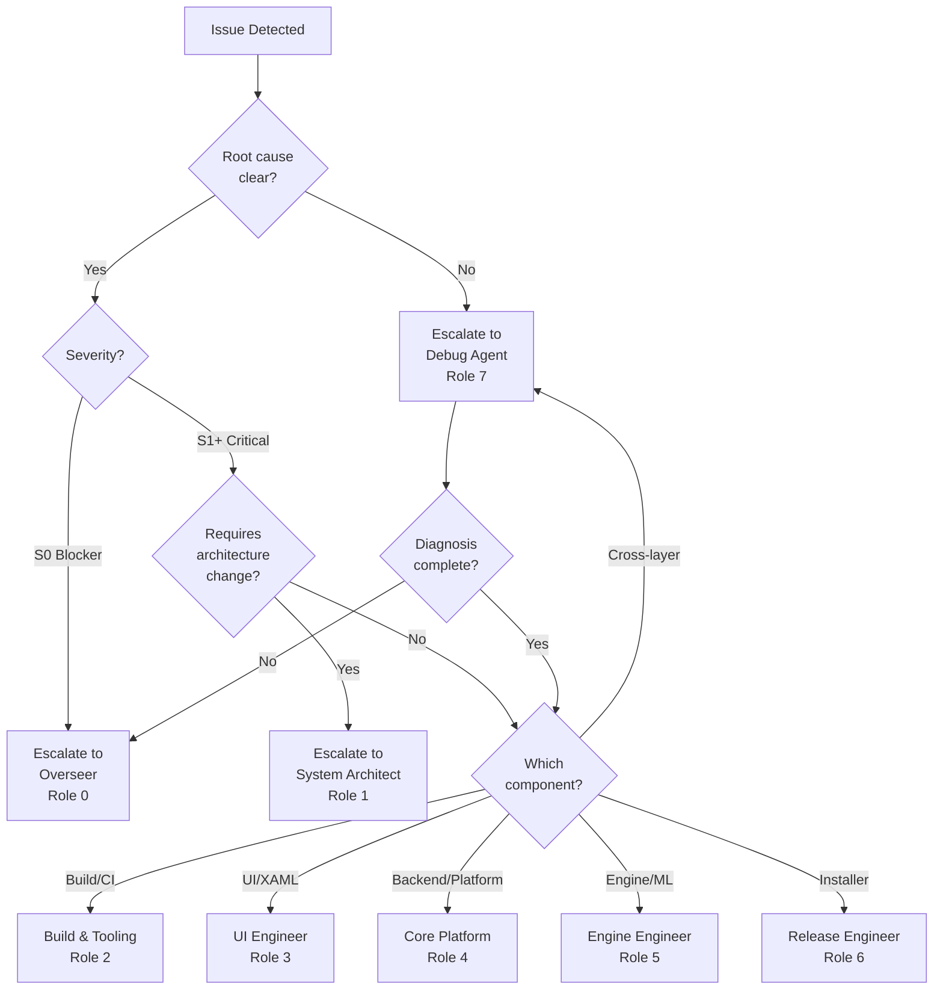

# Cross-Role Escalation Matrix

**Version**: 1.0  
**Date**: 2026-01-29  
**Purpose**: Decision tree and routing table for cross-role escalation and handoffs  
**Related**: ADR-017 (Debug Role), ADR-015 (Integration Contract)

---

## Escalation Decision Tree



---

## Escalation Routing Table

### When to Use Debug Agent (Role 7)

**Primary Use Cases**:

| Scenario | Example | Escalate to Debug Agent? |
|----------|---------|--------------------------|
| Root cause unclear | Error spans UI → Backend → Engine | ✅ YES |
| Multiple layer involvement | IPC failure affecting sync | ✅ YES |
| Intermittent or race conditions | Sporadic crash, no clear repro | ✅ YES |
| Pattern analysis needed | Multiple similar errors | ✅ YES |
| Cross-cutting concern | Logging, telemetry, observability issue | ✅ YES |
| Standard debugging failed | Tried role-specific fixes, still broken | ✅ YES |
| Proactive anomaly detection | Unusual metrics, logs, or behaviors | ✅ YES |

**NOT Debug Agent** (use specific role):

| Scenario | Owner Role | Rationale |
|----------|------------|-----------|
| XAML syntax error | UI Engineer (Role 3) | Clear component ownership |
| Dependency version conflict | Build & Tooling (Role 2) | Toolchain expertise |
| Backend API contract change | System Architect (Role 1) | Architecture decision |
| Engine quality regression | Engine Engineer (Role 5) | Domain expertise |
| Installer packaging failure | Release Engineer (Role 6) | Distribution expertise |
| Gate blocker or role conflict | Overseer (Role 0) | Authority required |

---

## Role-Specific Escalation Guidance

### Role 0: Overseer

**Escalate TO Debug Agent when**:
- Issue requires cross-layer diagnosis before assigning to a specialist role
- Multiple roles report similar symptoms (potential systemic issue)
- Proactive monitoring reveals anomalies
- Root-cause analysis needed before task creation

**Receive FROM Debug Agent**:
- S0 blockers after diagnosis (for immediate action)
- Systemic issues requiring architectural review
- Critical patterns affecting multiple roles

### Role 1: System Architect

**Escalate TO Debug Agent when**:
- Suspected architecture violation but symptoms unclear
- Need evidence collection before making ADR
- Contract misalignment suspected but unproven
- Boundary violation needs root-cause confirmation

**Receive FROM Debug Agent**:
- Architecture violations with root-cause analysis
- Contract changes needed with justification
- Boundary issues requiring ADR

### Role 2: Build & Tooling

**Escalate TO Debug Agent when**:
- Build failure but error message is cryptic
- CI passes locally but fails remotely (or vice versa)
- Intermittent build failures (race condition suspected)
- Toolchain issue affecting multiple components

**Receive FROM Debug Agent**:
- Build issues diagnosed (e.g., file lock, dependency conflict)
- CI-specific bugs with reproduction steps

### Role 3: UI Engineer

**Escalate TO Debug Agent when**:
- Binding failure but ViewModel looks correct
- XAML compiles but crashes at runtime
- Data flow issue (backend → UI) suspected
- Panel instantiation failures across multiple panels

**Receive FROM Debug Agent**:
- UI issues diagnosed (e.g., service injection, null reference)
- Cross-layer UI bugs (backend contract mismatch)

### Role 4: Core Platform

**Escalate TO Debug Agent when**:
- Job state persistence inconsistent (race condition?)
- Backend API returns unexpected errors
- Preflight checks pass but engine fails
- Context manager or storage issue unclear

**Receive FROM Debug Agent**:
- Platform bugs diagnosed (e.g., async issue, storage race)
- Backend issues with reproduction steps

### Role 5: Engine Engineer

**Escalate TO Debug Agent when**:
- Engine fails but logs don't show root cause
- Quality regression but metrics look normal
- Model loading succeeds but inference fails
- Cross-engine issue (affects multiple engines)

**Receive FROM Debug Agent**:
- Engine bugs diagnosed (e.g., tensor shape mismatch)
- Quality issues with reproduction and fix recommendation

### Role 6: Release Engineer

**Escalate TO Debug Agent when**:
- Installer builds but fails at runtime
- Gate C/H proof fails with unclear error
- Packaging issue but unclear which component
- Crash bundle analysis needed

**Receive FROM Debug Agent**:
- Installer/packaging issues diagnosed
- Runtime failures with reproduction steps

---

## Escalation Command Reference

### From Any Role

```bash
# Escalate issue to Debug Agent
python -m tools.overseer.cli.main issues query --status NEW --severity S1
python -m tools.overseer.cli.main debug analyze <issue-id>

# Escalate to Overseer (S0 blockers only)
# Update STATE.md Overseer Queue manually or via state_integration.py

# Create handoff for specific role
python -m tools.overseer.cli.main handoff create --from <source-role> --to <target-role> --issue <issue-id>
```

### Handoff Queue Locations

Per-role handoff queues (when implemented):
- `.cursor/handoff_queues/role_0_queue.jsonl` (Overseer)
- `.cursor/handoff_queues/role_1_queue.jsonl` (System Architect)
- `.cursor/handoff_queues/role_2_queue.jsonl` (Build & Tooling)
- `.cursor/handoff_queues/role_3_queue.jsonl` (UI Engineer)
- `.cursor/handoff_queues/role_4_queue.jsonl` (Core Platform)
- `.cursor/handoff_queues/role_5_queue.jsonl` (Engine Engineer)
- `.cursor/handoff_queues/role_6_queue.jsonl` (Release Engineer)
- `.cursor/handoff_queues/role_7_queue.jsonl` (Debug Agent)

---

## Automatic Escalation Rules

The system automatically escalates issues based on:

| Condition | Action | Target |
|-----------|--------|--------|
| S0 severity (blocker) | Auto-escalate | Overseer (Role 0) |
| Recurring issue (≥3 occurrences) | Auto-task creation | Debug Agent (Role 7) → owner role |
| Cross-layer instance type | Auto-assign | Debug Agent (Role 7) |
| Role conflict detected | Auto-escalate | Overseer (Role 0) |
| Gate regression | Immediate escalate | Overseer (Role 0) |

See `tools/overseer/issues/escalation.py` (`auto_escalate_if_needed()`) for implementation.

---

## Issue Ownership Matrix

| Instance Type | Primary Owner | Secondary (Diagnosis) |
|---------------|---------------|----------------------|
| `engine_error` | Engine Engineer (5) | Debug Agent (7) |
| `backend_error` | Core Platform (4) | Debug Agent (7) |
| `ui_error` | UI Engineer (3) | Debug Agent (7) |
| `build_error` | Build & Tooling (2) | Debug Agent (7) |
| `installer_error` | Release Engineer (6) | Debug Agent (7) |
| `architecture_violation` | System Architect (1) | Debug Agent (7) |
| `cross_layer_error` | Debug Agent (7) | Overseer (0) |
| `unknown` | Debug Agent (7) | Overseer (0) |

---

## Handoff Document Template

When escalating or handing off an issue:

```markdown
# Handoff: <Issue ID> → <Target Role>

**From**: <Source Role>  
**To**: <Target Role>  
**Date**: <Date>  
**Issue ID**: <Issue ID from Issue Store>  
**Severity**: S0/S1/S2/S3  

## Context

<Brief description of what was attempted and why handoff is needed>

## Diagnosis So Far

<What is known about the issue>

## Expected Outcome

<What the target role should deliver>

## Artifacts

- Issue JSONL entry: `.overseer_issues/<date>/<id>.jsonl`
- Reproduction steps: <script or manual steps>
- Related commits: <if any>
```

---

## Integration Points

- **Issue Store**: `tools/overseer/issues/store.py` (JSONL issue persistence)
- **Escalation Manager**: `tools/overseer/issues/escalation.py` (`determine_owner()`, `escalate_to_role()`)
- **Handoff Queue**: `tools/overseer/issues/handoff.py` (per-role queues)
- **STATE Integration**: `tools/overseer/issues/state_integration.py` (Overseer Queue updates)
- **Debug Workflow**: `tools/overseer/issues/debug_workflow.py` (`triage_new_issues()`, `analyze_issue()`)

---

## Usage Examples

### Example 1: UI Engineer encounters cross-layer issue

```bash
# UI Engineer (Role 3) identifies binding failure with unclear root cause
# Records issue
python -m tools.overseer.cli.main issues record \
  --instance-type ui_error \
  --severity S2 \
  --message "ProfilesView binding fails but ViewModel looks correct"

# Escalates to Debug Agent
python -m tools.overseer.cli.main issues query --status NEW --instance-type ui_error
# Note issue ID, then:
python -m tools.overseer.cli.main debug analyze <issue-id>
```

### Example 2: Debug Agent diagnoses and hands off

```bash
# Debug Agent analyzes cross-layer issue
python -m tools.overseer.cli.main debug analyze <issue-id>

# Determines it's a backend contract issue → System Architect
python -m tools.overseer.cli.main handoff create \
  --from debug-agent \
  --to system-architect \
  --issue <issue-id>
```

### Example 3: Overseer assigns issue to Debug Agent

```bash
# Overseer receives S0 blocker with unclear root cause
# Uses Debug Agent for diagnosis first
python -m tools.overseer.cli.main role invoke 7
# (Debug Agent onboards and receives issue context automatically)
```

---

## Next Steps for Full Integration

1. **Update role prompts** (ROLE_0 through ROLE_6): Add "When to Use Debug Agent" section
2. **Update role guides** (ROLE_0 through ROLE_6): Add Debug Agent reference in escalation sections
3. **Create handoff queue CLI**: Implement `handoff view-queue <role-id>` and `handoff acknowledge <handoff-id>`
4. **Test cross-role flow**: Create a test issue, escalate to Debug Agent, diagnose, hand off to specialist
5. **Add to onboarding**: Include escalation matrix in role onboarding packets

---

## Reference

- **ADR-017**: Debug Role Architecture and Issue-Task Integration
- **Debug Agent Guide**: `docs/governance/roles/ROLE_7_DEBUG_AGENT_GUIDE.md`
- **Issue System**: `tools/overseer/issues/` (store, escalation, handoff, debug_workflow)
- **CLI Commands**: `python -m tools.overseer.cli.main debug --help`
