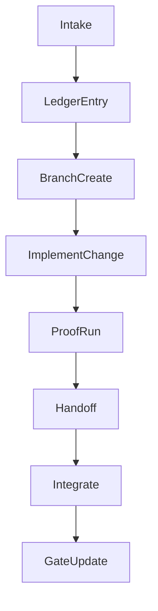

## Multi-role execution plan (Overseer-led)

### Purpose

Run parallel role work while preserving the gated recovery model and focusing on voice cloning quality and capability upgrades.

### Inputs

- Role boundaries: `Recovery Plan/ROLE_SYSTEM_AND_OVERSEER_PROTOCOL.md`
- Gate model: `Recovery Plan/VoiceStudio_Architectural_Recovery_and_Completion_Plan.md`
- Work backlog: `docs/governance/NEW_COMPREHENSIVE_ROADMAP_2025-01-28.md`
- UI spec: `docs/design/VOICESTUDIO_COMPLETE_IMPLEMENTATION_SPEC.md`
- Surface catalog: `docs/governance/FEATURE_FUNCTION_MAP.md`
- Git collaboration workflow: `docs/governance/overseer/GIT_WORKFLOW.md`

### Role prompts

Role prompt files live under `docs/governance/overseer/roles/`.

---

## Work item lifecycle

---

## Workstreams (gate-ordered, voice cloning focus)

### 1) Deterministic environment and clean compile (Gate A/B)

- **Owner role**: Build and Tooling Engineer
- **Sign-off roles**: System Architect, UI Engineer
- **Primary surfaces**:
  - `Directory.Build.props`, `Directory.Build.targets`, `global.json`, `VoiceStudio.sln`
  - `.github/workflows/`
- **Proof runs**:
  - Environment report command (when present)
  - `dotnet build "E:\\VoiceStudio\\VoiceStudio.sln" -c Debug -p:Platform=x64`

### 2) Core job runtime and storage baseline (Gate D)

- **Owner role**: Core Platform Engineer
- **Sign-off roles**: System Architect, Engine Engineer
- **Primary surfaces**:
  - `app/core/runtime/`
  - `app/core/storage/`
  - `backend/api/ws/`
- **Proof runs**:
  - A minimal job that persists an artifact and emits events end-to-end

### 3) Engine integration baseline for voice (Gate E)

- **Owner role**: Engine Engineer
- **Sign-off role**: Core Platform Engineer
- **Primary surfaces**:
  - `engines/` (manifest registration)
  - `app/core/engines/` (engine adapters and quality modules)
  - `backend/api/routes/voice*.py`
- **Proof runs**:
  - Voice workflow: import → transcribe (if used) → synthesize/convert → export
  - Reference audio outputs plus engine configuration snapshot

### 4) Studio UX wiring for voice flows (Gate C/F)

- **Owner role**: UI Engineer
- **Sign-off role**: System Architect
- **Primary surfaces**:
  - `src/VoiceStudio.App/Views/Panels/`
  - `src/VoiceStudio.App/ViewModels/`
  - `src/VoiceStudio.App/Services/BackendClientAdapter.cs`
- **Proof runs**:
  - App boot plus navigation across voice panels without binding spam
  - One end-to-end voice flow through the UI into the backend and back

### 5) Packaging and upgrades (Gate H)

- **Owner role**: Release Engineer
- **Sign-off roles**: Build and Tooling Engineer, Overseer
- **Primary surfaces**:
  - `installer/`
  - `scripts/`
  - `.github/workflows/release.yml`
- **Proof runs**:
  - Install → launch → upgrade → rollback → uninstall on a local machine profile

---

## Overseer cadence

- Operate in cycles: Log → Repro → Fix → Proof → Close.
- Keep ledger hygiene: every defect has a reproducible trigger and a proof run.
- Enforce sign-off boundaries and gate discipline on integration.

