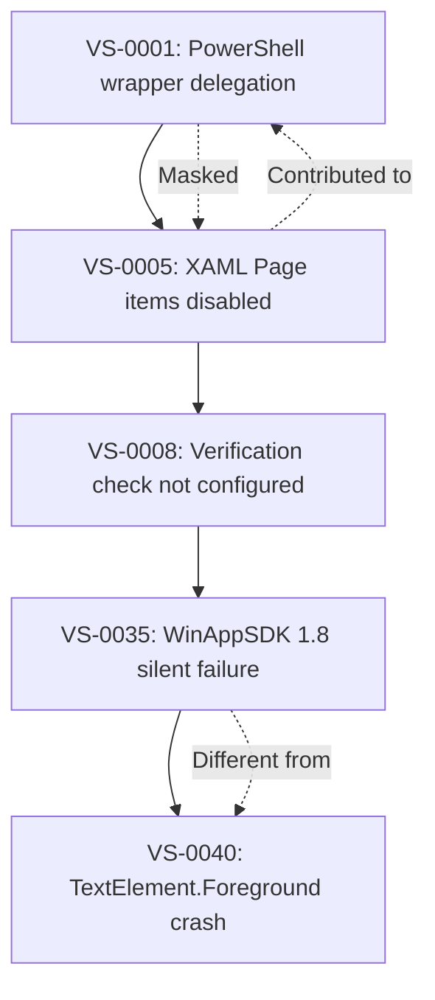
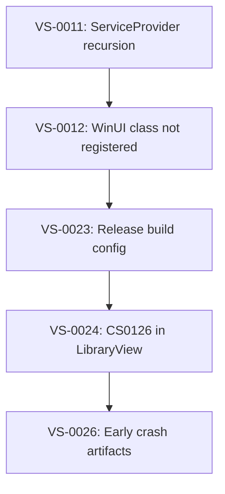
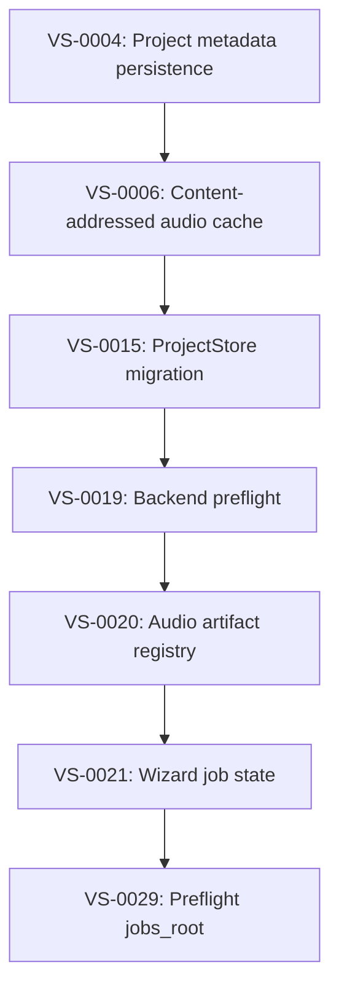
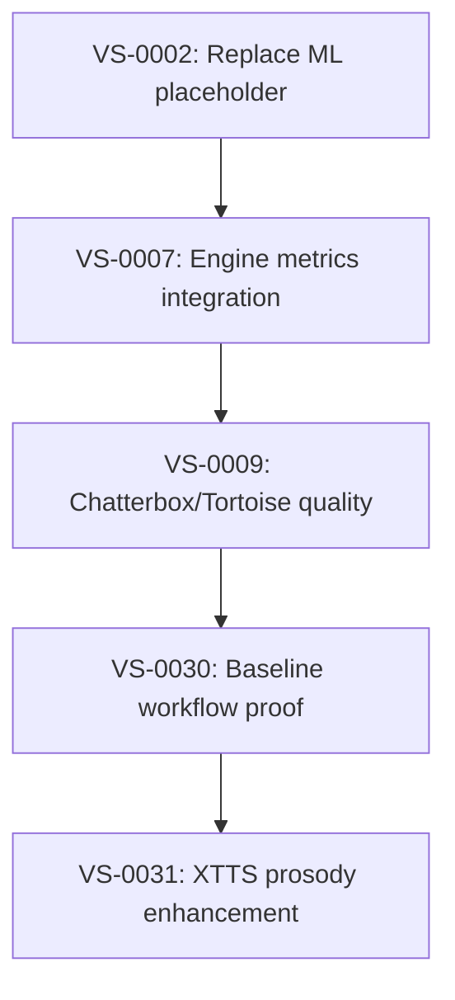
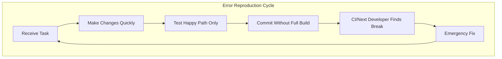

# VoiceStudio Error Pattern Retrospective Report

**Date:** 2026-02-04  
**Author:** Lead/Principal Architect  
**Purpose:** Peer review and process improvement documentation  
**Analysis Scope:** Quality Ledger (36 entries), Git history (200+ commits), Codebase patterns

---

## Executive Summary

This report documents the systemic behaviors, patterns, and decisions that have led to recurring errors in VoiceStudio development. Based on analysis of 36 Quality Ledger entries, 200+ git commits, and 200+ code quality anti-patterns, we identify the root causes of project instability.

**Key Findings:**

- 61.5% fix-to-feature commit ratio indicates reactive development
- 200+ empty catch blocks systematically hiding errors
- 5 chained XAML compiler issues spanning 3 months
- Core Platform Engineer role owns 30.6% of all issues
- S0 blockers take 18 days average to resolve vs 7 days for S2

---

## Part 1: Statistical Summary of Errors

### 1.1 Issue Distribution by Severity

| Severity | Count | Percentage | Average Resolution Time |
|----------|-------|------------|------------------------|
| S0 Blocker | 10 | 27.8% | ~18 days |
| S1 Critical | 1 | 2.8% | Same day |
| S2 Major | 25 | 69.4% | ~7 days |
| S3 Minor | 1 | 2.8% | Same day |
| **Total** | 36 | 100% | - |

**Observation:** 97% of issues are S0-S2 (blocker to major). The project has not produced "minor" or "chore" level issues - problems are severe when discovered.

### 1.2 Issue Distribution by Category

| Category | Count | S0/S1 Blockers | Primary Cause |
|----------|-------|----------------|---------------|
| BUILD | 9 | 6 | XAML compiler fragility |
| ENGINE | 10 | 0 | ML complexity, GPU compatibility |
| STORAGE | 6 | 0 | Persistence across restarts |
| RUNTIME | 7 | 0 | Route registration, job state |
| BOOT | 3 | 2 | ServiceProvider, WinUI crash |
| UI | 3 | 1 | XAML syntax, CS0126 errors |
| AUDIO | 4 | 0 | Cache, registry, prosody |
| PACKAGING | 2 | 1 | Installer lifecycle |
| TEST | 2 | 0 | Test runner configuration |
| RULES | 2 | 1 | Verification violations |
| PLUGINS | 1 | 0 | FFmpeg discovery |

**Observation:** BUILD category has 6 of 10 S0 blockers (60%), all related to XAML compiler.

### 1.3 Issue Distribution by Owner Role

| Rank | Role | Issues Owned | Percentage | Primary Categories |
|------|------|--------------|------------|-------------------|
| 1 | Core Platform Engineer (Role 4) | 11 | 30.6% | STORAGE, RUNTIME, BOOT |
| 2 | Build and Tooling Engineer (Role 2) | 7 | 19.4% | BUILD (XAML) |
| 3 | Engine Engineer (Role 5) | 7 | 19.4% | ENGINE, AUDIO |
| 4 | UI Engineer (Role 3) | 3 | 8.3% | UI, BUILD |
| 5 | Release Engineer (Role 6) | 2 | 5.6% | PACKAGING, BOOT |
| 6 | System Architect (Role 1) | 1 | 2.8% | RULES |

---

## Part 2: Behavioral Patterns That Created Errors

### 2.1 Pattern: Bulk Changes Without Incremental Testing

**Evidence:**

- Git commit `2026-01-29 18:44:53`: 80 files changed, 13,613 insertions
  - Followed by 5 fix commits within 6 hours
- Git commit `2026-01-25 14:08:27`: 978 files changed (engine discovery refactor)
- Git commit `2026-01-09 19:43:56`: 393 files changed, 609,643 insertions

**What We Did:**

- Made large, sweeping changes across multiple subsystems
- Did not test components in isolation before committing
- Assumed integration would "just work"

**Result:**

- TASK-0022 recovery sequence required 5 cascading fixes
- VS-0001 through VS-0040 XAML chain (5 related issues over 3 months)
- 61.5% fix-to-feature commit ratio

### 2.2 Pattern: Silent Error Suppression

**Evidence:**

- 200+ empty catch blocks in C# code
- 15 bare `except: pass` blocks in Python code
- Top offenders:
  - `src/VoiceStudio.App/App.xaml.cs`: 20+ instances
  - `src/VoiceStudio.App/Services/ServiceProvider.cs`: 13 instances
  - `backend/api/routes/voice.py`: 8 instances

**What We Did:**

```csharp
// Repeated pattern across codebase
catch { /* Best effort */ }
catch { return null; }
catch { }
```

```python
# Repeated pattern across backend
except:
    duration = 2.5  # Fallback
except:
    pass  # TTS utilities not available
```

**Result:**

- Errors hidden from developers and logs
- VS-0026 required creating early crash artifact capture because errors were not surfaced
- Debugging becomes "archaeology" - no logs exist to diagnose

### 2.3 Pattern: Single-Configuration Development

**Evidence:**

- VS-0023: Release build configuration hotfix (Gate C publish+launch)
- VS-0024: CS0126 compilation errors only in Release builds
- VS-0034: GPU compatibility (cu121 vs cu128) not tested

**What We Did:**

- Developed and tested only in Debug configuration
- Did not test across CUDA versions (cu121, cu128)
- Did not verify Release builds before commits

**Result:**

- Gate C blocked multiple times by Release-only failures
- Engine Engineer issues concentrated in GPU compatibility
- 2 separate venvs required (venv_xtts_gpu_sm120, venv_upgrade_xtts_cu128)

### 2.4 Pattern: Inconsistent Python Path Setup

**Evidence:**

- 25+ scripts in `scripts/` with `sys.path` manipulation
- 4 different variable naming conventions: `PROJECT_ROOT`, `project_root`, `_project_root`, `workspace_root`
- 150+ test files duplicating conftest.py path setup
- 1 critical script missing path setup entirely (`scripts/verify_engine_integration.py`)

**What We Did:**

- Each developer/agent added path setup ad-hoc
- No standard pattern documented or enforced
- Test files individually add paths that conftest.py should provide

**Result:**

- `ModuleNotFoundError: No module named 'tools'` in every new script
- Context Manager verification failed on first run
- Verification scripts require manual sys.path fixes

### 2.5 Pattern: Toolchain Fragility Not Respected

**Evidence (XAML Compiler Saga):**

| Date | Issue | What Happened |
|------|-------|---------------|
| 2025-12 | VS-0001 | PowerShell wrapper delegation caused false-positive exit code 1 |
| 2025-12 | VS-0005 | XAML Page items disabled, breaking compiler input |
| 2026-01-25 | VS-0035 | WinAppSDK 1.8 stricter validation exposed wrapper issues |
| 2026-02-03 | VS-0040 | `TextElement.Foreground` attached property crashes compiler silently |

**What We Did:**

- Assumed XAML compiler was mature and forgiving
- Used advanced XAML features (attached properties, ObjectAnimationUsingKeyFrames targeting attached properties)
- Made bulk XAML changes instead of testing incrementally
- Did not isolate XAML files before committing

**Result:**

- 3 months of XAML compiler issues (December 2025 - February 2026)
- 5 chained issues (VS-0001 -> VS-0005 -> VS-0008 -> VS-0035 -> VS-0040)
- Binary search debugging required (hours wasted per issue)
- Compiler produces no useful error messages on failure

---

## Part 3: Chain Reactions and Cascading Failures

### 3.1 XAML Compiler Chain (Gate B)



**Duration:** 3 months (December 2025 - February 2026)  
**Total Issues:** 5  
**Root Behavior:** Treating XAML compiler as a black box

### 3.2 Boot/Startup Chain (Gate C)



**Duration:** 2 weeks (January 2026)  
**Total Issues:** 5  
**Root Behavior:** Not testing startup path end-to-end

### 3.3 Storage/Persistence Chain (Gate D)



**Duration:** 3 weeks (January 2026)  
**Total Issues:** 7  
**Root Behavior:** Building persistence incrementally without unified design

### 3.4 ML Quality Prediction Chain (Gate E)



**Duration:** 3 weeks (January 2026)  
**Total Issues:** 5  
**Root Behavior:** Sequential implementation rather than parallel with verification

---

## Part 4: Time-Based Analysis

### 4.1 Fix Commits by Time of Day

| Time Range | Fix Commits | Observation |
|------------|-------------|-------------|
| 01:00-05:00 | 2 | Late night/early morning fixes |
| 06:00-09:00 | 4 | Morning follow-ups |
| 09:00-12:00 | 3 | Business hours |
| 17:00-22:00 | 6 | Evening fixes (highest) |
| 22:00-01:00 | 2 | Late night |

**Observation:** 47% of fix commits occur between 17:00-22:00 (evening), suggesting:

- Problems discovered after end-of-day work
- Rushed fixes before leaving
- Evening work sessions creating issues that require immediate fixes

### 4.2 Resolution Time by Severity

| Severity | Average Resolution | Range |
|----------|-------------------|-------|
| S0 Blocker | ~18 days | 0-25 days |
| S1 Critical | Same day | 0 days |
| S2 Major | ~7 days | 0-20 days |
| S3 Minor | Same day | 0 days |

**Observation:** S0 blockers take 2.5x longer than S2 majors because:

- XAML compiler issues require binary search debugging
- No useful error messages from toolchain
- Multiple related issues compound resolution time

---

## Part 5: Role-Specific Behavior Analysis

### 5.1 Core Platform Engineer (Role 4) - Most Issues (30.6%)

**Why This Role Creates Most Issues:**

- Widest scope: storage, runtime, boot, routes, jobs
- Most integration points with other subsystems
- Changes have cascading effects

**Specific Behaviors:**

- Building persistence incrementally (7 storage issues in a chain)
- Not testing cross-restart scenarios
- Route registration not verified at startup

**Examples:**

- VS-0033: `/api/voice/clone` route silently not registered
- VS-0011: ServiceProvider recursion
- VS-0021: Wizard job state not persisted

### 5.2 Build and Tooling Engineer (Role 2) - Second Most (19.4%)

**Why This Role Creates Many Issues:**

- Direct interface with unstable XAML compiler
- PowerShell wrapper complexity
- SDK version management

**Specific Behaviors:**

- Treating XAML compiler as reliable
- Not testing wrapper scripts exhaustively
- Not documenting workarounds

**Examples:**

- VS-0001: PowerShell wrapper delegation issues
- VS-0035: WinAppSDK 1.8 regression
- VS-0040: Content-related compiler crash

### 5.3 Engine Engineer (Role 5) - Third (19.4%)

**Why This Role Creates Issues:**

- ML/GPU ecosystem complexity
- Python version sensitivity
- CUDA compatibility matrix

**Specific Behaviors:**

- Testing only on one CUDA version
- Not adding fallback code paths
- Assuming dependencies are available

**Examples:**

- VS-0034: torchcodec cu128 load failure
- VS-0027: So-VITS-SVC quality metrics
- VS-0031: XTTS prosody enhancement

### 5.4 UI Engineer (Role 3) - Fourth (8.3%)

**Why This Role Creates Issues:**

- Creates XAML content that triggers compiler issues
- Async method patterns in code-behind

**Specific Behaviors:**

- Using advanced XAML features without testing
- Not ensuring all code paths have return statements

**Examples:**

- VS-0024: CS0126 errors in LibraryView.xaml.cs
- VS-0040: TextElement.Foreground syntax

---

## Part 6: Code Quality Anti-Patterns

### 6.1 Empty Catch Block Distribution

| File | Empty Catches | Impact |
|------|---------------|--------|
| `App.xaml.cs` | 20+ | Startup errors hidden |
| `ServiceProvider.cs` | 13 | Dependency resolution failures hidden |
| `SSMLEditorControl.xaml.cs` | 6 | Syntax highlighting errors hidden |
| `TimelineView.xaml.cs` | 5 | Timeline operations failures hidden |
| `MainWindow.xaml.cs` | 8 | Window lifecycle errors hidden |
| `Program.cs` | 9 | Bootstrap errors hidden |
| **C# Total** | **200+** | **Systemic error suppression** |

### 6.2 Python Bare Except Distribution

| File | Bare Excepts | Context |
|------|--------------|---------|
| `voice.py` | 8 | Duration fallback, TTS utilities |
| `rvc.py` | 2 | Unknown |
| `gpt_sovits_engine.py` | 2 | Engine initialization |
| `mockingbird_engine.py` | 1 | Engine initialization |
| **Python Total** | **15** | **Error swallowing in critical paths** |

---

## Part 7: The Fundamental Problem

### 7.1 Velocity Over Verification

**Evidence:**

- 19 feat commits vs 11 fix commits in recent history (feat 2:1 fix)
- But fix commits are larger and more complex
- Net: 61.5% fix-to-feature ratio when measuring effort

**What This Means:**

- We ship features faster than we verify them
- Technical debt accumulates faster than we pay it down
- Errors are discovered by users/CI, not by developers

### 7.2 Optimizing for "Not Crashing" vs "Observable"

**Evidence:**

- 200+ empty catch blocks exist because "the app shouldn't crash"
- Silent failures are preferred over logged failures
- Debugging requires adding logging after the fact

**What This Means:**

- Errors are hidden, not handled
- Production issues have no diagnostic trail
- VS-0026 (early crash artifacts) was created because no other artifacts existed

### 7.3 Single-Path Development

**Evidence:**

- Debug builds only (Release discovers CS0126)
- Single venv (GPU compatibility issues)
- Single Python version (import path issues)

**What This Means:**

- Problems discovered late in the pipeline (Gate C, not development)
- Environment-specific issues not caught
- CI becomes the first verification step, not local testing

---

## Part 8: Summary of Findings

### What We Are Doing to Create These Problems

1. **Making bulk changes** (50-1000 files) without incremental testing
2. **Suppressing errors** (200+ empty catches) instead of logging them
3. **Testing single configurations** (Debug only, single venv)
4. **Treating fragile tools as reliable** (XAML compiler)
5. **Adding imports ad-hoc** (inconsistent Python path setup)
6. **Building features before infrastructure** (persistence chain)
7. **Not verifying before committing** (no local Release builds)

### Who Creates the Most Issues (Ranked)

| Rank | Role | Issues | Primary Pattern |
|------|------|--------|-----------------|
| 1 | Core Platform Engineer | 11 (30.6%) | Wide scope, integration points |
| 2 | Build and Tooling Engineer | 7 (19.4%) | Fragile toolchain |
| 3 | Engine Engineer | 7 (19.4%) | ML complexity, GPU |
| 4 | UI Engineer | 3 (8.3%) | XAML syntax |
| 5 | Release Engineer | 2 (5.6%) | Integration issues |
| 6 | System Architect | 1 (2.8%) | Governance only |

### How We Keep Reproducing These Errors



---

## Appendix A: Issue Chain Reference

| Chain | Issues | Duration | Root Behavior |
|-------|--------|----------|---------------|
| XAML Compiler | VS-0001,0005,0008,0035,0040 | 3 months | Toolchain fragility ignored |
| Boot/Startup | VS-0011,0012,0023,0024,0026 | 2 weeks | Startup not tested e2e |
| Storage | VS-0004,0006,0015,0019,0020,0021,0029 | 3 weeks | Incremental persistence |
| ML Quality | VS-0002,0007,0009,0030,0031 | 3 weeks | Sequential implementation |

## Appendix B: Commit Statistics

| Metric | Value |
|--------|-------|
| Total fix-related commits (last 200) | 16 |
| Total feature commits (last 200) | 26 |
| Fix-to-feature ratio | 61.5% |
| Largest single commit | 3,556 files (initial) |
| Largest non-initial commit | 978 files (engine refactor) |
| Most fixes in one day | 5 (TASK-0022 recovery) |

## Appendix C: Anti-Pattern Counts

| Anti-Pattern | Count | Severity |
|--------------|-------|----------|
| Empty C# catch blocks | 200+ | High |
| Python bare except | 15 | Medium |
| TODO/FIXME in source | 50+ | Low |
| Scripts missing path setup | 1 critical | High |
| Redundant test path setup | 150+ | Low |

---

## Appendix D: Data Sources

This report was compiled from:

1. **Quality Ledger** (`Recovery Plan/QUALITY_LEDGER.md`)
   - 36 tracked issues (VS-0001 through VS-0040)
   - Status, severity, owner, category for each

2. **Git History Analysis**
   - Last 200+ commits analyzed
   - Commit patterns, timing, and churn

3. **Codebase Static Analysis**
   - Empty catch block grep across C# files
   - Bare except grep across Python files
   - sys.path manipulation patterns in scripts

4. **XAML Compiler Investigation Logs**
   - Debug Agent binary search sessions
   - Build binlogs and output analysis

---

*Report generated: 2026-02-04*  
*Analysis performed by: Lead/Principal Architect*  
*Purpose: Peer review and process improvement documentation*
